<p align="center">
  
</p>

<h1 align="center">Frame Beauty — Backend Architecture</h1>

<p align="center">
  <strong>Comprehensive technical reference for the Frame Beauty API platform.</strong><br/>
  Node.js · TypeScript · Express · MongoDB · Socket.IO · Cloudflare R2 · Firebase FCM
</p>

---

## Table of Contents

1. [Platform Overview](#1-platform-overview)
2. [System Topology](#2-system-topology)
3. [Request Lifecycle](#3-request-lifecycle)
4. [Authentication & Authorization](#4-authentication--authorization)
5. [Database Architecture](#5-database-architecture)
6. [Real-Time Architecture](#6-real-time-architecture)
7. [File Storage](#7-file-storage)
8. [Notification Pipeline](#8-notification-pipeline)
9. [Design Patterns](#9-design-patterns)
10. [System Reference](#10-system-reference)
11. [Middleware Pipeline](#11-middleware-pipeline)
12. [API Structure](#12-api-structure)
13. [Environment Variables](#13-environment-variables)
14. [Deployment](#14-deployment)
15. [Error Handling](#15-error-handling)

---

## 1. Platform Overview

Frame Beauty is a Tunisian startup platform digitizing the beauty and salon industry. It serves four user roles across a unified API:

| Role | Description | Capabilities |
|------|-------------|--------------|
| **Client** | End-user (customer) | Discover lounges, book services, join queues, social feed, marketplace shopping |
| **Lounge** | Beauty salon / barber shop | Manage catalog, agents, bookings, content, online store |
| **Agent** | Stylist / technician | Serve clients, manage own queue, update availability |
| **Admin** | Platform operator | Full access — user management, moderation, catalog, system health |

### Technology Stack

| Layer | Technology | Version |
|-------|-----------|---------|
| **Runtime** | Node.js | 18+ |
| **Language** | TypeScript | 5.x |
| **Framework** | Express | 4.18 |
| **ODM** | Mongoose | 8.x |
| **Database** | MongoDB | 6+ |
| **Real-Time** | Socket.IO | 4.8 |
| **File Storage** | Cloudflare R2 | S3-compatible |
| **Push Notifications** | Firebase FCM | Admin SDK 12 |
| **Compiler** | SWC | Latest |
| **Process Manager** | PM2 | Latest |
| **Reverse Proxy** | Nginx | Latest |
| **Containerization** | Docker + Docker Compose | Latest |

---

## 2. System Topology

The backend is organized into **9 independent vertical systems**, each owning its models, services, controllers, routes, and DTOs.

```mermaid
graph TB
    subgraph Core Infrastructure
        MW[Middleware Pipeline<br>auth · validation · rate-limit · CSRF · roles]
        SS[SocketService<br>Socket.IO Singleton]
        NS_SVC[NotificationService<br>Observer Hub]
        R2[Cloudflare R2<br>File Storage]
        FCM[Firebase FCM<br>Push Notifications]
        DB[(MongoDB)]
    end

    subgraph API Systems
        AUTH[AuthSystem<br>/v1/auth]
        UM[UserManager<br>/v1/me · /v1/client · /v1/agents · /v1/follows]
        AGENT[AgentSystem<br>/v1/agents/me · /v1/lounge/me]
        BOOK[BookingSystem<br>/v1/bookings · /v1/queues]
        CAT[ServiceCatalogSystem<br>/v1/services · /v1/service-categories · /v1/lounge-services]
        FEED[FeedContentSystem<br>/v1/posts · /v1/reels · /v1/comments · /v1/likes · /v1/follows · /v1/feed · /v1/reports]
        CHAT[ChatSystem<br>/v1/chat]
        NOTIF[NotificationSystem<br>/v1/notifications]
        ADMIN[AdminSystem<br>/v1/admin]
        MARKET[MarketplaceSystem<br>/v1/marketplace]
    end

    AUTH --> DB
    AUTH --> NS_SVC
    UM --> DB
    UM --> R2
    UM --> NS_SVC
    AGENT --> DB
    AGENT --> R2
    AGENT --> SS
    BOOK --> DB
    BOOK --> SS
    BOOK --> NS_SVC
    CAT --> DB
    CAT --> R2
    CAT --> NS_SVC
    FEED --> DB
    FEED --> R2
    FEED --> NS_SVC
    CHAT --> DB
    CHAT --> R2
    CHAT --> SS
    NOTIF --> DB
    NOTIF --> SS
    NOTIF --> FCM
    ADMIN --> DB
    ADMIN -->|Facade over all systems| AUTH
    ADMIN --> UM
    ADMIN --> BOOK
    ADMIN --> CAT
    ADMIN --> FEED
    MARKET --> DB
    MARKET --> R2
    MARKET --> NS_SVC

    MW --> AUTH
    MW --> UM
    MW --> AGENT
    MW --> BOOK
    MW --> CAT
    MW --> FEED
    MW --> CHAT
    MW --> NOTIF
    MW --> ADMIN
    MW --> MARKET

    style AUTH fill:#3498db,color:white
    style UM fill:#2ecc71,color:white
    style BOOK fill:#e67e22,color:white
    style CHAT fill:#9b59b6,color:white
    style NOTIF fill:#1abc9c,color:white
    style ADMIN fill:#e74c3c,color:white
    style MARKET fill:#f39c12,color:white
    style FEED fill:#27ae60,color:white
    style CAT fill:#2980b9,color:white
```

### Cross-System Dependencies

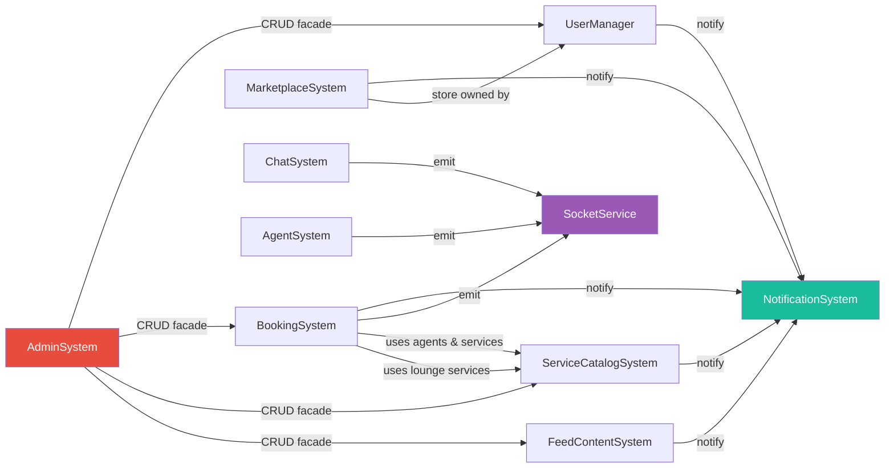

---

## 3. Request Lifecycle

Every HTTP request passes through a consistent pipeline before reaching business logic:

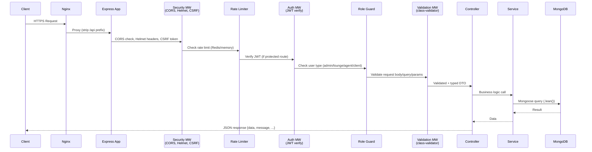

### Response Envelope

All API responses follow a consistent shape:

```typescript
// Success
{
  "data": { ... },        // payload
  "message": "Success",   // optional message
  "pagination": {          // when paginated
    "page": 1,
    "limit": 20,
    "total": 100,
    "totalPages": 5
  }
}

// Error
{
  "message": "Error description",
  "errors": ["Validation error 1", ...]  // optional, for 400s
}
```

---

## 4. Authentication & Authorization

### JWT Token Strategy

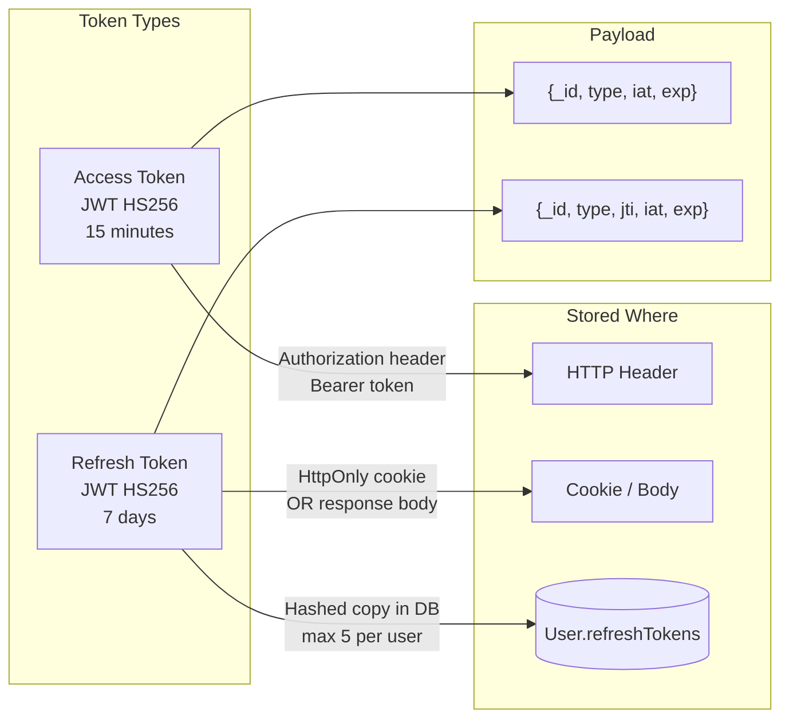

### Token Refresh (Rotation)

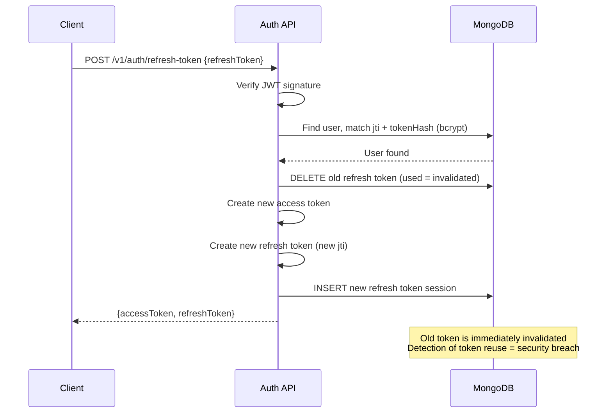

### Role Guards

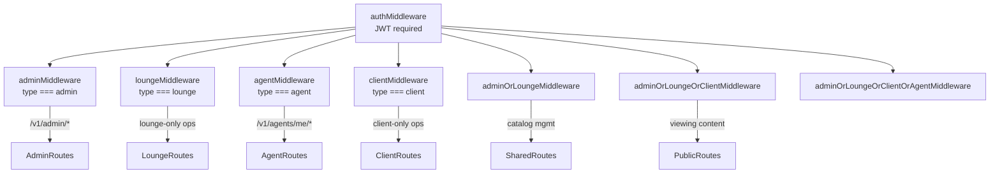

### Security Hardening

| Threat | Mitigation |
|--------|-----------|
| Brute force login | 5 failed attempts → 15 min lockout; per-IP rate limiting |
| Token theft | Short-lived access tokens (15 min); refresh rotation detects reuse |
| CSRF | SameSite=Strict cookie; CSRF middleware on state-mutating routes |
| SQL/NoSQL injection | Mongoose ODM with typed schemas; no raw query string interpolation |
| XSS | Helmet.js security headers; Content-Security-Policy |
| Enumeration | Generic error messages on failed auth; no user-existence leakage |
| Session fixation | New jti on every refresh; full session invalidation on password change |
| Password exposure | bcrypt (10 rounds); passwords never included in API responses |

---

## 5. Database Architecture

### MongoDB Collections

| Collection | System Owner | Est. Size | Key Indexes |
|------------|-------------|-----------|-------------|
| `users` | UserManager | Large | `email (unique)`, `type`, `location (2dsphere)`, `refreshTokens.jti` |
| `agents` | UserManager | Medium | `loungeId`, `idLoungeService` |
| `follows` | UserManager | Large | `{followerId, followingId} (unique)`, `followingId` |
| `verificationtokens` | AuthSystem | Small | `token (unique)`, `expiresAt (TTL)` |
| `bookings` | BookingSystem | Large | `{loungeId, bookingDate}`, `clientId`, `status` |
| `queues` | BookingSystem | Medium | `agentId (unique)`, `date` |
| `services` | ServiceCatalogSystem | Small | `name`, `categoryId` |
| `servicecategories` | ServiceCatalogSystem | Tiny | `name (unique)` |
| `loungeservices` | ServiceCatalogSystem | Medium | `loungeId`, `serviceId`, `agentIds` |
| `servicesuggestions` | ServiceCatalogSystem | Small | `loungeId`, `status` |
| `ratings` | ServiceCatalogSystem | Medium | `{clientId, loungeId} (unique)`, `loungeId` |
| `posts` | FeedContentSystem | Large | `authorId`, `createdAt`, `hashtags`, `isHidden` |
| `reels` | FeedContentSystem | Large | `authorId`, `createdAt`, `hashtags` |
| `comments` | FeedContentSystem | Large | `contentId`, `authorId`, `parentId` |
| `contentlikes` | FeedContentSystem | Large | `{userId, contentId} (unique)` |
| `likes` | FeedContentSystem | Large | `{clientId, loungeId} (unique)` |
| `contentsaves` | FeedContentSystem | Large | `{userId, contentId} (unique)` |
| `hashtags` | FeedContentSystem | Medium | `name (unique)`, `count` |
| `reports` | FeedContentSystem | Medium | `status`, `reporterId`, `contentId` |
| `notifications` | NotificationSystem | Large | `userId`, `isRead`, `createdAt (TTL 90d)` |
| `conversations` | ChatSystem | Medium | `{participants} (unique pair)`, `lastMessageAt` |
| `messages` | ChatSystem | Large | `conversationId`, `createdAt`, `contentType` |
| `stores` | MarketplaceSystem | Small | `ownerId (unique)`, `slug (unique)`, `status`, `location (2dsphere)` |
| `products` | MarketplaceSystem | Medium | `storeId`, `categoryId`, `slug`, `status`, `tags` |
| `productcategories` | MarketplaceSystem | Tiny | `name (unique)`, `isActive` |
| `productcategorysuggestions` | MarketplaceSystem | Small | `submittedBy`, `status` |
| `orders` | MarketplaceSystem | Large | `buyerId`, `storeId`, `status`, `createdAt` |
| `carts` | MarketplaceSystem | Medium | `userId (unique)` |
| `reviews` | MarketplaceSystem | Medium | `{buyerId, productId} (unique)`, `productId`, `storeId` |
| `wishlists` | MarketplaceSystem | Medium | `userId (unique)` |

### Data Modeling Principles

```
1. Single User Collection with Discriminator
   User { type: 'client' | 'lounge' | 'admin' | 'user' }
   → Single collection, type-specific fields co-exist

2. Denormalized Counts
   Post.likesCount, Reel.commentsCount, User.followersCount, Store.stats.*
   → Incremented/decremented atomically with $inc
   → Avoids expensive COUNT() aggregations

3. Lean Queries
   Every read uses .lean() → returns plain JS objects, not Mongoose Documents
   → ~3x faster reads, lower memory usage

4. TTL Indexes
   VerificationToken.expiresAt → auto-delete expired tokens
   Notification.createdAt → 90-day auto-cleanup

5. Compound Unique Constraints
   {followerId, followingId} → prevents duplicate follows
   {clientId, loungeId} on Rating → one rating per client per lounge
   {buyerId, productId} on Review → one review per purchase
   {userId} on Cart → one cart per user
   agentId on Queue → one active queue per agent
```

### Entity Relationship Overview

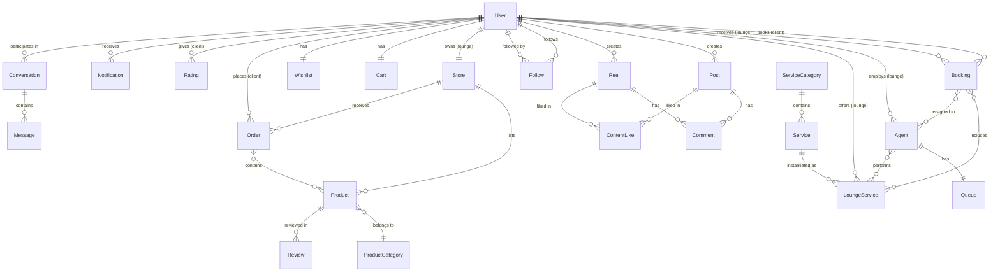

---

## 6. Real-Time Architecture

### Socket.IO Room Structure

```mermaid
graph TD
    SIO[Socket.IO Server] --> R1[Room: user:{userId}<br>All authenticated users]
    SIO --> R2[Room: lounge:{loungeId}<br>Lounge + its agents]
    SIO --> R3[Room: chat:{conversationId}<br>Conversation participants]
    SIO --> R4[Room: notifications:{userId}<br>Notification channel]

    R1 -->|bookingCreated, bookingUpdated| CLIENT
    R2 -->|queueUpdated, bookingCreated| LOUNGE
    R3 -->|newMessage, messageRead, messageDeleted, typing| CHAT_PARTICIPANTS
    R4 -->|notification| USER_NOTIF
```

### Socket.IO Events Catalog

#### Emitted by Server → Client

| Event | Room | Payload | Trigger |
|-------|------|---------|---------|
| `queueUpdated` | `lounge:{loungeId}` | `{ agentId, queue[] }` | Any queue mutation |
| `bookingCreated` | `user:{loungeId}` | `{ booking }` | New booking created |
| `bookingUpdated` | `user:{userId}` | `{ booking }` | Booking status change |
| `bookingDeleted` | `user:{userId}` | `{ bookingId }` | Booking cancelled/deleted |
| `notification` | `notifications:{userId}` | `{ notification }` | Any notification event |
| `newMessage` | `chat:{conversationId}` | `{ message }` | Message sent |
| `messageEdited` | `chat:{conversationId}` | `{ messageId, text }` | Message edited |
| `messageDeleted` | `chat:{conversationId}` | `{ messageId, recallForEveryone }` | Message deleted |
| `messageRead` | `chat:{conversationId}` | `{ userId, messageIds[] }` | Messages marked read |
| `messageReaction` | `chat:{conversationId}` | `{ messageId, userId, emoji }` | Reaction added/removed |
| `typing` | `chat:{conversationId}` | `{ userId, isTyping }` | Typing indicator |
| `conversationUpdated` | `user:{userId}` | `{ conversation }` | Conversation metadata change |

#### Sent by Client → Server

| Event | Payload | Description |
|-------|---------|-------------|
| `joinConversation` | `{ conversationId }` | Join a chat room |
| `leaveConversation` | `{ conversationId }` | Leave a chat room |
| `typing` | `{ conversationId, isTyping }` | Broadcast typing status |

### Socket.IO Authentication

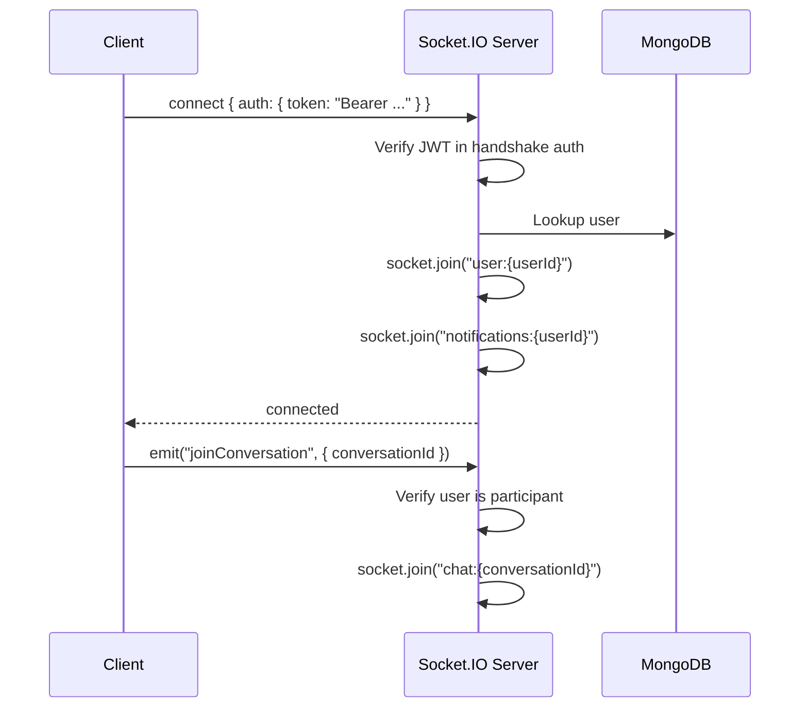

---

## 7. File Storage

All media files are stored on **Cloudflare R2** (S3-compatible object storage).

```mermaid
graph LR
    C[Client] -->|multipart/form-data| MW[imageUpload.middleware<br>multer in-memory]
    MW -->|Buffer| R2SVC[r2Service<br>@aws-sdk/client-s3]
    R2SVC -->|PutObjectCommand| R2[(Cloudflare R2<br>Bucket)]
    R2SVC -->|public URL| DB[(MongoDB<br>store URL string)]
    R2SVC -->|DeleteObjectCommand| R2
```

### Upload Middleware Patterns

| Pattern | Usage | Middleware |
|---------|-------|-----------|
| **Single optional** | Profile image, service image | `optionalUpload('profileImage')` |
| **Single required** | Reel video, post/reel image | `upload.single('fieldName')` |
| **Array** | Product images (max 8), post images | `upload.array('images', 8)` |
| **Fields** | Multiple named fields | `upload.fields([...])` |

### R2 Key Structure

```
frame-beauty/
├── users/
│   └── {userId}/
│       ├── profile/      # profile images
│       └── cover/        # cover images
├── agents/
│   └── {agentId}/profile/
├── lounge-services/
│   └── {serviceId}/
├── posts/
│   └── {postId}/         # up to 10 images
├── reels/
│   └── {reelId}/         # video + thumbnail
├── products/
│   └── {productId}/      # up to 8 images
├── stores/
│   └── {storeId}/
│       ├── logo/
│       └── banner/
└── chat/
    └── {conversationId}/ # message attachments
```

---

## 8. Notification Pipeline

The NotificationSystem acts as a **central observer** — all other systems call its trigger methods.

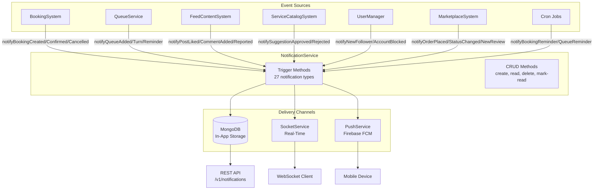

### Notification Categories & Types

| Category | Types | Count |
|----------|-------|-------|
| `booking` | created, confirmed, cancelled, completed, reminder, updated | 6 |
| `queue` | added, position_changed, reminder, turn, completed, removed | 6 |
| `social` | new_follower, lounge_liked, lounge_rated | 3 |
| `content` | post_liked, reel_liked, comment_added, content_reported | 4 |
| `system` | suggestion_created, suggestion_approved, suggestion_rejected, account_blocked, account_unblocked | 5 |
| `marketplace` | order_placed, order_status_changed, new_review | 3 |

**Total: 27 notification types**

---

## 9. Design Patterns

### 9.1 Service Layer Pattern

```
Controller → Service → Model (Mongoose)
```

Controllers are thin — they parse requests, call a service, and return responses. All business logic lives in services.

```typescript
// Controller (thin)
async createBooking(req: RequestWithUser, res: Response) {
  const data = req.body as CreateBookingDto;
  const booking = await this.bookingService.createBooking(data, req.user);
  res.status(201).json({ data: booking });
}

// Service (business logic)
async createBooking(dto: CreateBookingDto, actor: User): Promise<Booking> {
  const services = await LoungeService.find({ _id: { $in: dto.loungeServiceIds } }).lean();
  const totalPrice = services.reduce((sum, s) => sum + s.price, 0);
  const booking = await Booking.create({ ...dto, totalPrice });
  await this.notificationService.notifyBookingCreated(booking);
  return booking;
}
```

### 9.2 Repository Pattern (via Mongoose)

Mongoose models act as repositories. The service layer calls `.find()`, `.create()`, `.findByIdAndUpdate()`, etc. directly on models with `.lean()` for reads.

**Convention:**
- `Model.find(...).lean()` — all reads return plain objects
- `Model.create(data)` — all creates
- `Model.findByIdAndUpdate(id, update, { new: true })` — all updates

### 9.3 Observer / Event-Driven Pattern

The `NotificationService` implements the Observer pattern. All systems are publishers; `NotificationService` is the subscriber that fans out to 3 delivery channels.

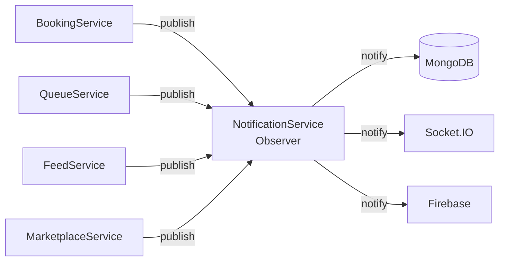

### 9.4 Singleton Pattern

`SocketService` is a singleton initialized once at startup and shared across all systems:

```typescript
// Singleton init (server.ts)
const socketService = SocketService.getInstance(httpServer);

// Usage in any service
SocketService.getInstance().emitQueueUpdated(agentId, queue);
```

### 9.5 Middleware Chain (Chain of Responsibility)

Express middleware is stacked as a chain. Each middleware either passes control to `next()` or short-circuits with an error:

```
CORS → Helmet → RateLimit → authMiddleware → roleMiddleware → validationMiddleware → controller
```

### 9.6 DTO (Data Transfer Object) Pattern

All request bodies are validated via `class-validator` + `class-transformer` DTOs:

```typescript
export class CreateBookingDto {
  @IsMongoId()
  loungeId: string;

  @IsDateString()
  bookingDate: string;

  @IsOptional()
  @IsString()
  @MaxLength(500)
  notes?: string;
}
```

`validationMiddleware(CreateBookingDto, 'body')` pipes the raw body through the DTO and returns `422` on validation failure.

### 9.7 Facade Pattern

`AdminSystem` acts as a facade — it exposes a single unified admin interface while delegating all actual work to the underlying systems' services:

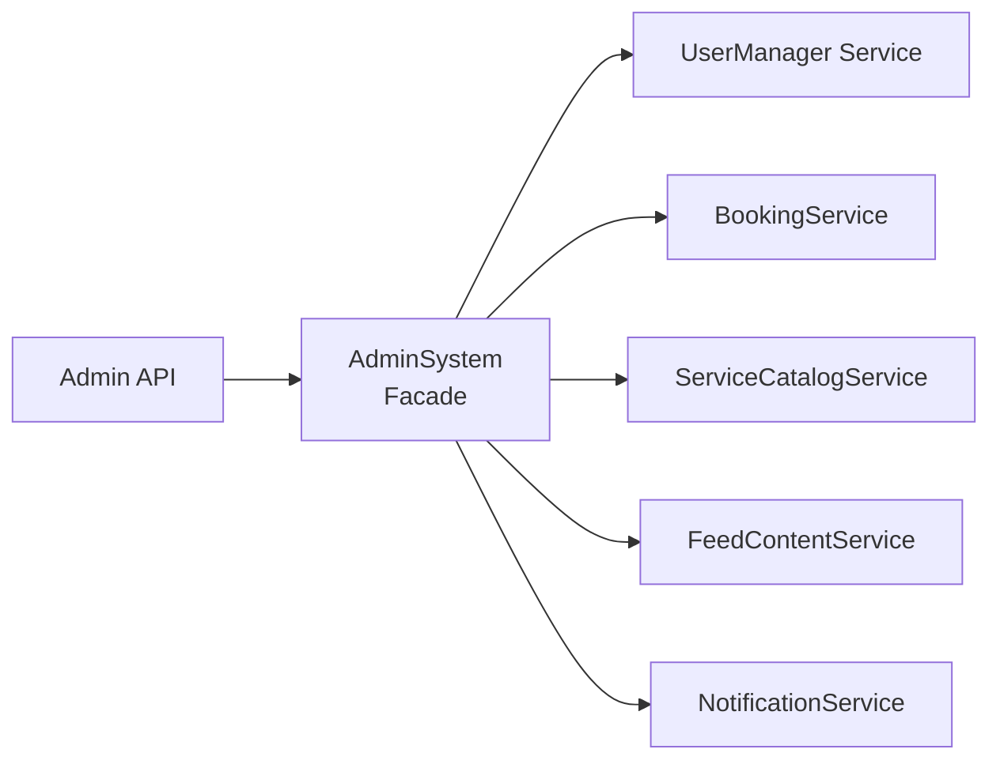

### 9.8 Strategy Pattern (Auth)

The auth system uses Passport.js strategies — local (email/password) and Google OAuth 2.0 — as pluggable authentication strategies:

```typescript
passport.use('google-login', new GoogleStrategy(...));
passport.use('google-signup', new GoogleStrategy(...));
passport.use('jwt', new JwtStrategy(...));
```

---

## 10. System Reference

### Systems at a Glance

| System | Base Path(s) | Own Collections | Key Services |
|--------|-------------|-----------------|-------------|
| **AuthSystem** | `/v1/auth` | `verificationtokens` | AuthService, AuthTokenService, AuthSessionService |
| **UserManager** | `/v1/me`, `/v1/client`, `/v1/agents`, `/v1/follows` | `users`, `agents`, `follows` | UserProfileService, UserManagementService, AgentService, FollowService |
| **BookingSystem** | `/v1/bookings`, `/v1/queues` | `bookings`, `queues` | BookingService, QueueService |
| **ServiceCatalogSystem** | `/v1/services`, `/v1/service-categories`, `/v1/lounge-services`, `/v1/suggestions`, `/v1/ratings` | `services`, `servicecategories`, `loungeservices`, `servicesuggestions`, `ratings` | ServicesService, ServiceCategoriesService, LoungeServicesService, SuggestionsService, RatingService |
| **FeedContentSystem** | `/v1/posts`, `/v1/reels`, `/v1/comments`, `/v1/likes`, `/v1/follows`, `/v1/feed`, `/v1/reports` | `posts`, `reels`, `comments`, `contentlikes`, `likes`, `contentsaves`, `hashtags`, `reports` | PostService, ReelService, CommentService, ContentLikeService, LikeService, SaveService, HashtagService, FeedService, ReportService |
| **ChatSystem** | `/v1/chat` | `conversations`, `messages` | ConversationService, MessageService |
| **NotificationSystem** | `/v1/notifications` | `notifications` | NotificationService, SocketService, PushService |
| **AdminSystem** | `/v1/admin` | _(none — facade)_ | SystemServicesService, CatalogManagementService, ContentModerationService |
| **MarketplaceSystem** | `/v1/marketplace` | `stores`, `products`, `productcategories`, `productcategorysuggestions`, `orders`, `carts`, `reviews`, `wishlists` | StoreService, ProductService, OrderService, CartService, ReviewService, WishlistService, AnalyticsService |

### Per-System Directory Structure

Each system follows the same internal layout:

```
src/systems/{SystemName}/
├── interfaces/          # TypeScript interfaces & enums
├── models/              # Mongoose models
├── dtos/                # class-validator DTOs
├── services/            # Business logic
├── controllers/         # Route handlers
├── routes/              # Express Router definitions
└── README.md            # System documentation
```

### Agent Access Layer

Agents have a **dedicated self-management API** separate from the admin-facing agent management:

| Route Group | Base Path | Auth | Description |
|------------|-----------|------|-------------|
| **Agent Self** | `/v1/agents/me` | `agentMiddleware` | Profile, availability, image |
| **Agent Queue Self** | `/v1/agents/me/queue` | `agentMiddleware` | Own queue management |
| **Lounge Queue Toggle** | `/v1/lounge/me/queue-booking` | `loungeMiddleware` | Toggle agent's queue booking per lounge |

---

## 11. Middleware Pipeline

### Global Middleware (applied to all routes)

```typescript
app.use(cors(corsOptions));          // CORS with whitelist
app.use(helmet());                   // Security headers (CSP, HSTS, etc.)
app.use(express.json());             // JSON body parser
app.use(express.urlencoded(...));    // URL-encoded body parser
app.use(cookieParser());             // Cookie parsing for refresh tokens
app.use(morganMiddleware);           // HTTP request logging (Morgan + Winston)
app.use(csrfMiddleware);             // CSRF protection
```

### Per-Route Middleware Stack

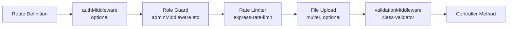

### Rate Limiting Strategy

| Route Group | Limit | Window | Store |
|-------------|-------|--------|-------|
| `POST /v1/auth/signup` | 3 | 1 hour | Memory |
| `POST /v1/auth/login` | 5 | 15 min | Memory |
| `POST /v1/auth/forgot-password` | 3 | 1 hour | Memory |
| All others | 100 | 15 min | Memory |

### Error Middleware

All unhandled errors are caught by the global error middleware:

```typescript
app.use((err: HttpException, req, res, next) => {
  const status = err.status || 500;
  const message = err.message || 'Something went wrong';
  logger.error(`[${req.method}] ${req.path} — ${status}: ${message}`);
  res.status(status).json({ message });
});
```

---

## 12. API Structure

### Version & Base Path

All API routes are prefixed with `/v1`:

```
https://api.framebeauty.tn/v1/{system}/{resource}
```

### Complete Route Groups

```
/v1/auth/*              → AuthSystem
/v1/me/*                → UserManager (current user)
/v1/client/*            → UserManager (client views)
/v1/agents/*            → UserManager (agent CRUD, admin/lounge)
/v1/agents/me/*         → AgentSystem (agent self)
/v1/follows/*           → UserManager (follow system)
/v1/bookings/*          → BookingSystem
/v1/queues/*            → BookingSystem
/v1/lounge/me/*         → UserManager / AgentSystem (lounge self)
/v1/services/*          → ServiceCatalogSystem
/v1/service-categories/* → ServiceCatalogSystem
/v1/lounge-services/*   → ServiceCatalogSystem
/v1/suggestions/*       → ServiceCatalogSystem
/v1/ratings/*           → ServiceCatalogSystem
/v1/posts/*             → FeedContentSystem
/v1/reels/*             → FeedContentSystem
/v1/comments/*          → FeedContentSystem
/v1/likes/*             → FeedContentSystem
/v1/feed/*              → FeedContentSystem
/v1/reports/*           → FeedContentSystem
/v1/chat/*              → ChatSystem
/v1/notifications/*     → NotificationSystem
/v1/marketplace/*       → MarketplaceSystem
/v1/admin/*             → AdminSystem
```

### Swagger / OpenAPI

Interactive API documentation is available at:
- **Local:** `http://localhost:{PORT}/api-docs`
- **File:** [`swagger.yaml`](swagger.yaml) (OpenAPI 2.0 / Swagger, ~11,000 lines)

---

## 13. Environment Variables

### Required Variables

```env
# ── Application ─────────────────────────────────────────────────────
NODE_ENV=development         # development | production | test
PORT=3000                    # HTTP port
LOG_LEVEL=info               # error | warn | info | debug

# ── Security ────────────────────────────────────────────────────────
SECRET_KEY=                  # JWT signing secret (min 32 chars)
ACCESS_TOKEN_EXPIRES=15m     # Access token TTL (e.g. 15m, 1h)
REFRESH_TOKEN_EXPIRES=7d     # Refresh token TTL (e.g. 7d, 30d)
CSRF_SECRET=                 # CSRF token secret

# ── MongoDB ─────────────────────────────────────────────────────────
MONGODB_URI=                 # MongoDB connection string

# ── CORS ────────────────────────────────────────────────────────────
CLIENT_URL=                  # Frontend app URL (for CORS + OAuth redirect)
ALLOWED_ORIGINS=             # Comma-separated allowed origins

# ── Cloudflare R2 ───────────────────────────────────────────────────
R2_ACCOUNT_ID=               # Cloudflare account ID
R2_ACCESS_KEY_ID=            # R2 access key
R2_SECRET_ACCESS_KEY=        # R2 secret key
R2_BUCKET_NAME=              # R2 bucket name
R2_PUBLIC_URL=               # Public CDN URL for R2 assets

# ── Firebase FCM ────────────────────────────────────────────────────
FIREBASE_PROJECT_ID=         # Firebase project ID
FIREBASE_CLIENT_EMAIL=       # Firebase service account email
FIREBASE_PRIVATE_KEY=        # Firebase private key (base64 or escaped)

# ── Google OAuth ────────────────────────────────────────────────────
GOOGLE_CLIENT_ID=            # Google OAuth client ID
GOOGLE_CLIENT_SECRET=        # Google OAuth client secret

# ── Email (SMTP) ────────────────────────────────────────────────────
SMTP_HOST=                   # SMTP server host
SMTP_PORT=587                # SMTP port (587 STARTTLS, 465 SSL)
SMTP_USER=                   # SMTP username
SMTP_PASS=                   # SMTP password
EMAIL_FROM=                  # From address (e.g. "Frame Beauty <no-reply@framebeauty.tn>")
```

### Variable Validation

All required environment variables are validated at startup via `validateEnv()` in `src/utils/validateEnv.ts`. The app will **refuse to start** if any required variable is missing.

---

## 14. Deployment

### Docker Compose Architecture

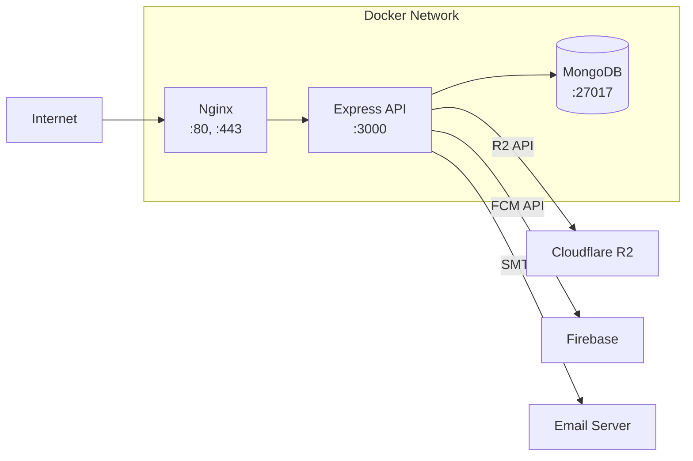

### Deployment Commands

```bash
# Development
npm run dev                    # nodemon + SWC watch

# Build
npm run build                  # SWC compile to dist/

# Production (PM2)
npm run start:prod             # pm2 start ecosystem.config.js
pm2 status                     # Check process status
pm2 logs frame-beauty          # View logs

# Docker
docker-compose up -d           # Start all services
docker-compose logs -f api     # Stream API logs
make deploy                    # Full build + deploy (see Makefile)
```

### PM2 Cluster Mode

The `ecosystem.config.js` runs the API in **cluster mode** for multi-core CPU utilization:

```javascript
{
  name: 'frame-beauty',
  script: 'dist/index.js',
  instances: 'max',       // one per CPU core
  exec_mode: 'cluster',
  watch: false,
  max_memory_restart: '1G'
}
```

### Nginx Configuration

Nginx handles:
- TLS termination (HTTPS)
- Gzip compression
- HTTP/2
- Static file serving
- Reverse proxy to Express (strips `/api` prefix)
- Security headers (`X-Frame-Options`, `X-XSS-Protection`, etc.)

---

## 15. Error Handling

### HTTP Exception Class

```typescript
class HttpException extends Error {
  constructor(
    public status: number,
    public message: string
  ) {
    super(message);
  }
}

// Usage in services:
throw new HttpException(404, 'Booking not found');
throw new HttpException(403, 'Access denied');
throw new HttpException(422, 'Validation failed');
```

### HTTP Status Code Conventions

| Status | Meaning | Usage |
|--------|---------|-------|
| `200` | OK | Successful GET, PATCH, PUT |
| `201` | Created | Successful POST that creates a resource |
| `204` | No Content | Successful DELETE |
| `400` | Bad Request | Business rule violation |
| `401` | Unauthorized | Missing or invalid JWT |
| `403` | Forbidden | Insufficient role/permissions |
| `404` | Not Found | Resource not found |
| `409` | Conflict | Duplicate resource (e.g., already following) |
| `422` | Unprocessable Entity | DTO validation failure |
| `429` | Too Many Requests | Rate limit exceeded |
| `500` | Internal Server Error | Unhandled server error |

### Logging

Winston-based structured logging with daily rotation:

```
logs/
├── debug/   debug-YYYY-MM-DD.log   (all levels)
├── error/   error-YYYY-MM-DD.log   (error only)
└── security/ security-YYYY-MM-DD.log (auth events)
```

Log levels: `error > warn > info > http > debug`

---

## Related Documentation

| Document | Description |
|----------|-------------|
| [`README.md`](README.md) | Project setup, getting started |
| [`swagger.yaml`](swagger.yaml) | Full OpenAPI specification (~11,000 lines) |
| [`src/systems/AuthSystem/README.md`](src/systems/AuthSystem/README.md) | AuthSystem deep-dive |
| [`src/systems/UserManager/README.md`](src/systems/UserManager/README.md) | UserManager deep-dive |
| [`src/systems/BookingSystem/README.md`](src/systems/BookingSystem/README.md) | BookingSystem deep-dive |
| [`src/systems/ServiceCatalogSystem/README.md`](src/systems/ServiceCatalogSystem/README.md) | ServiceCatalogSystem deep-dive |
| [`src/systems/FeedContentSystem/README.md`](src/systems/FeedContentSystem/README.md) | FeedContentSystem deep-dive |
| [`src/systems/ChatSystem/README.md`](src/systems/ChatSystem/README.md) | ChatSystem deep-dive |
| [`src/systems/NotificationSystem/README.md`](src/systems/NotificationSystem/README.md) | NotificationSystem deep-dive |
| [`src/systems/AdminSystem/README.md`](src/systems/AdminSystem/README.md) | AdminSystem deep-dive |
| [`src/systems/MarketplaceSystem/README.md`](src/systems/MarketplaceSystem/README.md) | MarketplaceSystem deep-dive |

---

<p align="center">
  <em>Frame Beauty Backend — Built with ❤️ in Tunisia</em>
</p>
