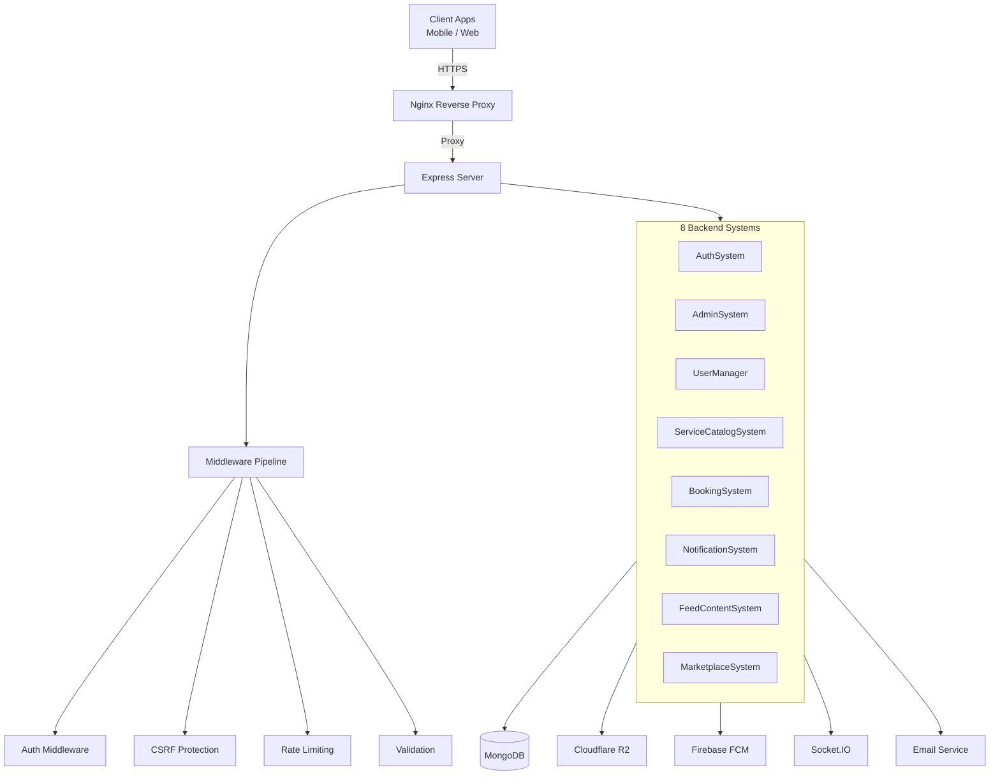
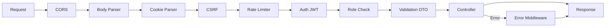

# 🪞 Frame Beauty — Backend API

> **Frame Beauty** is a Tunisian startup revolutionizing the beauty and salon industry by connecting clients with beauty lounges, agents (stylists/technicians), and an integrated marketplace — all from a single platform.

[](https://nodejs.org/)
[](https://www.typescriptlang.org/)
[](https://expressjs.com/)
[](https://www.mongodb.com/)
[](https://socket.io/)

---

## Table of Contents

- [About Frame Beauty](#about-frame-beauty)
- [Tech Stack](#tech-stack)
- [Architecture Overview](#architecture-overview)
- [System Map](#system-map)
- [Project Structure](#project-structure)
- [Getting Started](#getting-started)
- [Environment Variables](#environment-variables)
- [API Overview](#api-overview)
- [Middleware Pipeline](#middleware-pipeline)
- [Deployment](#deployment)
- [Key Constants](#key-constants)

---

## About Frame Beauty

**Frame Beauty** is built by a Tunisian startup team aiming to digitize and streamline the beauty industry in Tunisia and beyond. The platform serves three core user types:

| Role | Description |
|------|-------------|
| **Client** | End-users who discover lounges, book services, join queues, follow lounges, interact with social feeds, and shop in the marketplace |
| **Lounge** | Beauty salons/barber shops that manage their service catalog, agents, bookings, queues, social content, and online store |
| **Agent** | Stylists, barbers, or technicians employed by a lounge who handle service delivery and queue management |
| **Admin** | Platform administrators who moderate content, manage users, oversee the catalog, and monitor system health |

### What Frame Does

```
┌─────────────┐     ┌──────────────┐     ┌─────────────┐
│   Clients   │────▶│ Frame Beauty │◀────│   Lounges   │
│  (discover, │     │   Platform   │     │  (manage,   │
│   book,     │     │              │     │   serve,    │
│   shop)     │     │  🇹🇳 Tunisia │     │   sell)     │
└─────────────┘     └──────┬───────┘     └─────────────┘
                           │
                    ┌──────▼───────┐
                    │    Agents    │
                    │  (deliver    │
                    │   services)  │
                    └──────────────┘
```

**Core Value Propositions:**
- **For Clients:** Discover nearby lounges, book appointments or join live queues, follow favorite lounges, interact with beauty content, and shop beauty products
- **For Lounges:** Manage service catalog, agents, and real-time queues; publish content (posts/reels); run an online store
- **For the Industry:** A centralized Tunisian beauty ecosystem replacing fragmented phone-based booking and discovery

---

## Tech Stack

| Layer | Technology |
|-------|-----------|
| **Runtime** | Node.js 18+ |
| **Language** | TypeScript 5.x |
| **Framework** | Express 4.18.1 |
| **Database** | MongoDB with Mongoose 6.5.0 |
| **Real-time** | Socket.IO 4.8.3 |
| **Authentication** | JWT (access + refresh tokens) + Google OAuth 2.0 via Passport.js |
| **Push Notifications** | Firebase Admin SDK (FCM) |
| **File Storage** | Cloudflare R2 (S3-compatible) |
| **Email** | Nodemailer |
| **Validation** | class-validator + class-transformer |
| **Process Manager** | PM2 (ecosystem.config.js) |
| **Containerization** | Docker + Docker Compose |
| **Reverse Proxy** | Nginx |
| **Scheduling** | node-cron |

---

## Architecture Overview

The backend follows a **modular system-based architecture** where each business domain is encapsulated in its own system under `src/systems/`. Each system is self-contained with its own models, routes, controllers, services, DTOs, interfaces, and tests.



### Request Flow

```
HTTP Request
  → Nginx (SSL termination, rate limit)
    → Express (CORS, body parsing, cookies)
      → CSRF Middleware
        → Auth Middleware (JWT verification)
          → Role Middleware (admin/lounge/client check)
            → Validation Middleware (DTO validation)
              → Controller (extract params, call service)
                → Service (business logic, DB queries)
                  → Model (Mongoose schema + MongoDB)
              → Response (JSON)
```

---

## System Map

| # | System | Base Route | Description | Key Models |
|---|--------|-----------|-------------|------------|
| 1 | [**AuthSystem**](src/systems/AuthSystem/README.md) | `/v1/auth` | Authentication & authorization — signup (magic link), login, OAuth, JWT refresh, password reset, session management | VerificationToken |
| 2 | [**AdminSystem**](src/systems/AdminSystem/README.md) | `/v1/admin` | Admin dashboard — user management, system health, content moderation, catalog management facade | — (uses other system models) |
| 3 | [**UserManager**](src/systems/UserManager/README.md) | `/v1/me`, `/v1/client`, `/v1/agents`, `/v1/follows` | User profiles, client browsing, agent CRUD, follow system | User, Agent, Follow |
| 4 | [**ServiceCatalogSystem**](src/systems/ServiceCatalogSystem/README.md) | `/v1/lounge-services`, `/v1/services`, `/v1/service-categories`, `/v1/ratings`, `/v1/service-suggestions` | Service catalog, lounge service management, ratings, suggestions | Service, ServiceCategory, LoungeService, Rating, ServiceSuggestion |
| 5 | [**BookingSystem**](src/systems/BookingSystem/README.md) | `/v1/bookings`, `/v1/queues` | Appointment booking, real-time queue management | Booking, Queue |
| 6 | [**NotificationSystem**](src/systems/NotificationSystem/README.md) | `/v1/notifications` | In-app notifications, push (FCM), real-time (Socket.IO) | Notification |
| 7 | [**FeedContentSystem**](src/systems/FeedContentSystem/README.md) | `/v1/posts`, `/v1/reels`, `/v1/comments`, `/v1/likes`, `/v1/feed`, `/v1/reports` | Social feed — posts, reels, comments, likes, saves, hashtags, reports | Post, Reel, Comment, Like, ContentLike, ContentSave, Hashtag, Report |
| 8 | [**MarketplaceSystem**](src/systems/MarketplaceSystem/README.md) | `/v1/marketplace/*` | E-commerce — stores, products, orders, cart, reviews, wishlists, analytics | Store, Product, Order, Cart, Review, Wishlist, ProductCategory, ProductCategorySuggestion |

**Totals:** 28 models · 180+ endpoints · 50+ service classes · 22 DTO groups

---

## Project Structure

```
Frame Back/
├── src/
│   ├── app.ts                  # Express app configuration
│   ├── server.ts               # HTTP server + Socket.IO initialization
│   ├── index.ts                # Entry point
│   ├── config/
│   │   ├── index.ts            # Environment config loader
│   │   ├── constants.ts        # App-wide constants
│   │   └── passport.ts         # Google OAuth strategy
│   ├── databases/
│   │   └── index.ts            # MongoDB connection
│   ├── exceptions/
│   │   └── HttpException.ts    # Custom HTTP error class
│   ├── middlewares/
│   │   ├── auth.middleware.ts   # JWT verification
│   │   ├── role.middleware.ts   # Role-based access control
│   │   ├── csrf.middleware.ts   # CSRF protection
│   │   ├── rate-limit.middleware.ts
│   │   ├── validation.middleware.ts
│   │   ├── image-upload.middleware.ts
│   │   └── error.middleware.ts  # Global error handler
│   ├── utils/
│   │   ├── logger.ts           # Winston logger
│   │   ├── email.ts            # Email service
│   │   ├── cron.ts             # Scheduled jobs
│   │   ├── initAdmin.ts        # Seed admin user
│   │   └── validateEnv.ts      # Env validation
│   └── systems/
│       ├── AuthSystem/
│       ├── AdminSystem/
│       ├── UserManager/
│       ├── ServiceCatalogSystem/
│       ├── BookingSystem/
│       ├── NotificationSystem/
│       ├── FeedContentSystem/
│       └── MarketplaceSystem/
├── docker-compose.yml
├── Dockerfile
├── nginx.conf
├── ecosystem.config.js         # PM2 config
├── package.json
├── tsconfig.json
└── swagger.yaml
```

Each system follows this internal structure:
```
SystemName/
├── controllers/     # HTTP request handlers
├── dtos/            # Data Transfer Objects (validation)
├── interfaces/      # TypeScript interfaces & enums
├── models/          # Mongoose schemas
├── routes/          # Express route definitions
├── services/        # Business logic
└── tests/           # System-specific tests
```

---

## Getting Started

### Prerequisites

- **Node.js** ≥ 18
- **MongoDB** ≥ 6 (local or Atlas)
- **Cloudflare R2** bucket (for file uploads)
- **Firebase** project (for push notifications)
- **Google OAuth** credentials (for social login)

### Installation

```bash
# Clone the repository
git clone <repo-url>
cd "Frame Back"

# Install dependencies
npm install

# Copy environment file
cp .env.example .env
# Fill in all required values (see Environment Variables below)

# Development
npm run dev

# Production build
npm run build
npm start
```

### Docker

```bash
# Build and run with Docker Compose
docker-compose up --build

# Or standalone
docker build -t frame-beauty-api .
docker run -p 3000:3000 frame-beauty-api
```

---

## Environment Variables

| Variable | Description |
|----------|-------------|
| `NODE_ENV` | `development` / `production` |
| `PORT` | Server port (default: 3000) |
| `MONGO_URI` | MongoDB connection string |
| `ACCESS_TOKEN_SECRET` | JWT access token secret |
| `REFRESH_TOKEN_SECRET` | JWT refresh token secret |
| `GOOGLE_CLIENT_ID` | Google OAuth client ID |
| `GOOGLE_CLIENT_SECRET` | Google OAuth client secret |
| `GOOGLE_CALLBACK_URL` | Google OAuth redirect URI |
| `R2_ACCOUNT_ID` | Cloudflare R2 account |
| `R2_ACCESS_KEY_ID` | R2 access key |
| `R2_SECRET_ACCESS_KEY` | R2 secret key |
| `R2_BUCKET_NAME` | R2 bucket name |
| `R2_PUBLIC_URL` | R2 public URL |
| `FIREBASE_*` | Firebase Admin SDK credentials |
| `SMTP_HOST` / `SMTP_PORT` / `SMTP_USER` / `SMTP_PASS` | Email config |
| `CLIENT_URL` | Frontend URL (for CORS, magic links) |
| `CSRF_SECRET` | CSRF token secret |

---

## API Overview

All endpoints are prefixed with `/v1/`. Authentication is via **Bearer JWT** in the `Authorization` header or **httpOnly cookies**.

### Authentication Flow
```
Signup → Magic Link Email → Verify → JWT Access + Refresh Tokens
Login  → Credentials Check → JWT Access + Refresh Tokens
OAuth  → Google Redirect → Callback → JWT Access + Refresh Tokens
```

### Token Strategy
- **Access Token:** 15 minutes, signed JWT `{_id, type}`
- **Refresh Token:** 7 days, rotated on each use, max 5 sessions per user
- **CSRF:** Double-submit cookie pattern for web clients

### Rate Limits
| Endpoint Type | Limit |
|---------------|-------|
| Login | 5 requests / 15 min |
| Signup | 3 requests / 1 hr |
| Content creation | 20 requests / 1 hr |
| Likes / Follows / Comments | 30 requests / 15 min |

---

## Middleware Pipeline



| Middleware | File | Purpose |
|-----------|------|---------|
| **Auth** | `auth.middleware.ts` | Verifies JWT, attaches `user` to request |
| **Role** | `role.middleware.ts` | `adminMiddleware`, `loungeMiddleware`, `clientMiddleware`, `adminOrLoungeMiddleware`, `adminOrLoungeOrClientMiddleware` |
| **CSRF** | `csrf.middleware.ts` | CSRF token generation & validation |
| **Rate Limit** | `rate-limit.middleware.ts` | Per-endpoint rate limiting |
| **Validation** | `validation.middleware.ts` | class-validator DTO validation |
| **Image Upload** | `image-upload.middleware.ts` | Multer single/array with type & size validation |
| **Error** | `error.middleware.ts` | Global `HttpException` handler |

---

## Deployment

### Docker Compose (Recommended)

```yaml
# docker-compose.yml includes:
# - frame-beauty-api (Node.js app)
# - MongoDB
# - Nginx reverse proxy
```

### PM2 (Production)

```bash
npm run build
pm2 start ecosystem.config.js
```

### Monitoring

```bash
# Health check
./monitor.sh

# PM2 dashboard
pm2 monit
```

---

## Key Constants

| Constant | Value |
|----------|-------|
| `ACCESS_TOKEN_EXPIRES` | 900s (15 min) |
| `REFRESH_TOKEN_EXPIRES` | 604800s (7 days) |
| `MAX_SESSIONS_PER_USER` | 5 |
| `BCRYPT_ROUNDS` | 10 |
| `MAX_FAILED_LOGIN_ATTEMPTS` | 5 |
| `ACCOUNT_LOCKOUT_DURATION` | 900,000 ms (15 min) |
| Notification TTL | 90 days |
| Max post media | 10 files |
| Reel max duration | 60 seconds |

---

## License

Proprietary — © Frame Beauty, Tunisia. All rights reserved.
# Frame Beauty API

> Enterprise backend API for the **Frame Beauty** platform — a child application of the **Frame** ecosystem.

Frame Beauty powers salon discovery, booking, real-time queue management, and social features for beauty professionals and clients.

---

## Tech Stack

| Layer | Technology |
|---|---|
| Runtime | Node.js 18+ / TypeScript |
| Framework | Express.js |
| Database | MongoDB 6+ / Mongoose |
| Auth | JWT (access + refresh rotation) + Google OAuth 2.0 |
| Real-time | Socket.IO |
| Media | Cloudflare R2 |
| Push | Firebase Cloud Messaging |
| Email | Nodemailer (Brevo SMTP) |
| Process Mgmt | PM2 |
| Container | Docker + Nginx reverse proxy |

## Prerequisites

- Node.js 18+ and npm 9+
- MongoDB 6+ (local or hosted)

## Setup

1. Install dependencies:

```bash
npm install
```

2. Copy the example environment file and fill in your values:

```bash
cp .env.example .env.development.local
```

Required variables:
```env
# Server
NODE_ENV=development
PORT=3000

# MongoDB
DB_HOST=127.0.0.1
DB_PORT=27017
DB_DATABASE=frame_beauty_dev

# JWT — must be two distinct secrets
SECRET_KEY=<your-jwt-secret>
REFRESH_TOKEN_SECRET=<different-refresh-secret>

# Admin seed account
ADMIN_EMAIL=admin@framebeauty.com
ADMIN_PASSWORD=Admin@123

# CORS allowed origin(s)
ORIGIN=http://localhost:3001

# Google OAuth 2.0
GOOGLE_CLIENT_ID=<google-client-id>
GOOGLE_CLIENT_SECRET=<google-client-secret>
GOOGLE_REDIRECT_URI=http://localhost:3000/v1/auth/google/callback
FRONTEND_BASE_URL=http://localhost:3001

# Email — Brevo SMTP (optional — magic-link and password reset)
BREVO_SMTP_USER=<brevo-smtp-login>
BREVO_SMTP_KEY=<brevo-smtp-api-key>
SMTP_FROM=noreply@framebeauty.com

# Media — Cloudflare R2 (required if ENABLE_IMAGE_UPLOAD=true)
ENABLE_IMAGE_UPLOAD=false
R2_ACCOUNT_ID=
R2_ACCESS_KEY_ID=
R2_SECRET_ACCESS_KEY=
R2_BUCKET_NAME=
R2_PUBLIC_URL=

# Firebase FCM push notifications (optional)
FIREBASE_SERVICE_ACCOUNT_PATH=./firebase-service-account.json
# — or inline credentials:
FIREBASE_PROJECT_ID=
FIREBASE_CLIENT_EMAIL=
FIREBASE_PRIVATE_KEY=
```

## Development

```bash
npm run dev
```

## Production Build & Run

```bash
npm run build
npm start
```

## Docker

```bash
npm run docker:build
npm run docker:up
```

## API Documentation

Swagger UI is available at `/api-docs` in non-production environments.

## Architecture — Vertical Domain Systems

The codebase is organised into **8 self-contained domain systems**, each owning its own controllers, services, models, routes, DTOs, and interfaces. This structure is designed for future microservice extraction.

```
src/
├── systems/
│   ├── AuthSystem/           # Registration, login, JWT, OAuth, sessions
│   ├── UserManager/          # User profiles (client/lounge), agents, follow graph
│   ├── BookingSystem/        # Appointments, walk-in queues, analytics, cron
│   ├── ServiceCatalogSystem/ # Service catalog, lounge offerings, ratings, suggestions
│   ├── NotificationSystem/   # WebSocket (Socket.IO), FCM push, notification history
│   ├── FeedContentSystem/    # Posts, reels, comments, likes, feed, moderation
│   ├── MarketplaceSystem/    # Stores, products, cart, orders, reviews, wishlist
│   └── AdminSystem/          # Platform administration, dashboards, moderation
│
├── shared/
│   └── services/             # Cross-system utilities (Cloudflare R2 upload)
│
├── config/                   # Env vars, Passport OAuth strategy, constants
├── databases/                # MongoDB connection
├── exceptions/               # HttpException base class
├── interfaces/               # Shared interfaces (routes.interface)
├── middlewares/              # Auth, CSRF, rate-limit, role, validation, upload
└── utils/                    # Logger, email, cron, admin seeder, validators
```

Each system has its own `README.md`:

| System | Description |
|---|---|
| [AuthSystem](src/systems/AuthSystem/README.md) | Magic-link signup, JWT refresh rotation, Google OAuth, CSRF |
| [UserManager](src/systems/UserManager/README.md) | Profiles, agents, blocking, social follow graph |
| [BookingSystem](src/systems/BookingSystem/README.md) | Service appointments, walk-in queue, cron automation |
| [ServiceCatalogSystem](src/systems/ServiceCatalogSystem/README.md) | Global catalog, lounge service offerings, ratings |
| [NotificationSystem](src/systems/NotificationSystem/README.md) | Real-time (Socket.IO) + FCM push + notification history |
| [FeedContentSystem](src/systems/FeedContentSystem/README.md) | Posts, reels, hashtags, comments, personalized feed |
| [MarketplaceSystem](src/systems/MarketplaceSystem/README.md) | E-commerce — stores, products, orders, reviews |
| [AdminSystem](src/systems/AdminSystem/README.md) | Platform admin — user, content, catalog management |

## Available Scripts

| Script | Description |
|---|---|
| `npm run dev` | Start development server with hot reload |
| `npm run build` | Compile TypeScript to dist/ |
| `npm start` | Build + start in production mode |
| `npm test` | Run test suite |
| `npm run lint` | ESLint check |
| `npm run deploy:prod` | Build + PM2 production deploy |
| `npm run audit` | Security audit of production deps |

## Health Checks

- `GET /health` — Application health (always available)
- `GET /ready` — Readiness probe (database + WebSocket status)

---

**Part of the Frame Enterprise Platform** — Built with TypeScript, Express.js, MongoDB</content>
<parameter name="oldString">## Prerequisites
- Node.js 16+ and npm
- MongoDB (local or hosted)

## Setup
1. Install dependencies:

```bash
npm install
```

2. Create a local environment file (example `.env`):

```
DB_HOST=127.0.0.1
DB_PORT=27017
DB_DATABASE=dev
JWT_SECRET=your_jwt_secret
PORT=3000
```

## Run (development)

```bash
npm run dev
```

## Build & Run (production)

```bash
npm run build
npm start
```