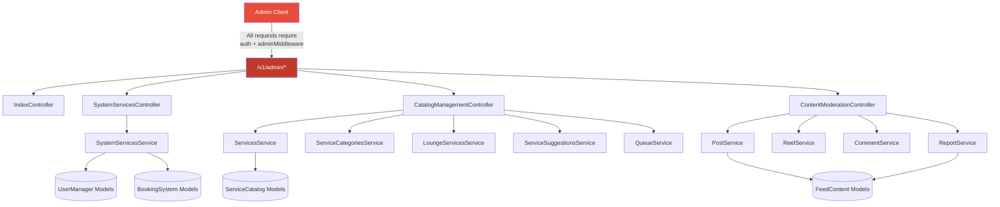
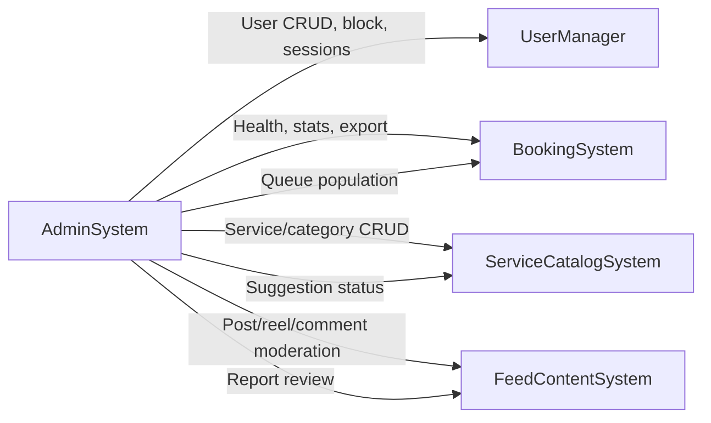
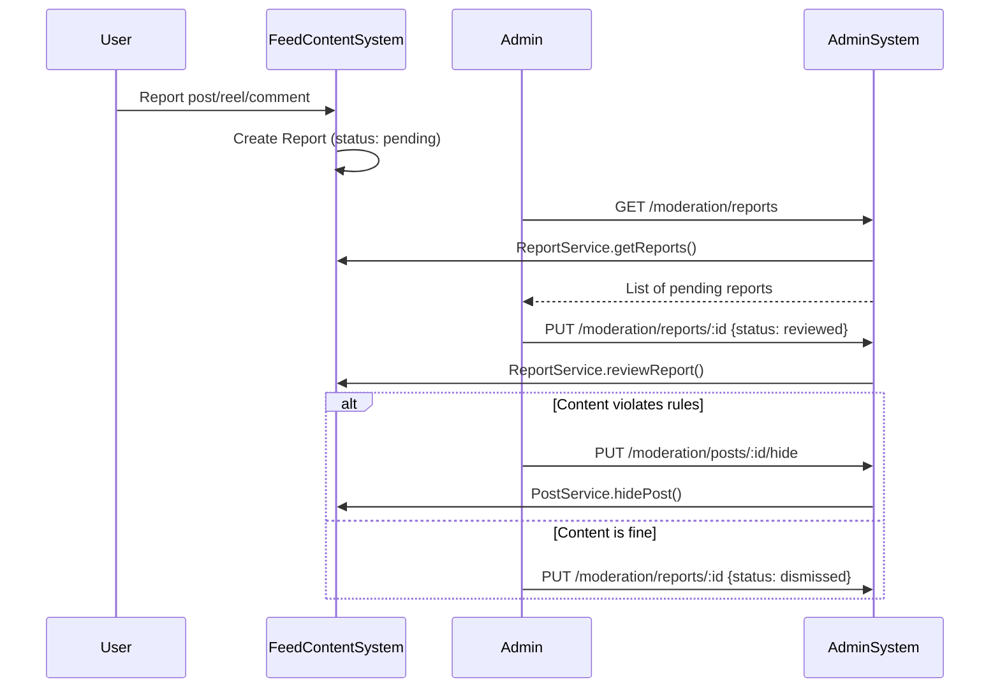
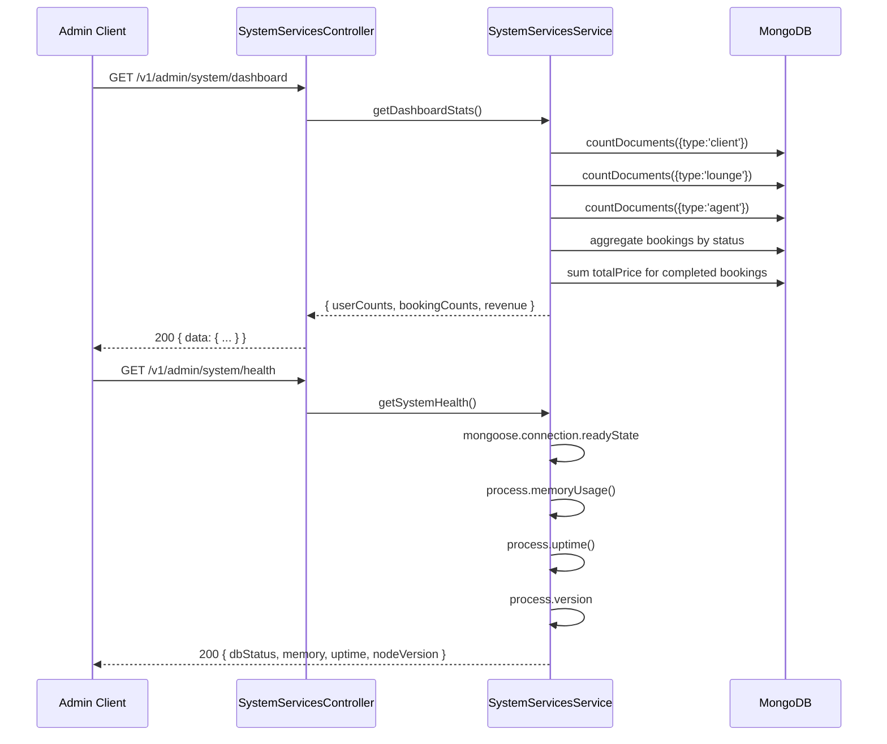
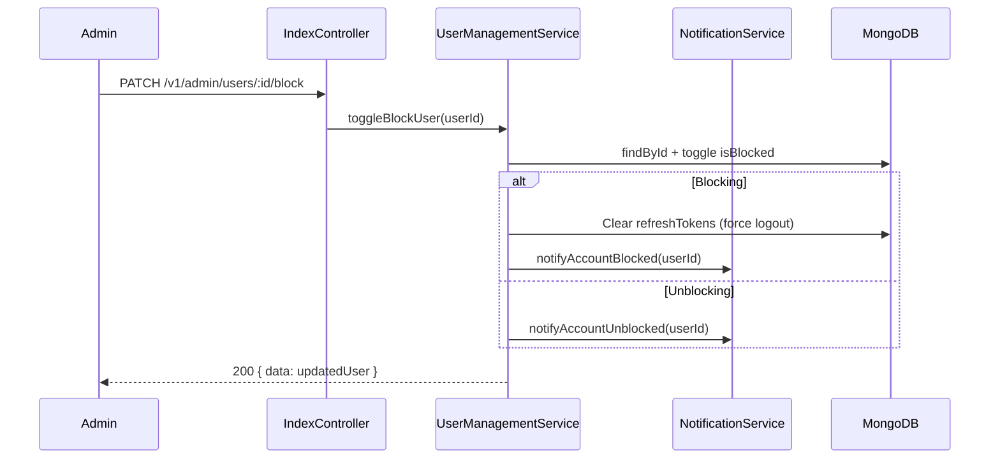
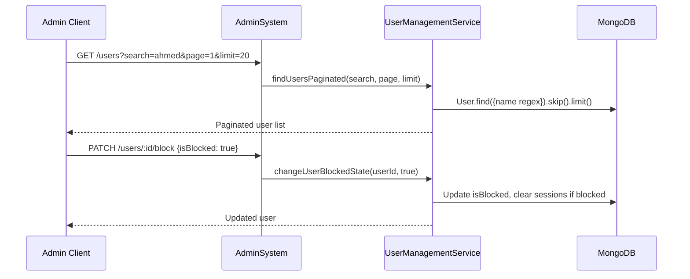

<p align="center">
  
</p>

# AdminSystem

> The centralized administration dashboard providing platform-wide management capabilities: user CRUD, system health monitoring, content moderation, catalog management facade, and audit logging.

---

## Table of Contents

- [Overview](#overview)
- [Architecture](#architecture)
- [API Endpoints](#api-endpoints)
- [Controllers](#controllers)
- [Services](#services)
- [System Flow](#system-flow)
- [Directory Structure](#directory-structure)

---

## Overview

The AdminSystem acts as a **super-layer** on top of all other systems, giving platform administrators a single interface to manage users, moderate content, oversee the service catalog, monitor system health, and perform operational tasks.

**Key Capabilities:**
- User management (CRUD, block/unblock, session management, password reset)
- System monitoring (health checks, dashboard stats, activity logs)
- Content moderation (hide/unhide/delete posts, reels, comments; review reports)
- Service catalog management (services, categories, suggestions, lounge services)
- Queue population trigger
- Data export and audit logging

> **Note:** The AdminSystem does not own any database models. It operates as a facade, delegating to services from UserManager, FeedContentSystem, ServiceCatalogSystem, BookingSystem, and NotificationSystem.

---

## Architecture



### Cross-System Dependencies



---

## API Endpoints

### Base: `/v1/admin` — All endpoints require `authMiddleware` + `adminMiddleware`

### User Management

| Method | Endpoint | Description |
|--------|----------|-------------|
| `GET` | `/users` | List all users (paginated, searchable) |
| `GET` | `/users/:id` | Get user details by ID |
| `POST` | `/users` | Create a new user |
| `PUT` | `/users/:id` | Update user data |
| `DELETE` | `/users/:id` | Delete a user |
| `PATCH` | `/users/:id/block` | Toggle user blocked state |
| `GET` | `/session-info` | Get all currently online users |
| `GET` | `/lounges/names` | Get all lounge names (dropdown data) |

### System Operations

| Method | Endpoint | Description |
|--------|----------|-------------|
| `GET` | `/system/stats` | Aggregate stats across all collections |
| `GET` | `/system/health` | DB connection status, memory usage, uptime |
| `GET` | `/system/activity-log` | Recent user activity (default: last 100) |
| `GET` | `/system/dashboard` | User, booking, revenue dashboard stats |
| `POST` | `/system/users/:userId/clear-sessions` | Clear all sessions for a user |
| `POST` | `/system/users/:userId/reset-password` | Admin reset user password |
| `GET` | `/system/users/:userId/export` | Export user data (profile + bookings + ratings + follows) |
| `POST` | `/system/audit-log` | Create an admin audit log entry |

### Content Moderation

| Method | Endpoint | Description |
|--------|----------|-------------|
| `PUT` | `/moderation/posts/:id/hide` | Hide a post |
| `PUT` | `/moderation/posts/:id/unhide` | Unhide a post |
| `DELETE` | `/moderation/posts/:id` | Permanently delete a post |
| `PUT` | `/moderation/reels/:id/hide` | Hide a reel |
| `PUT` | `/moderation/reels/:id/unhide` | Unhide a reel |
| `DELETE` | `/moderation/reels/:id` | Permanently delete a reel |
| `PUT` | `/moderation/comments/:id/hide` | Hide a comment |
| `PUT` | `/moderation/comments/:id/unhide` | Unhide a comment |
| `DELETE` | `/moderation/comments/:id` | Permanently delete a comment |
| `GET` | `/moderation/reports` | List reports (filterable by status) |
| `PUT` | `/moderation/reports/:id` | Review a report (approve/dismiss) |

### Catalog Management

| Method | Endpoint | Description |
|--------|----------|-------------|
| `GET` | `/services` | Get services (paginated) |
| `POST` | `/services` | Create a service |
| `POST` | `/services/bulk` | Bulk create services |
| `GET` | `/services/search` | Search services by name |
| `GET` | `/services/category/:categoryId` | Get services by category |
| `GET` | `/services/:id` | Get service by ID |
| `PUT` | `/services/:id` | Update a service |
| `DELETE` | `/services/:id` | Delete a service |
| `GET` | `/service-categories` | List all categories |
| `POST` | `/service-categories` | Create a category |
| `GET` | `/service-categories/search` | Search categories |
| `GET` | `/service-categories/:id` | Get category by ID |
| `PUT` | `/service-categories/:id` | Update a category |
| `DELETE` | `/service-categories/:id` | Delete a category |
| `GET` | `/suggestions/stats` | Suggestion statistics |
| `PATCH` | `/suggestions/:id/status` | Update suggestion status |
| `PATCH` | `/suggestions/:id/approve` | Admin approve suggestion (auto-creates service) |
| `GET` | `/lounge-services` | List lounge services (paginated) |
| `POST` | `/lounge-services/bulk` | Bulk create lounge services |
| `GET` | `/lounge-services/search` | Search lounge services |
| `POST` | `/queue/populate` | Trigger daily queue population |

---

## Controllers

### IndexController

Simple health check / service info endpoint.

```
GET /v1/admin → { name, version, status }
```

### SystemServicesController

Manages platform-level operations and monitoring.

| Method | Input | Output |
|--------|-------|--------|
| `getAllAdminServices()` | — | Aggregate counts from all collections |
| `getSystemHealth()` | — | `{ dbStatus, memoryUsage, uptime, nodeVersion }` |
| `getUserActivityLog(limit?)` | `?limit=100` | Recent user login/signup/action events |
| `getDashboardStats()` | — | `{ totalUsers, totalBookings, revenue, ... }` |
| `clearUserSessions(userId)` | `:userId` | Clears all refresh tokens & sets offline |
| `resetUserPassword(userId, newPassword)` | `:userId`, body | Hashes & updates password |
| `exportUserData(userId)` | `:userId` | `{ user, bookings, ratings, follows }` |
| `createAuditLog(action, userId, details)` | body | Creates audit trail entry |

### CatalogManagementController

Admin facade over ServiceCatalogSystem for managing the platform service catalog.

**Responsibilities:**
- Full CRUD on global services and service categories
- Bulk import of services and lounge services
- Service suggestion workflow management
- Daily queue population trigger

### ContentModerationController

Manages user-generated content moderation across the FeedContentSystem.

**Moderation Flow:**


---

## Services

### SystemServicesService

| Method | Description |
|--------|-------------|
| `getAllAdminServices()` | Runs `countDocuments()` on User, Booking, Post, Reel, Service, LoungeService, etc. |
| `getSystemHealth()` | Checks `mongoose.connection.readyState`, `process.memoryUsage()`, `process.uptime()` |
| `getUserActivityLog(limit)` | Queries recent user records sorted by `updatedAt` |
| `getDashboardStats()` | Aggregates user counts by type, booking counts by status, revenue sums |
| `clearUserSessions(userId)` | Sets `refreshTokens: []`, `sessionTrack.isOnline: false` |
| `resetUserPassword(userId, newPassword)` | Hashes with bcrypt, sets `passwordChangedAt`, clears sessions |
| `exportUserData(userId)` | Joins user profile + bookings + ratings + follows into single export |
| `createAuditLog(action, userId, details)` | Persists admin action for accountability |

---

## System Flow

### Admin Dashboard Load



### User Block / Unblock Flow



### User Management Flow



---

## Security Model

All AdminSystem endpoints enforce **double middleware protection**:

```
authMiddleware   → valid JWT required
    ↓
adminMiddleware  → user.type === 'admin' required
    ↓
Controller method
```

Any request without a valid admin JWT returns `401 Unauthorized`. Any authenticated non-admin user gets `403 Forbidden`.

> **Principle of Least Privilege**: Admin credentials are never created through a public API endpoint. Initial admin seeding is done via the `initAdmin` utility (`src/utils/initAdmin.ts`) which runs once at startup if no admin exists.

---

## Directory Structure

```
AdminSystem/
├── controllers/
│   ├── index.controller.ts            # Service info endpoint
│   ├── systemServices.controller.ts   # System ops & monitoring
│   ├── catalogManagement.controller.ts # Service catalog admin facade
│   └── contentModeration.controller.ts # Content moderation endpoints
├── routes/
│   └── admin.route.ts                 # All admin routes (auth + admin middleware)
├── services/
│   └── systemServices.service.ts      # System operations business logic
└── tests/
    └── admin.test.ts                  # Admin integration tests
```

> **No models, DTOs, or interfaces** — The AdminSystem reuses models and DTOs from the systems it manages.
