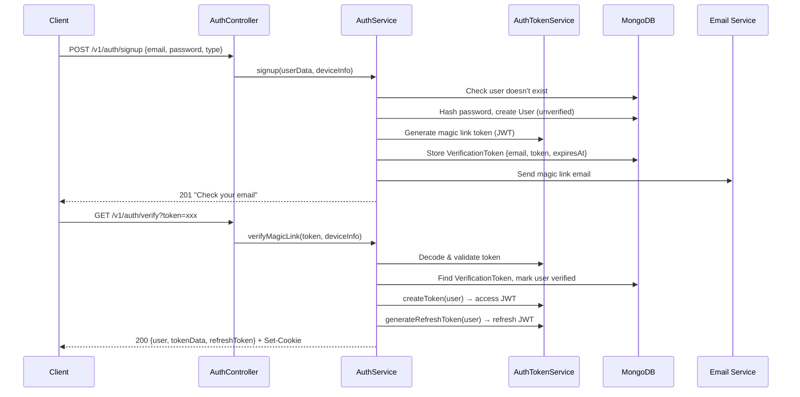
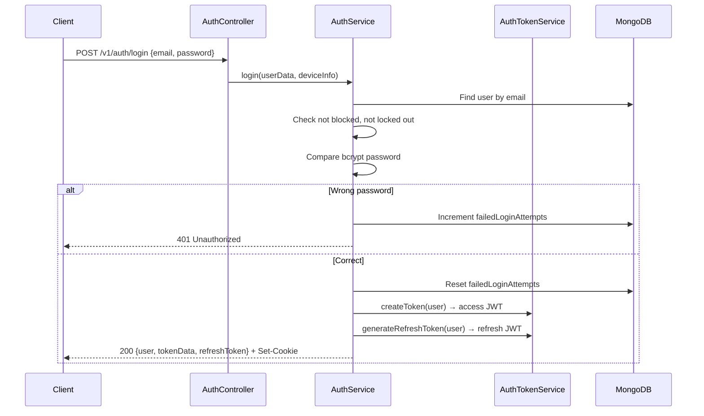
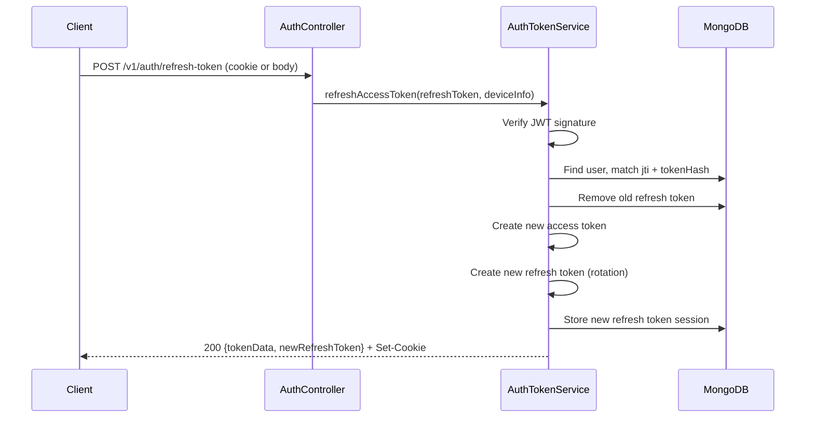
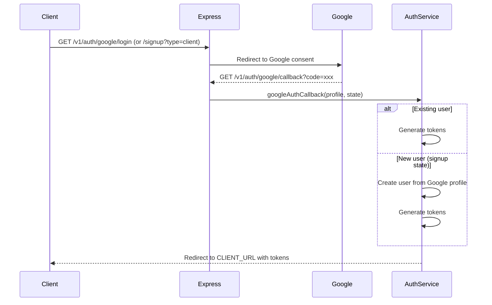
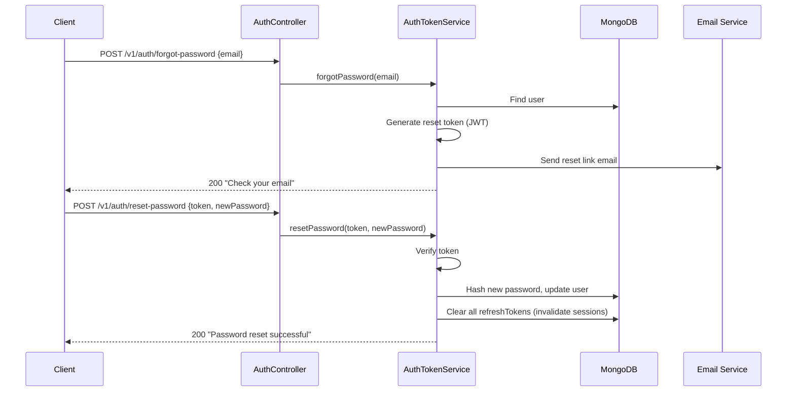
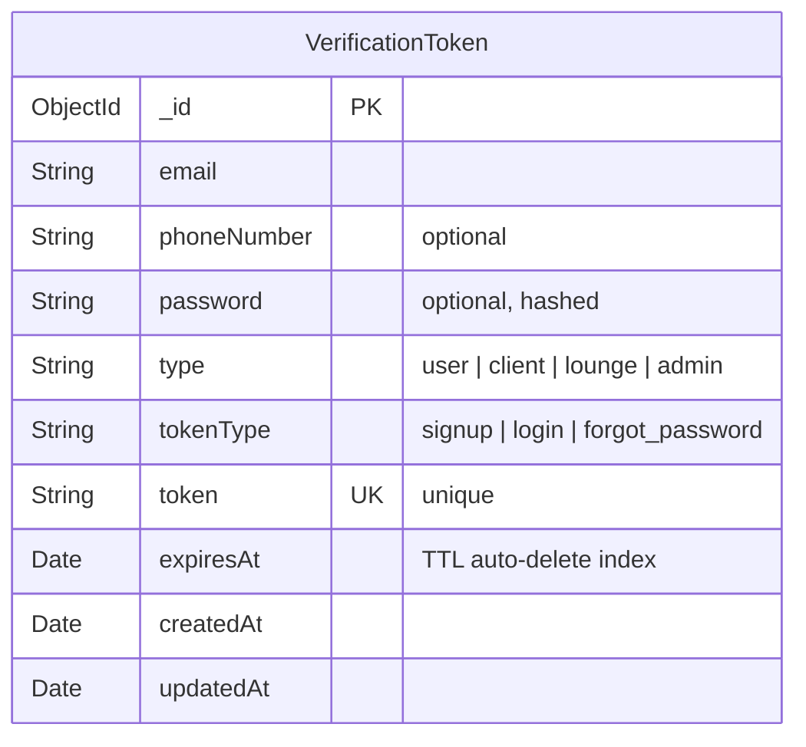
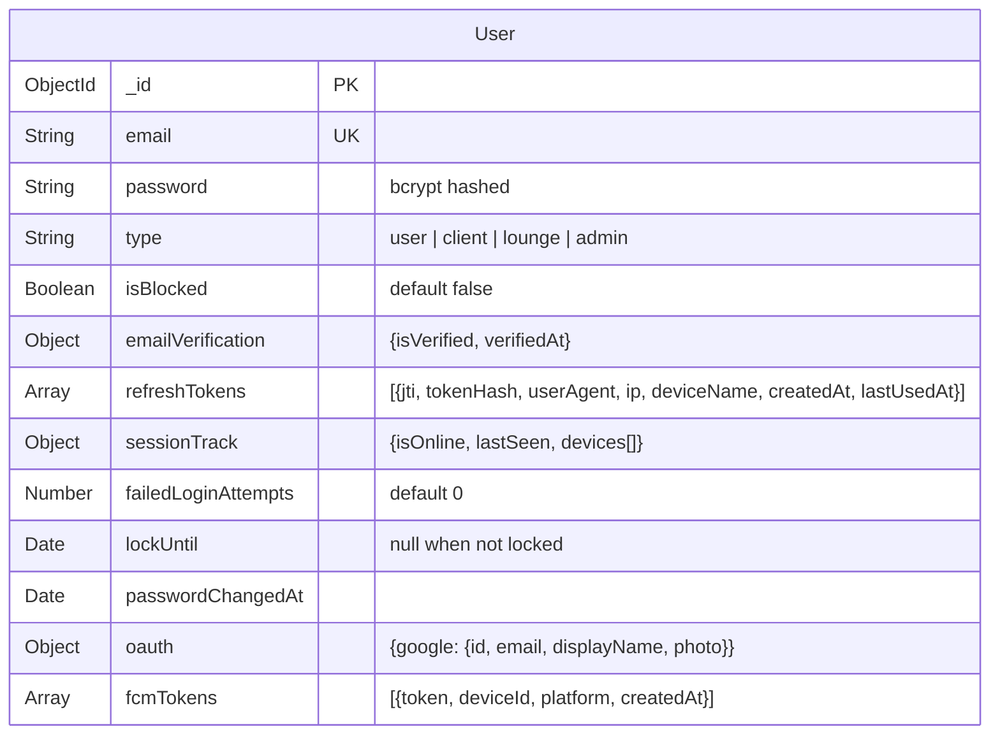

<p align="center">
  
</p>

# AuthSystem

> Handles all authentication and authorization flows: signup via magic link, email/password login, Google OAuth 2.0, JWT token management (access + refresh with rotation), password recovery, and multi-device session management.

---

## Table of Contents

- [Overview](#overview)
- [Authentication Flows](#authentication-flows)
- [Database Schema](#database-schema)
- [API Endpoints](#api-endpoints)
- [DTOs & Validation](#dtos--validation)
- [Services](#services)
- [Security Features](#security-features)
- [Interfaces](#interfaces)
- [Directory Structure](#directory-structure)

---

## Overview

The AuthSystem is the gateway to the Frame Beauty platform. It supports multiple authentication strategies and manages secure sessions across devices.

**Key Capabilities:**
- Magic link email signup with 6-digit verification codes
- Email/password login with brute-force protection
- Google OAuth 2.0 (login & signup)
- JWT access tokens (15 min) + refresh tokens (7 days) with automatic rotation
- Multi-device session tracking (max 5 sessions per user)
- Forgot/reset password flow
- Per-route rate limiting (signup, login, forgot password)

---

## Authentication Flows

### Signup Flow (Magic Link)



### Login Flow



### Token Refresh Flow



### Google OAuth Flow



### Password Reset Flow



---

## Database Schema

### VerificationToken



| Field | Type | Required | Description |
|-------|------|----------|-------------|
| `email` | String | Yes | User's email address |
| `phoneNumber` | String | No | Optional phone number |
| `password` | String | No | Hashed password (stored during signup before user creation) |
| `type` | String | Yes | User type: `user`, `client`, `lounge`, `admin` |
| `tokenType` | String | Yes | Purpose: `signup`, `login`, `forgot_password` |
| `token` | String | Yes | Unique verification token |
| `expiresAt` | Date | Yes | Auto-delete TTL index — MongoDB removes expired docs automatically |

> **Note:** The AuthSystem also relies heavily on the `User` model from [UserManager](../UserManager/README.md), specifically the `refreshTokens`, `sessionTrack`, `failedLoginAttempts`, `lockUntil`, `passwordChangedAt`, and `oauth` fields.

### User Fields Used by Auth



---

## API Endpoints

### Base: `/v1/auth`

| Method | Endpoint | Auth | Rate Limit | Description |
|--------|----------|------|------------|-------------|
| `POST` | `/signup` | No | 3/hr | Register with email — sends magic link |
| `GET` | `/verify` | No | General | Verify magic link token |
| `POST` | `/login` | No | 5/15min | Login with email + password |
| `POST` | `/logout` | Yes | — | Logout current device |
| `POST` | `/logout-all` | Yes | — | Logout all devices |
| `POST` | `/refresh-token` | No* | — | Refresh access token (*uses refresh token) |
| `POST` | `/forgot-password` | No | Forgot PW limit | Send password reset email |
| `POST` | `/reset-password` | No | — | Reset password with token |
| `GET` | `/google/login` | No | — | Initiate Google OAuth (login) |
| `GET` | `/google/signup` | No | — | Initiate Google OAuth (signup with type) |
| `GET` | `/google/callback` | No | — | Google OAuth callback |

### Request/Response Examples

**POST /v1/auth/signup**
```json
// Request
{
  "email": "user@example.com",
  "password": "securePass123",
  "type": "client",
  "firstName": "Ahmed",
  "lastName": "Ben Ali"
}

// Response 201
{
  "message": "Verification email sent. Please check your inbox."
}
```

**POST /v1/auth/login**
```json
// Request
{
  "email": "user@example.com",
  "password": "securePass123"
}

// Response 200
{
  "tokenData": {
    "token": "eyJhbG...",
    "expiresIn": 900
  },
  "refreshToken": "eyJhbG...",
  "user": { "_id": "...", "email": "...", "type": "client", ... }
}
```

---

## DTOs & Validation

| DTO | Fields | Validation Rules |
|-----|--------|-----------------|
| `SendVerificationEmailDto` | `email` | `@IsEmail()` |
| `VerifyEmailCodeDto` | `email`, `code` | `@IsEmail()`, `@IsString() @Length(6, 6)` |
| `LoginUserDto` | `email`, `password` | `@IsEmail()`, `@IsString() @MinLength(8)` |
| `ForgotPasswordDto` | `email` | `@IsEmail()` |
| `ResetPasswordDto` | `token`, `newPassword` | `@IsString()`, `@IsString() @MinLength(8)` |
| `SessionIdDto` | `sessionId` | `@IsString()` |

---

## Services

### AuthService (Orchestrator)

The main service that coordinates between token and session services.

| Method | Description |
|--------|-------------|
| `signup(userData, deviceInfo?)` | Dedup check → hash password → create user → generate magic link → send email |
| `verifyMagicLink(token, deviceInfo)` | Validate token → mark user verified → generate access + refresh tokens |
| `login(userData, deviceInfo?)` | Validate credentials → lockout check → block check → generate tokens |
| `forgotPassword(email)` | Delegates to AuthTokenService |
| `resetPassword(token, newPassword)` | Delegates to AuthTokenService |
| `refreshAccessToken(refreshToken, deviceInfo)` | Token rotation via AuthTokenService |
| `logout(userData, jti?)` | Remove single session via AuthSessionService |
| `logoutAllDevices(userId)` | Clear all sessions via AuthSessionService |
| `generateTokensForOAuthUser(user, deviceInfo)` | For Google OAuth flow |

### AuthTokenService

Handles JWT creation, verification, and refresh token management.

| Method | Description |
|--------|-------------|
| `createToken(user)` | Signs JWT `{_id, type}` with `ACCESS_TOKEN_EXPIRES` (15 min) |
| `generateRefreshToken(user, deviceInfo?)` | Creates unique `jti`, hashes token, stores in `user.refreshTokens`, enforces max 5 sessions |
| `refreshAccessToken(refreshToken, deviceInfo)` | Verifies → rotates → returns new token pair |
| `getUserByToken(token)` | Decodes JWT, finds user |
| `forgotPassword(email)` | Generates reset token, sends email |
| `resetPassword(token, newPassword)` | Validates token → hashes password → invalidates all sessions |

### AuthSessionService

Manages multi-device sessions and online status tracking.

| Method | Description |
|--------|-------------|
| `updateSessionTrack(userId, sessions)` | Updates `sessionTrack` with active devices |
| `parseDeviceName(userAgent?)` | Extracts device name from User-Agent header |
| `getDevicesFromSessions(sessions)` | Extracts device info from refresh token sessions |
| `logout(userData, jti?)` | Removes single session by `jti` |
| `logoutAllDevices(userId)` | Clears all `refreshTokens`, sets offline |
| `generateTokensForOAuthUser(user, deviceInfo)` | Access + refresh for OAuth flow |

---

## Security Features

| Feature | Implementation |
|---------|---------------|
| **Password Hashing** | bcrypt with 10 rounds |
| **Brute Force Protection** | 5 failed attempts → 15 min lockout |
| **Token Rotation** | Refresh tokens are single-use, rotated on each refresh |
| **Session Limit** | Max 5 concurrent sessions per user; oldest removed on overflow |
| **CSRF Protection** | Double-submit cookie pattern |
| **Rate Limiting** | Login: 5/15min, Signup: 3/hr, Forgot password: dedicated limit |
| **Token TTL** | Verification tokens auto-deleted via MongoDB TTL index |
| **Account Blocking** | Blocked users cannot authenticate |
| **Secure Cookies** | httpOnly, secure, sameSite for refresh tokens |

---

## Interfaces

```typescript
// Request with authenticated user
interface RequestWithUser extends Request {
  user: User;
}

// JWT payload
interface DataStoredInToken {
  _id: string;
  type: string;  // user | client | lounge | admin
}

// Access token response
interface TokenData {
  token: string;
  expiresIn: number;
}

// Refresh token JWT payload
interface RefreshTokenPayload {
  _id: string;
  type: string;
  jti: string;    // unique session ID
  iat: number;
  exp: number;
}

// Stored refresh token session
interface RefreshTokenSession {
  jti: string;
  tokenHash: string;
  userAgent?: string;
  ip?: string;
  deviceName?: string;
  createdAt: Date;
  lastUsedAt: Date;
}
```

---

## Directory Structure

```
AuthSystem/
├── controllers/
│   └── auth.controller.ts       # HTTP handlers for all auth endpoints
├── dtos/
│   └── auth.dto.ts              # Request validation DTOs
├── interfaces/
│   └── auth.interface.ts        # RequestWithUser, TokenData, etc.
├── models/
│   └── verificationToken.model.ts  # Mongoose schema for verification tokens
├── routes/
│   └── auth.route.ts            # Express route definitions
├── services/
│   ├── auth.service.ts          # Main auth orchestrator
│   ├── authToken.service.ts     # JWT & refresh token logic
│   └── authSession.service.ts   # Session management
└── tests/
    └── auth.test.ts             # Auth integration tests
```
