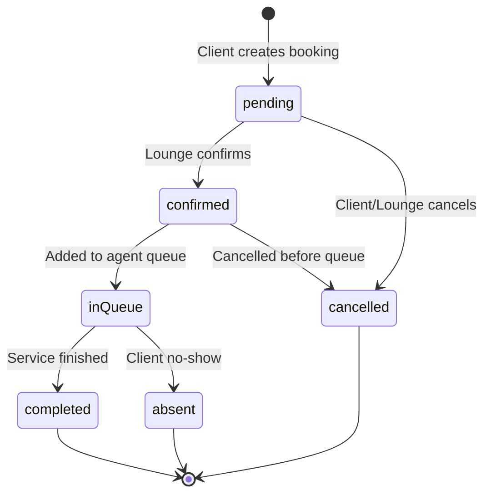
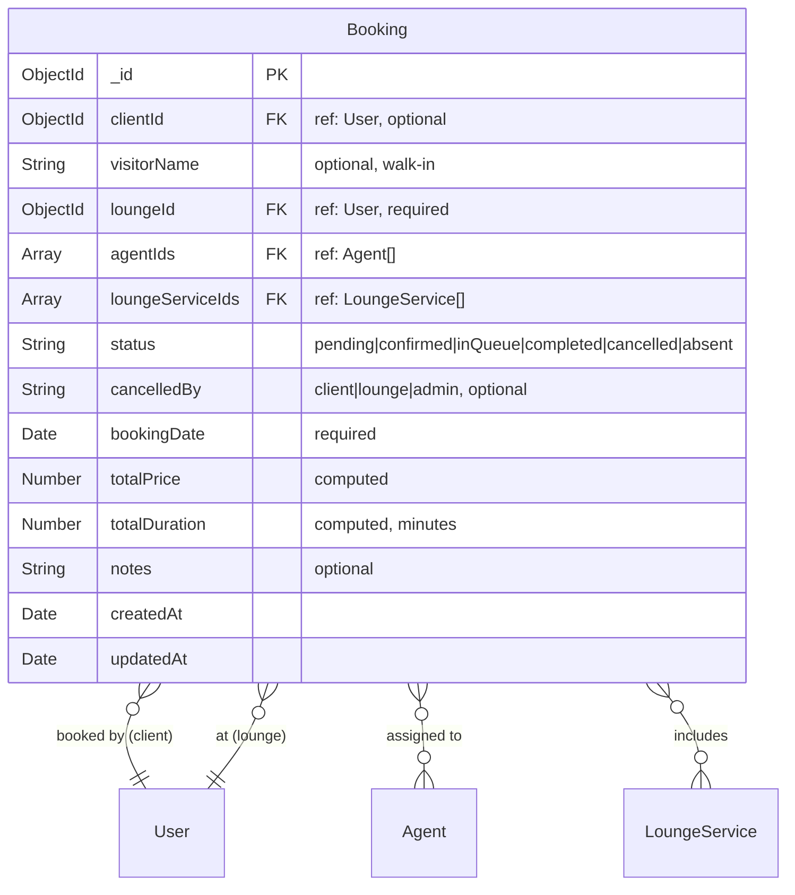
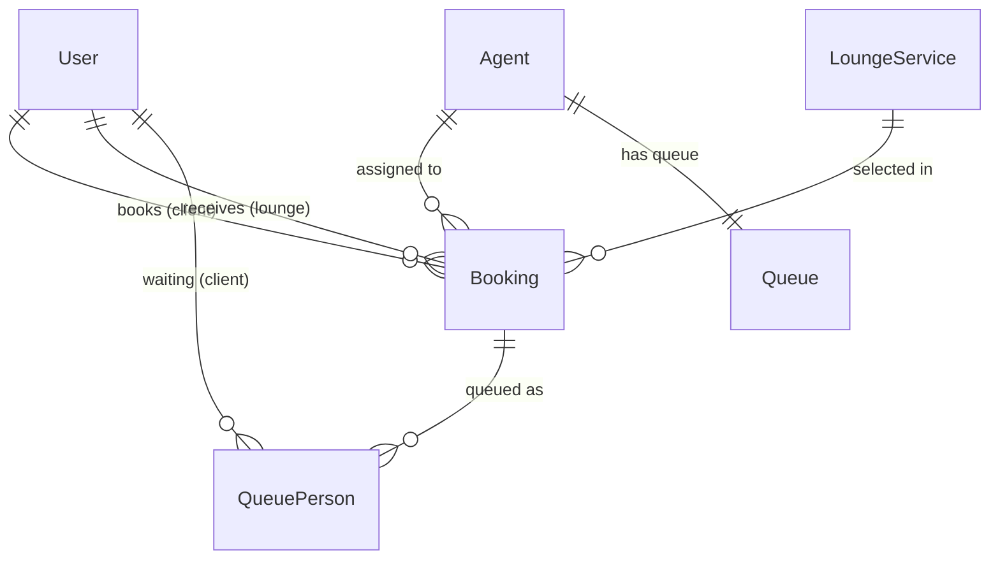
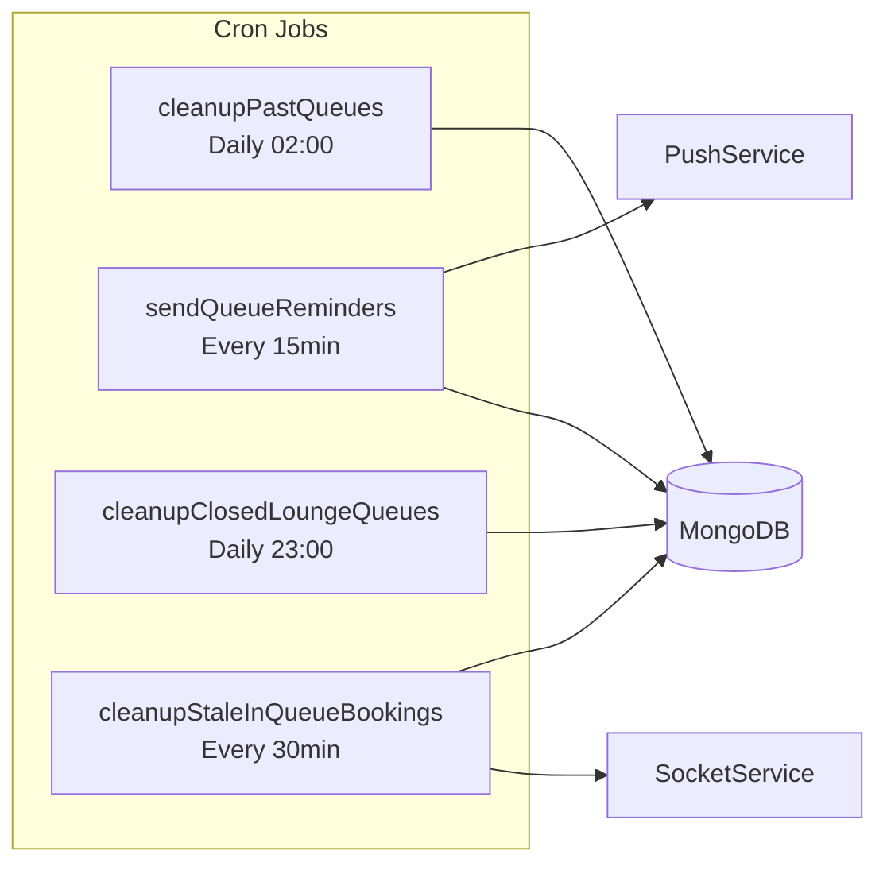
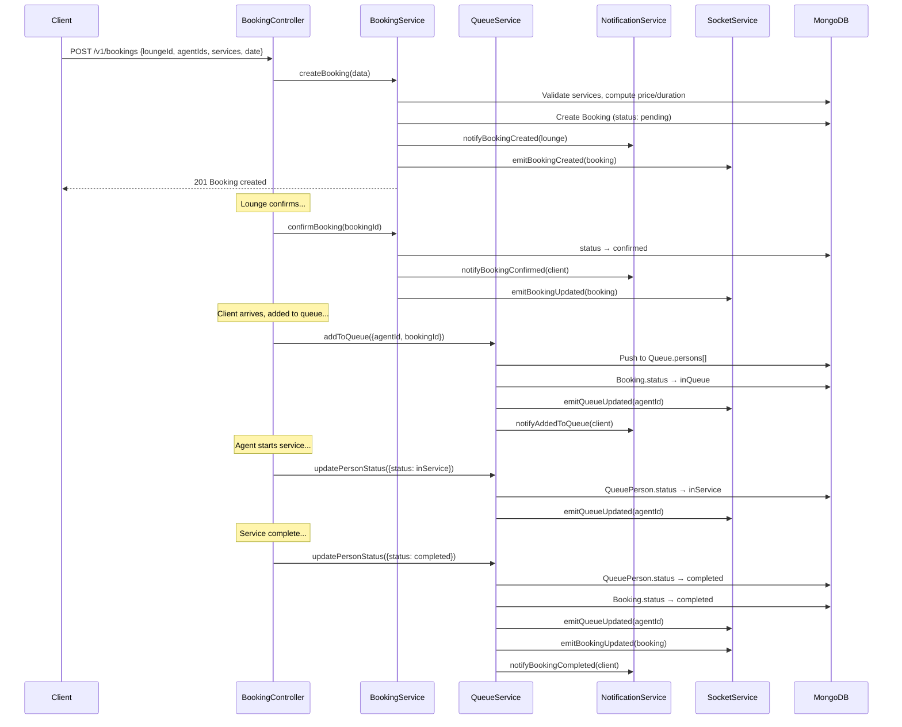
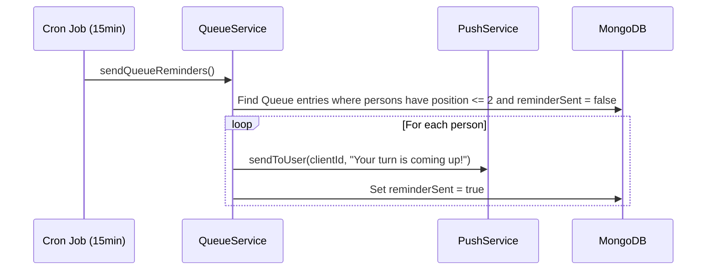

# BookingSystem

> Manages the full booking lifecycle — from client reservation through queue management to completion — including real-time queue updates, automated reminders, and cron-based cleanup jobs.

---

## Table of Contents

- [Overview](#overview)
- [Database Schemas](#database-schemas)
- [Entity Relationships](#entity-relationships)
- [API Endpoints](#api-endpoints)
- [DTOs & Validation](#dtos--validation)
- [Services](#services)
- [Cron Jobs](#cron-jobs)
- [Flows](#flows)
- [Directory Structure](#directory-structure)

---

## Overview

The BookingSystem is the **transactional heart** of Frame Beauty. It handles:

- **Booking CRUD** — Create, update, cancel bookings with multi-agent, multi-service support
- **Queue Management** — Real-time per-agent queues with position tracking
- **Status Lifecycle** — `pending → confirmed → inQueue → completed` (or `cancelled`/`absent`)
- **Automated Cron Jobs** — Cleanup past queues, send reminders, handle stale bookings
- **Real-Time Events** — Socket.IO emissions for queue and booking changes



---

## Database Schemas

### Booking



| Field | Type | Required | Description |
|-------|------|----------|-------------|
| `clientId` | ObjectId | No | Client who booked (null for walk-ins) |
| `visitorName` | String | No | Name for walk-in visitors |
| `loungeId` | ObjectId | Yes | Lounge receiving the booking |
| `agentIds` | ObjectId[] | No | Assigned agents |
| `loungeServiceIds` | ObjectId[] | No | Selected services |
| `status` | String | — | Booking lifecycle state |
| `cancelledBy` | String | No | Who cancelled: `client`, `lounge`, or `admin` |
| `bookingDate` | Date | Yes | Scheduled date/time |
| `totalPrice` | Number | — | Sum of selected service prices |
| `totalDuration` | Number | — | Sum of service durations (minutes) |
| `notes` | String | No | Client notes |

**Indexes:**
- `{ loungeId, bookingDate }` — efficient lounge schedule queries
- `{ clientId, createdAt }` — client booking history
- `{ status }` — status-based filtering

### Queue

```mermaid
erDiagram
    Queue {
        ObjectId _id PK
        ObjectId agentId FK UK "ref: Agent, unique"
        Date date "required"
        Array persons "QueuePerson[]"
        Date createdAt
        Date updatedAt
    }

    Queue ||--o{ QueuePerson : contains
    Queue }o--|| Agent : "belongs to"

    QueuePerson {
        ObjectId bookingId FK "ref: Booking"
        ObjectId clientId FK "ref: User, optional"
        String visitorName "optional"
        Number position "queue position"
        String status "waiting|inService|completed|absent"
        Date joinedAt
        Boolean reminderSent "default false"
    }
```

| Field | Type | Required | Description |
|-------|------|----------|-------------|
| `agentId` | ObjectId | Yes | **Unique** — one queue per agent |
| `date` | Date | Yes | Queue date |
| `persons` | QueuePerson[] | — | Ordered list of people in queue |

**QueuePerson sub-document:**

| Field | Type | Description |
|-------|------|-------------|
| `bookingId` | ObjectId | Reference to the booking |
| `clientId` | ObjectId | Client (null for walk-ins) |
| `visitorName` | String | Walk-in name |
| `position` | Number | Position in queue (1-based) |
| `status` | String | `waiting`, `inService`, `completed`, `absent` |
| `joinedAt` | Date | When added to queue |
| `reminderSent` | Boolean | Whether reminder notification was sent |

**Unique constraint:** `{ agentId }` — one active queue per agent

---

## Entity Relationships



---

## API Endpoints

### Booking Routes — `/v1/bookings`

| Method | Endpoint | Auth | Description |
|--------|----------|------|-------------|
| `GET` | `/` | auth | List bookings (filtered by user type) |
| `GET` | `/:bookingId` | auth | Get booking details |
| `POST` | `/` | auth + validation | Create booking |
| `PUT` | `/:bookingId` | auth + validation | Update booking |
| `DELETE` | `/:bookingId` | auth | Cancel booking |
| `PATCH` | `/:bookingId/status` | auth + validation | Update booking status |
| `PATCH` | `/:bookingId/confirm` | lounge/admin | Confirm a pending booking |
| `GET` | `/lounge/:loungeId` | auth | Get bookings for a lounge |
| `GET` | `/lounge/:loungeId/date/:date` | auth | Get bookings for a lounge on a specific date |
| `GET` | `/client/:clientId` | auth | Get client's bookings |
| `GET` | `/agent/:agentId` | auth | Get bookings assigned to an agent |
| `GET` | `/stats` | lounge/admin | Booking statistics |

### Queue Routes — `/v1/queues`

| Method | Endpoint | Auth | Description |
|--------|----------|------|-------------|
| `GET` | `/agent/:agentId` | auth | Get agent's current queue |
| `GET` | `/lounge/:loungeId` | auth | Get all queues for a lounge's agents |
| `POST` | `/add` | auth + validation | Add person to an agent's queue |
| `PATCH` | `/position` | auth + validation | Update person's position in queue |
| `PATCH` | `/status` | auth + validation | Update queue person's status |
| `DELETE` | `/remove` | auth + validation | Remove person from queue |
| `GET` | `/my-position/:agentId` | auth | Get current user's position in queue |
| `GET` | `/stats/:agentId` | auth | Queue statistics for an agent |

---

## DTOs & Validation

### Booking DTOs

| DTO | Fields | Key Validations |
|-----|--------|----------------|
| `CreateBookingDto` | clientId?, visitorName?, loungeId, agentIds[], loungeServiceIds[], bookingDate, notes? | `@IsMongoId()`, `@IsDateString()`, `@IsArray()` |
| `UpdateBookingDto` | agentIds?, loungeServiceIds?, bookingDate?, notes?, status? | All `@IsOptional()` |
| `UpdateBookingStatusDto` | status, cancelledBy? | `@IsEnum(BookingStatus)` |

### Queue DTOs

| DTO | Fields | Key Validations |
|-----|--------|----------------|
| `AddToQueueDto` | agentId, bookingId, clientId?, visitorName? | `@IsMongoId()` required for agentId, bookingId |
| `UpdateQueuePositionDto` | agentId, bookingId, newPosition | `@IsNumber()` |
| `UpdateQueuePersonStatusDto` | agentId, bookingId, status | `@IsEnum(QueuePersonStatus)` |
| `RemoveFromQueueDto` | agentId, bookingId | `@IsMongoId()` |

### Enums

```typescript
enum BookingStatus {
  pending = 'pending',
  confirmed = 'confirmed',
  inQueue = 'inQueue',
  completed = 'completed',
  cancelled = 'cancelled',
  absent = 'absent'
}

enum QueuePersonStatus {
  waiting = 'waiting',
  inService = 'inService',
  completed = 'completed',
  absent = 'absent'
}
```

---

## Services

### BookingService

Full booking lifecycle management.

| Method | Description |
|--------|-------------|
| `createBooking(data)` | Validate services exist, compute totalPrice/totalDuration, create booking, notify lounge |
| `getBookingById(bookingId)` | Get booking with populated refs |
| `getBookings(userId, userType, filters)` | Filtered list — clients see own, lounges see theirs, admins see all |
| `updateBooking(bookingId, data, userId)` | Update booking fields |
| `cancelBooking(bookingId, cancelledBy, userId)` | Set status=cancelled, remove from queue if present, notify parties |
| `updateBookingStatus(bookingId, status, userId)` | Transition status with validation, emit Socket.IO events |
| `confirmBooking(bookingId, userId)` | Lounge confirms pending → confirmed |
| `getBookingsByLounge(loungeId, filters)` | Lounge's bookings with date/status filters |
| `getBookingsByLoungeAndDate(loungeId, date)` | Single-day schedule view |
| `getBookingsByClient(clientId, filters)` | Client booking history |
| `getBookingsByAgent(agentId, filters)` | Agent's assigned bookings |
| `getBookingStats(loungeId?)` | Aggregate stats: total, by status, revenue |

### QueueService

Real-time queue management with Socket.IO integration.

| Method | Description |
|--------|-------------|
| `getAgentQueue(agentId)` | Get current queue with populated person details |
| `getLoungeQueues(loungeId)` | Get all queues for lounge agents |
| `addToQueue(data)` | Add person to queue, update booking status → inQueue, emit `queueUpdated` |
| `updatePosition(data)` | Reorder person in queue, recalculate positions, emit update |
| `updatePersonStatus(data)` | Transition person status (waiting→inService→completed), update booking status, emit |
| `removeFromQueue(data)` | Remove person, recalculate positions, emit update |
| `getMyPosition(agentId, userId)` | Client checks their position |
| `getQueueStats(agentId)` | Stats: total, waiting, inService, completed, absent |

#### Socket.IO Events Emitted

| Event | Payload | Trigger |
|-------|---------|---------|
| `queueUpdated` | `{ agentId, queue }` | Any queue mutation |
| `bookingCreated` | `{ booking }` | New booking |
| `bookingUpdated` | `{ booking }` | Status change |
| `bookingDeleted` | `{ bookingId }` | Cancellation |

---

## Cron Jobs

The QueueService registers four cron jobs via `node-cron`:

| Job | Schedule | Description |
|-----|----------|-------------|
| `cleanupPastQueues` | Daily at 02:00 | Remove queue entries with dates before today |
| `sendQueueReminders` | Every 15 minutes | Send push notification to next-in-line persons (`position <= 2`, `reminderSent: false`) |
| `cleanupClosedLoungeQueues` | Daily at 23:00 | Clear queues for lounges past their closing time |
| `cleanupStaleInQueueBookings` | Every 30 minutes | Transition bookings stuck in `inQueue` for >4 hours to `absent` |



---

## Flows

### Full Booking Lifecycle



### Queue Reminder Flow



---

## Directory Structure

```
BookingSystem/
├── controllers/
│   ├── booking.controller.ts    # Booking CRUD & status management
│   └── queue.controller.ts      # Queue management endpoints
├── dtos/
│   ├── booking.dto.ts           # Booking DTOs
│   └── queue.dto.ts             # Queue DTOs
├── interfaces/
│   ├── booking.interface.ts     # Booking, BookingStatus types
│   └── queue.interface.ts       # Queue, QueuePerson types
├── models/
│   ├── booking.model.ts         # Booking Mongoose schema
│   └── queue.model.ts           # Queue Mongoose schema
├── routes/
│   ├── booking.route.ts         # /v1/bookings routes
│   └── queue.route.ts           # /v1/queues routes
├── services/
│   ├── booking.service.ts       # Booking business logic
│   └── queue.service.ts         # Queue management + cron jobs
└── tests/
    └── queue.test.ts            # Queue & booking tests
```
