<p align="center">
  
</p>

# FeedContentSystem

> Powers the social content layer — posts, reels, comments, likes, saved content, hashtags, content feeds, and abuse reporting.

---

## Table of Contents

- [Overview](#overview)
- [Database Schemas](#database-schemas)
- [Entity Relationships](#entity-relationships)
- [API Endpoints](#api-endpoints)
- [DTOs & Validation](#dtos--validation)
- [Services](#services)
- [Flows](#flows)
- [Directory Structure](#directory-structure)

---

## Overview

The FeedContentSystem turns Frame Beauty into a **social platform** where lounges showcase their work and clients discover new styles. It provides:

- **Posts** — Image/text content created by lounges
- **Reels** — Short video content
- **Comments** — Threaded comments on posts and reels
- **Likes** — Lounge likes (client → lounge) and content likes (post/reel)
- **Saves** — Bookmark content for later
- **Hashtags** — Trending topic tracking
- **Feeds** — Following feed, explore feed, hashtag feed, saved feed
- **Reports** — Content abuse reporting and admin moderation

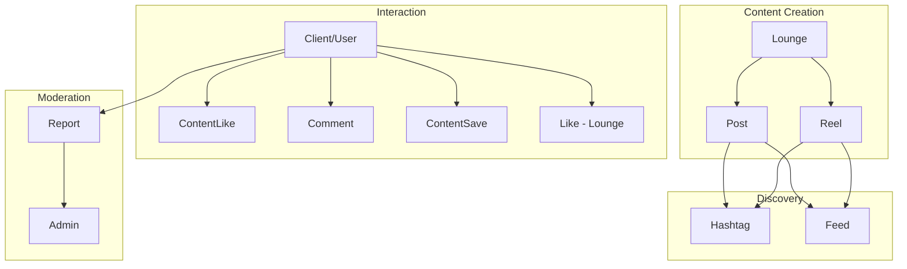

---

## Database Schemas

### Post

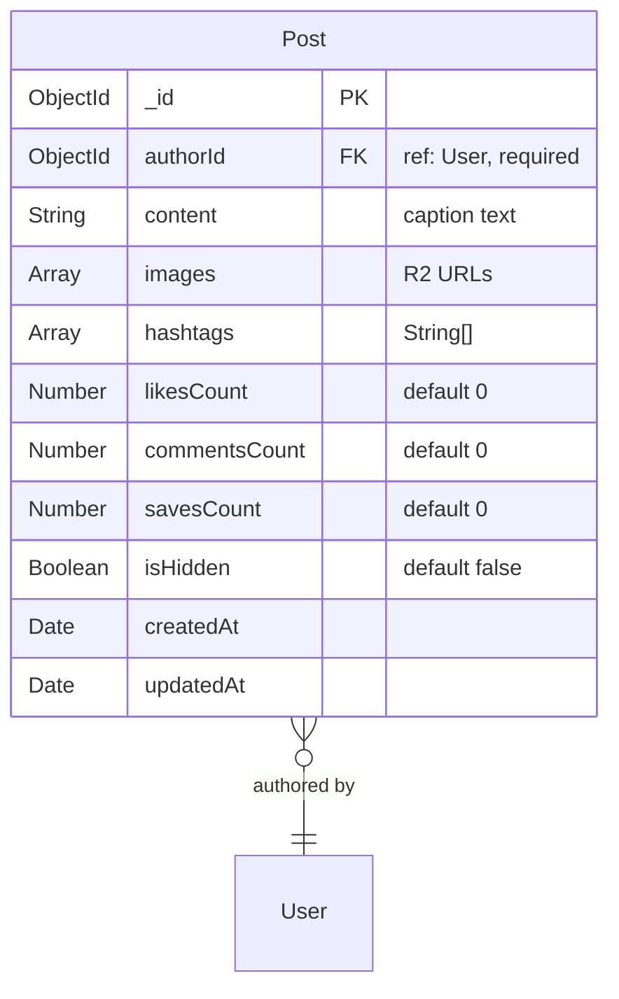

| Field | Type | Required | Description |
|-------|------|----------|-------------|
| `authorId` | ObjectId | Yes | User who created the post |
| `content` | String | No | Caption/text content |
| `images` | String[] | No | Array of Cloudflare R2 image URLs |
| `hashtags` | String[] | No | Extracted hashtag strings |
| `likesCount` | Number | — | Denormalized like count |
| `commentsCount` | Number | — | Denormalized comment count |
| `savesCount` | Number | — | Denormalized save count |
| `isHidden` | Boolean | — | Admin moderation flag |

### Reel

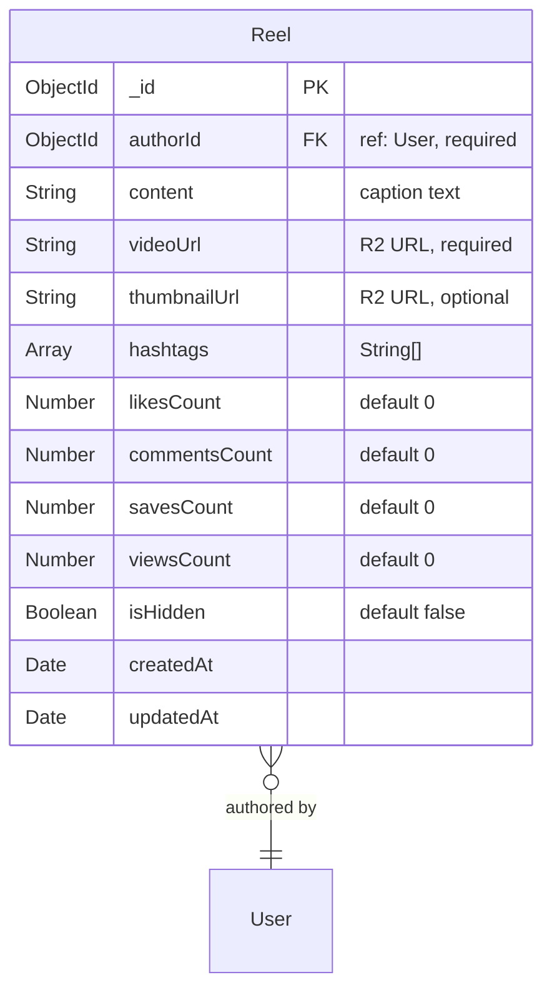

| Field | Type | Required | Description |
|-------|------|----------|-------------|
| `authorId` | ObjectId | Yes | User who created the reel |
| `content` | String | No | Caption |
| `videoUrl` | String | Yes | R2 video URL |
| `thumbnailUrl` | String | No | Video thumbnail |
| `hashtags` | String[] | No | Extracted hashtags |
| `viewsCount` | Number | — | View counter |
| `isHidden` | Boolean | — | Admin moderation flag |

### Comment

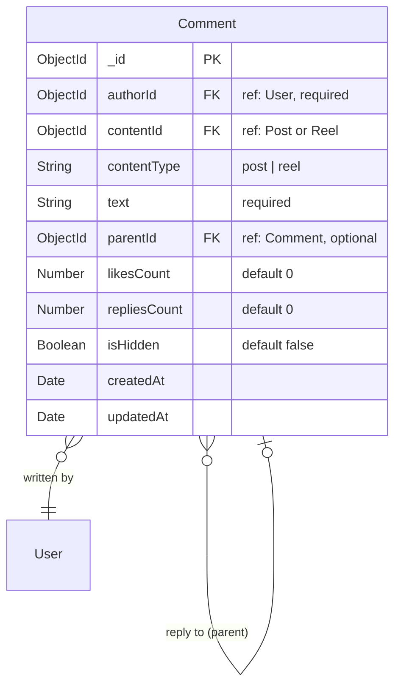

| Field | Type | Required | Description |
|-------|------|----------|-------------|
| `authorId` | ObjectId | Yes | Comment author |
| `contentId` | ObjectId | Yes | Post or Reel being commented on |
| `contentType` | String | Yes | `post` or `reel` |
| `text` | String | Yes | Comment body |
| `parentId` | ObjectId | No | Parent comment (for threaded replies) |

### Like (Lounge Like)

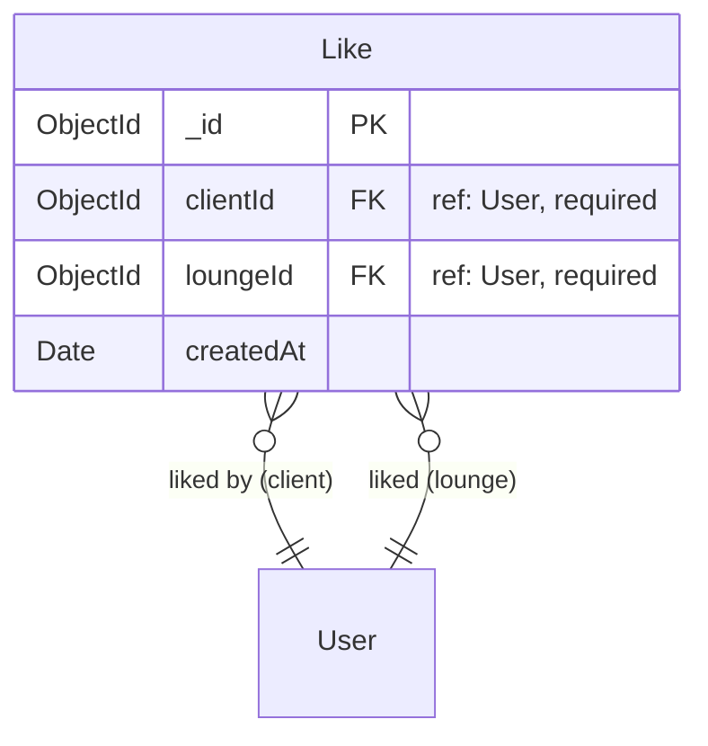

| Constraint | Description |
|-----------|-------------|
| **Unique compound:** `{clientId, loungeId}` | One like per client per lounge |

### ContentLike

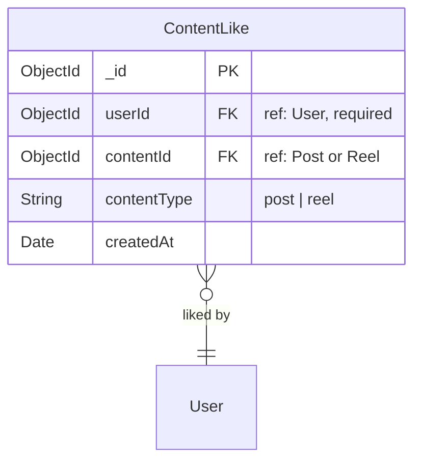

| Constraint | Description |
|-----------|-------------|
| **Unique compound:** `{userId, contentId, contentType}` | One like per user per content item |

### ContentSave


| Constraint | Description |
|-----------|-------------|
| **Unique compound:** `{userId, contentId, contentType}` | One save per user per content item |

### Hashtag

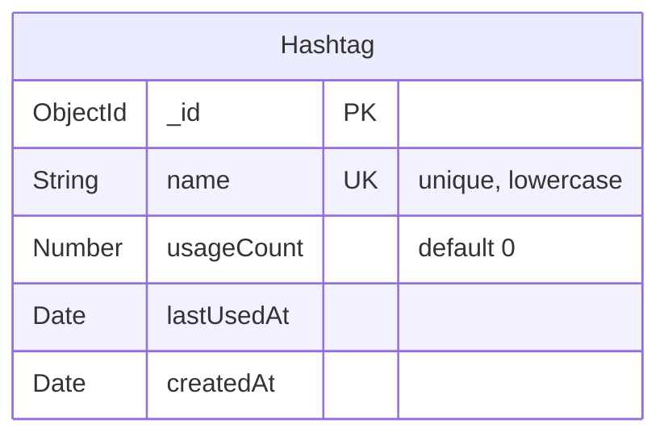

### Report

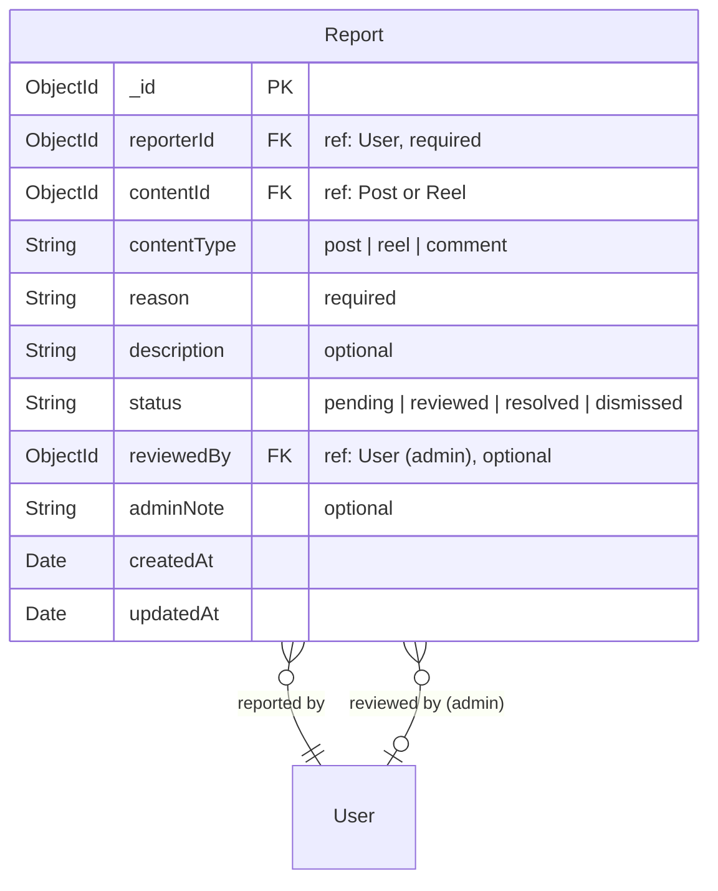

---

## Entity Relationships

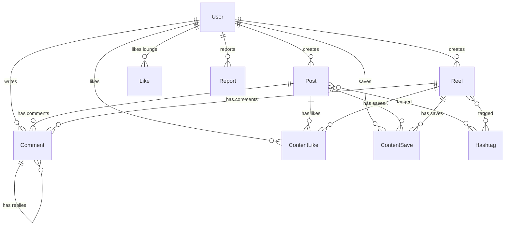

---

## API Endpoints

### Post Routes — `/v1/posts`

| Method | Endpoint | Auth | Description |
|--------|----------|------|-------------|
| `GET` | `/` | auth | Get all posts (paginated) |
| `GET` | `/:postId` | auth | Get single post |
| `POST` | `/` | auth + imageUpload | Create post with images |
| `PUT` | `/:postId` | auth | Update post |
| `DELETE` | `/:postId` | auth | Delete post |
| `GET` | `/user/:userId` | auth | Get posts by a user |
| `POST` | `/:postId/like` | auth | Like a post |
| `DELETE` | `/:postId/like` | auth | Unlike a post |
| `POST` | `/:postId/save` | auth | Save/bookmark a post |
| `DELETE` | `/:postId/save` | auth | Unsave a post |

### Reel Routes — `/v1/reels`

| Method | Endpoint | Auth | Description |
|--------|----------|------|-------------|
| `GET` | `/` | auth | Get all reels (paginated) |
| `GET` | `/:reelId` | auth | Get single reel |
| `POST` | `/` | auth + videoUpload | Create reel with video |
| `PUT` | `/:reelId` | auth | Update reel |
| `DELETE` | `/:reelId` | auth | Delete reel |
| `GET` | `/user/:userId` | auth | Get reels by a user |
| `POST` | `/:reelId/like` | auth | Like a reel |
| `DELETE` | `/:reelId/like` | auth | Unlike a reel |
| `POST` | `/:reelId/save` | auth | Save a reel |
| `DELETE` | `/:reelId/save` | auth | Unsave a reel |

### Comment Routes — `/v1/comments`

| Method | Endpoint | Auth | Description |
|--------|----------|------|-------------|
| `GET` | `/content/:contentId` | auth | Get comments for a post/reel |
| `GET` | `/:commentId` | auth | Get single comment |
| `POST` | `/` | auth + validation | Create comment |
| `PUT` | `/:commentId` | auth | Update own comment |
| `DELETE` | `/:commentId` | auth | Delete own comment |
| `GET` | `/:commentId/replies` | auth | Get replies to a comment |
| `POST` | `/:commentId/like` | auth | Like a comment |
| `DELETE` | `/:commentId/like` | auth | Unlike a comment |

### Like Routes — `/v1/likes` (lounge likes)

| Method | Endpoint | Auth | Description |
|--------|----------|------|-------------|
| `POST` | `/:loungeId` | client | Like a lounge |
| `DELETE` | `/:loungeId` | client | Unlike a lounge |
| `GET` | `/check/:loungeId` | auth | Check if liked |
| `GET` | `/lounge/:loungeId` | auth | Get all likes for a lounge |

### Feed Routes — `/v1/feed`

| Method | Endpoint | Auth | Description |
|--------|----------|------|-------------|
| `GET` | `/following` | auth | Feed from followed users |
| `GET` | `/explore` | auth | Discover new content |
| `GET` | `/hashtag/:hashtag` | auth | Content tagged with hashtag |
| `GET` | `/saved` | auth | User's saved content |
| `GET` | `/trending-hashtags` | auth | Trending hashtags |
| `GET` | `/user/:userId` | auth | Mixed feed for a specific user |

### Report Routes — `/v1/reports`

| Method | Endpoint | Auth | Description |
|--------|----------|------|-------------|
| `POST` | `/` | auth + validation | Report content |
| `GET` | `/` | admin | List all reports (paginated) |
| `PATCH` | `/:reportId/review` | admin | Review/resolve a report |

---

## DTOs & Validation

| DTO | Fields | Key Validations |
|-----|--------|----------------|
| `CreatePostDto` | content?, images?, hashtags? | `@IsOptional()`, `@IsArray()` |
| `UpdatePostDto` | content?, hashtags? | `@IsOptional()` |
| `CreateReelDto` | content?, videoUrl, thumbnailUrl?, hashtags? | `@IsString()` for videoUrl |
| `UpdateReelDto` | content?, hashtags? | `@IsOptional()` |
| `CreateCommentDto` | contentId, contentType, text, parentId? | `@IsMongoId()`, `@IsEnum(['post','reel'])` |
| `UpdateCommentDto` | text | `@IsString()` |
| `CreateReportDto` | contentId, contentType, reason, description? | `@IsEnum(['post','reel','comment'])` |
| `ReviewReportDto` | status, adminNote? | `@IsEnum(ReportStatus)` |

---

## Services

### PostService

| Method | Description |
|--------|-------------|
| `createPost(authorId, data, files?)` | Upload images to R2, extract hashtags, create post |
| `getPosts(page, limit)` | Paginated, sorted by createdAt |
| `getPostById(postId, userId?)` | Get post + isLiked/isSaved flags for current user |
| `updatePost(postId, authorId, data)` | Update own post |
| `deletePost(postId, authorId)` | Delete own post + cleanup likes/comments/saves |
| `getPostsByUser(userId, page, limit)` | User's posts |

### ReelService

| Method | Description |
|--------|-------------|
| `createReel(authorId, data, file?)` | Upload video to R2, create reel |
| `getReels(page, limit)` | Paginated reels |
| `getReelById(reelId, userId?)` | Get reel + interaction flags |
| `updateReel(reelId, authorId, data)` | Update own reel |
| `deleteReel(reelId, authorId)` | Delete + cleanup |
| `getReelsByUser(userId, page, limit)` | User's reels |
| `incrementViews(reelId)` | Increment view counter |

### CommentService

| Method | Description |
|--------|-------------|
| `createComment(authorId, data)` | Create comment, increment content commentsCount, notify content owner |
| `getCommentsByContent(contentId, page, limit)` | Top-level comments |
| `getCommentById(commentId)` | Single comment |
| `updateComment(commentId, authorId, text)` | Update own comment |
| `deleteComment(commentId, authorId)` | Delete + decrement count |
| `getReplies(commentId, page, limit)` | Threaded replies |

### LikeService (Lounge Likes)

| Method | Description |
|--------|-------------|
| `likeLounge(clientId, loungeId)` | Like + increment likesCount + notify |
| `unlikeLounge(clientId, loungeId)` | Unlike + decrement |
| `isLiked(clientId, loungeId)` | Check like status |
| `getLoungeLikes(loungeId, page, limit)` | Paginated likes for a lounge |

### ContentLikeService (Post/Reel Likes)

| Method | Description |
|--------|-------------|
| `likeContent(userId, contentId, contentType)` | Like + increment count + notify owner |
| `unlikeContent(userId, contentId, contentType)` | Unlike + decrement |
| `isLiked(userId, contentId, contentType)` | Check like status |

### ContentSaveService

| Method | Description |
|--------|-------------|
| `saveContent(userId, contentId, contentType)` | Save + increment savesCount |
| `unsaveContent(userId, contentId, contentType)` | Unsave + decrement |
| `isSaved(userId, contentId, contentType)` | Check save status |

### FeedService

| Method | Description |
|--------|-------------|
| `getFollowingFeed(userId, page, limit)` | Posts + reels from followed users, sorted chronologically |
| `getExploreFeed(userId, page, limit)` | Algorithm: trending + new content from unfollowed users |
| `getHashtagFeed(hashtag, page, limit)` | Content tagged with specific hashtag |
| `getSavedFeed(userId, page, limit)` | User's saved posts/reels |
| `getTrendingHashtags(limit)` | Most used hashtags recently |
| `getUserFeed(userId, page, limit)` | Mixed posts + reels from a specific user |

### ReportService

| Method | Description |
|--------|-------------|
| `createReport(reporterId, data)` | Create report + notify admins |
| `getReports(page, limit, filters)` | Admin paginated list |
| `reviewReport(reportId, adminId, data)` | Update status, optionally hide content |

---

## Flows

### Post Creation Flow

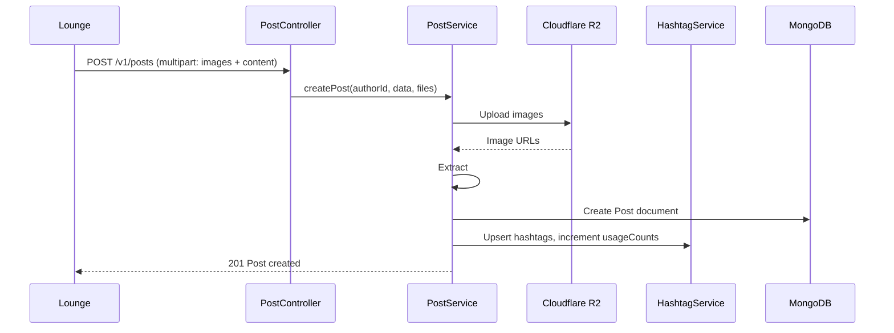

### Feed Generation Flow

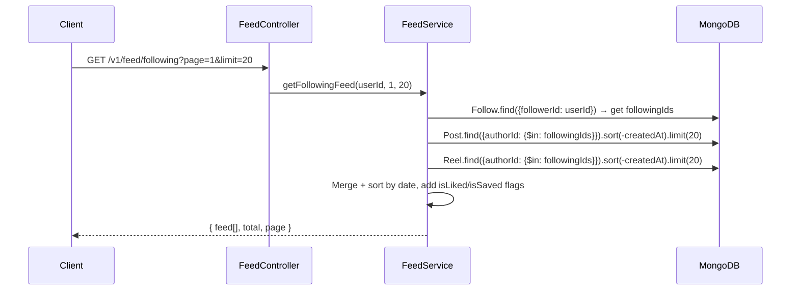

### Content Report & Moderation Flow

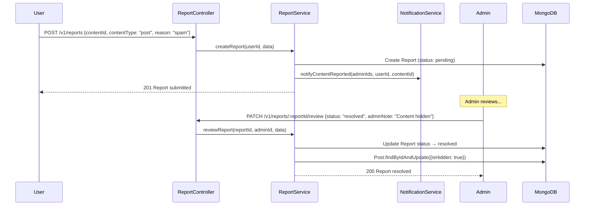

---

## Directory Structure

```
FeedContentSystem/
├── controllers/
│   ├── post.controller.ts          # Post CRUD + like/save
│   ├── reel.controller.ts          # Reel CRUD + like/save
│   ├── comment.controller.ts       # Comment CRUD + replies
│   ├── like.controller.ts          # Lounge likes
│   ├── feed.controller.ts          # Feed generation endpoints
│   └── report.controller.ts        # Report submission + moderation
├── dtos/
│   ├── post.dto.ts
│   ├── reel.dto.ts
│   ├── comment.dto.ts
│   └── report.dto.ts
├── interfaces/
│   ├── post.interface.ts
│   ├── reel.interface.ts
│   ├── comment.interface.ts
│   ├── like.interface.ts
│   ├── contentLike.interface.ts
│   ├── contentSave.interface.ts
│   ├── hashtag.interface.ts
│   └── report.interface.ts
├── models/
│   ├── post.model.ts
│   ├── reel.model.ts
│   ├── comment.model.ts
│   ├── like.model.ts
│   ├── contentLike.model.ts
│   ├── contentSave.model.ts
│   ├── hashtag.model.ts
│   └── report.model.ts
├── routes/
│   ├── post.route.ts
│   ├── reel.route.ts
│   ├── comment.route.ts
│   ├── like.route.ts
│   ├── feed.route.ts
│   └── report.route.ts
├── services/
│   ├── post.service.ts
│   ├── reel.service.ts
│   ├── comment.service.ts
│   ├── like.service.ts
│   ├── contentLike.service.ts
│   ├── contentSave.service.ts
│   ├── feed.service.ts
│   └── report.service.ts
└── tests/
    └── feedContent.test.ts
```
