# MarketplaceSystem

> Full e-commerce marketplace — stores, products, orders, cart, reviews, wishlists, product categories with suggestion workflow, and analytics.

---

## Table of Contents

- [Overview](#overview)
- [Database Schemas](#database-schemas)
- [Entity Relationships](#entity-relationships)
- [API Endpoints](#api-endpoints)
- [DTOs & Validation](#dtos--validation)
- [Services](#services)
- [Flows](#flows)
- [Directory Structure](#directory-structure)

---

## Overview

The MarketplaceSystem extends Frame Beauty beyond services into **physical product sales**. Lounges can open stores, list beauty products, and process orders — all within the same platform.

**Key Capabilities:**

| Feature | Description |
|---------|-------------|
| **Stores** | Lounges create stores with categories, badges, policies |
| **Products** | Full product catalog with variants, stock, SKU, images |
| **Orders** | Multi-status order lifecycle with 3 payment methods |
| **Cart** | Persistent shopping cart per user |
| **Reviews** | Verified-purchase product reviews with ratings |
| **Wishlists** | Save products for later |
| **Categories** | Admin-managed product categories + lounge suggestion workflow |
| **Analytics** | Store & product performance metrics |

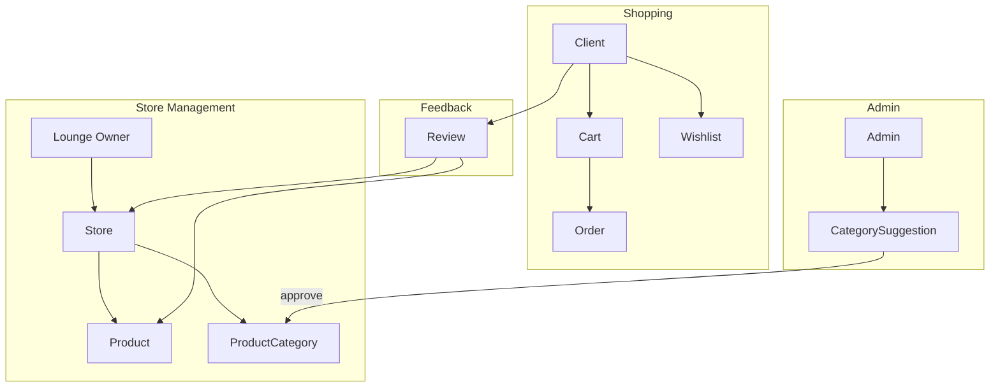

---

## Database Schemas

### Store

```mermaid
erDiagram
    Store {
        ObjectId _id PK
        ObjectId ownerId FK UK "ref: User, required"
        String name "required"
        String slug UK "auto-generated"
        String description "optional"
        String logo "R2 URL"
        String coverImage "R2 URL"
        String status "pending|active|suspended|closed"
        String category "beauty|fashion|wellness|accessories|tools|other"
        String badge "optional"
        String phoneNumber "optional"
        String email "optional"
        String website "optional"
        Object socialLinks "instagram, facebook, tiktok"
        Object policies "return, shipping, privacy"
        Date createdAt
        Date updatedAt
    }

    Store ||--o| StoreLocation : has
    Store ||--o| StoreStats : has

    StoreLocation {
        String type "Point"
        Array coordinates "lng_lat"
        String address
        String city
        String state
    }

    StoreStats {
        Number totalProducts "default 0"
        Number totalOrders "default 0"
        Number totalRevenue "default 0"
        Number averageRating "default 0"
        Number totalReviews "default 0"
    }

    Store }o--|| User : "owned by (lounge)"
```

| Field | Type | Required | Description |
|-------|------|----------|-------------|
| `ownerId` | ObjectId | Yes | **Unique** — one store per lounge |
| `name` | String | Yes | Store name |
| `slug` | String | Auto | URL-friendly auto-generated slug |
| `status` | String | — | `pending` → `active` → `suspended` / `closed` |
| `category` | String | Yes | `beauty`, `fashion`, `wellness`, `accessories`, `tools`, `other` |
| `badge` | String | No | Special badge (e.g., "Verified", "Top Seller") |
| `location` | GeoJSON | No | 2dsphere-indexed store location |
| `policies` | Object | No | `{returnPolicy, shippingPolicy, privacyPolicy}` |
| `stats` | Object | — | Denormalized aggregate stats |

### Product

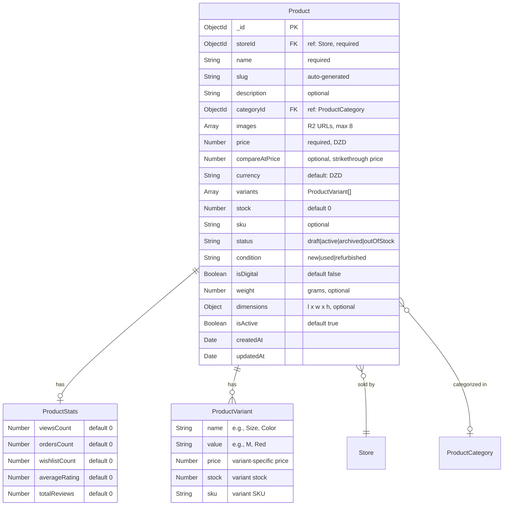

| Field | Type | Required | Description |
|-------|------|----------|-------------|
| `storeId` | ObjectId | Yes | Store selling this product |
| `name` | String | Yes | Product name |
| `slug` | String | Auto | URL-friendly slug |
| `categoryId` | ObjectId | No | Product category |
| `images` | String[] | No | Up to 8 R2 image URLs |
| `price` | Number | Yes | Price in DZD (Algerian Dinar) |
| `compareAtPrice` | Number | No | Original price for discount display |
| `currency` | String | — | Always `DZD` |
| `variants` | Array | No | Product variants (size, color, etc.) |
| `stock` | Number | — | Available stock count |
| `sku` | String | No | Stock Keeping Unit |
| `status` | String | — | `draft`, `active`, `archived`, `outOfStock` |
| `condition` | String | — | `new`, `used`, `refurbished` |
| `isDigital` | Boolean | — | Digital product flag |
| `weight` | Number | No | Weight in grams (for shipping) |
| `dimensions` | Object | No | `{length, width, height}` in cm |
| `stats` | Object | — | Denormalized stats |

### Order

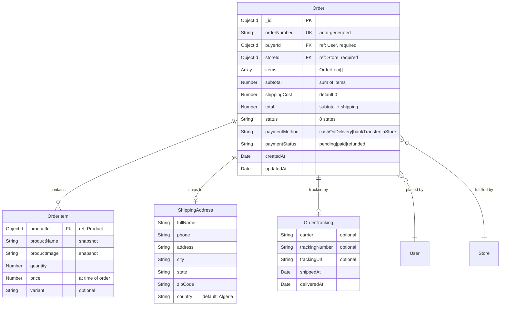

| Field | Type | Required | Description |
|-------|------|----------|-------------|
| `orderNumber` | String | Auto | Unique order number (e.g., `ORD-20240115-XXXX`) |
| `buyerId` | ObjectId | Yes | Client who placed the order |
| `storeId` | ObjectId | Yes | Store fulfilling the order |
| `items` | OrderItem[] | Yes | Product snapshots at time of order |
| `subtotal` | Number | — | Sum of item prices × quantities |
| `shippingCost` | Number | — | Shipping fee |
| `total` | Number | — | `subtotal + shippingCost` |
| `status` | String | — | See status lifecycle below |
| `paymentMethod` | String | Yes | `cashOnDelivery`, `bankTransfer`, `inStore` |
| `paymentStatus` | String | — | `pending`, `paid`, `refunded` |
| `shippingAddress` | Object | Yes | Full delivery address |
| `tracking` | Object | No | Shipping tracking info |

**Order Status Lifecycle:**

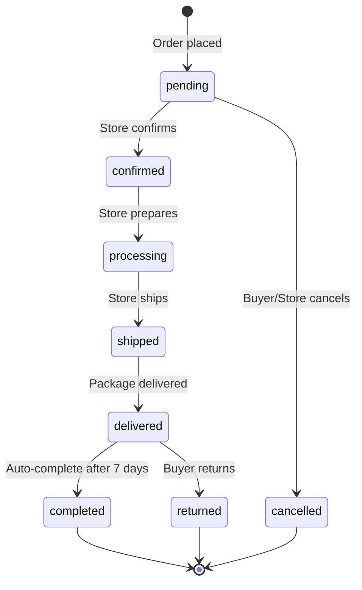

### Cart

```mermaid
erDiagram
    Cart {
        ObjectId _id PK
        ObjectId userId FK UK "ref: User, unique"
        Array items "CartItem[]"
        Date updatedAt
    }

    Cart ||--o{ CartItem : contains

    CartItem {
        ObjectId productId FK "ref: Product"
        Number quantity "min 1"
        String variant "optional"
        Date addedAt
    }

    Cart }o--|| User : "belongs to"
```

| Constraint | Description |
|-----------|-------------|
| **Unique:** `userId` | One cart per user |

### Review

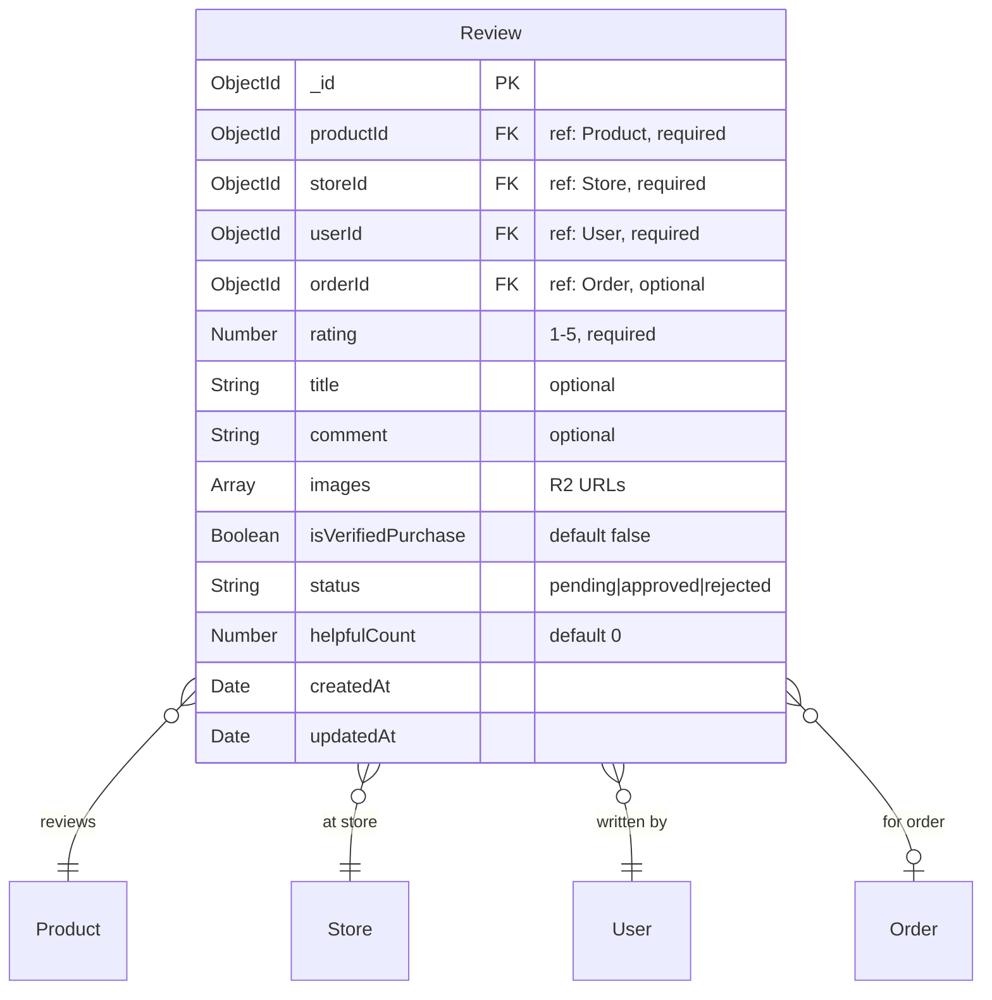

| Field | Type | Description |
|-------|------|-------------|
| `rating` | Number | 1–5 stars |
| `isVerifiedPurchase` | Boolean | Auto-set `true` if `orderId` links to a completed order by the reviewer |
| `status` | String | `pending` → `approved` / `rejected` |
| `helpfulCount` | Number | "Was this helpful?" counter |

### Wishlist

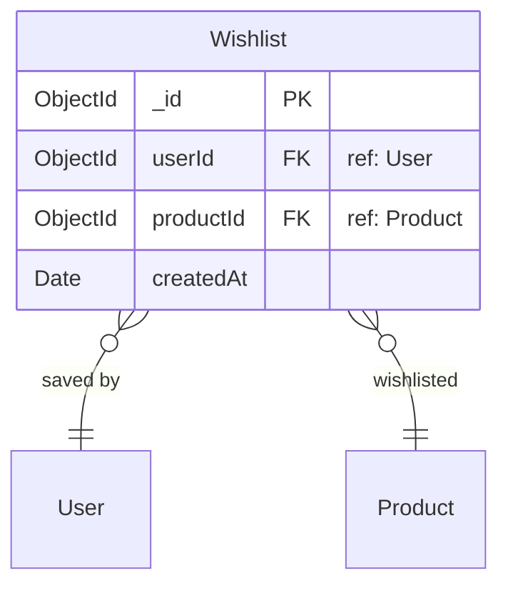

| Constraint | Description |
|-----------|-------------|
| **Unique compound:** `{userId, productId}` | One wishlist entry per product per user |

### ProductCategory

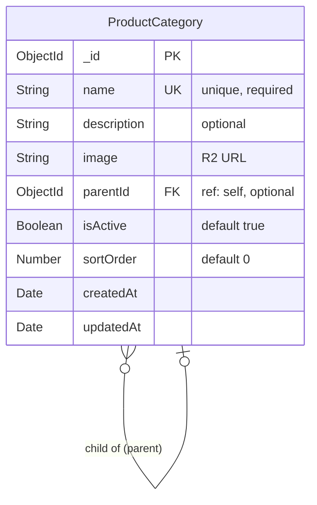

### ProductCategorySuggestion

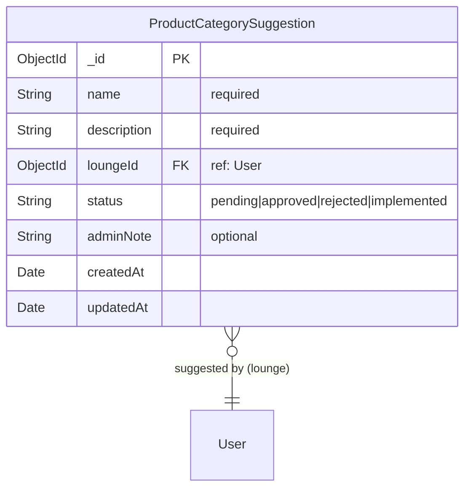

---

## Entity Relationships

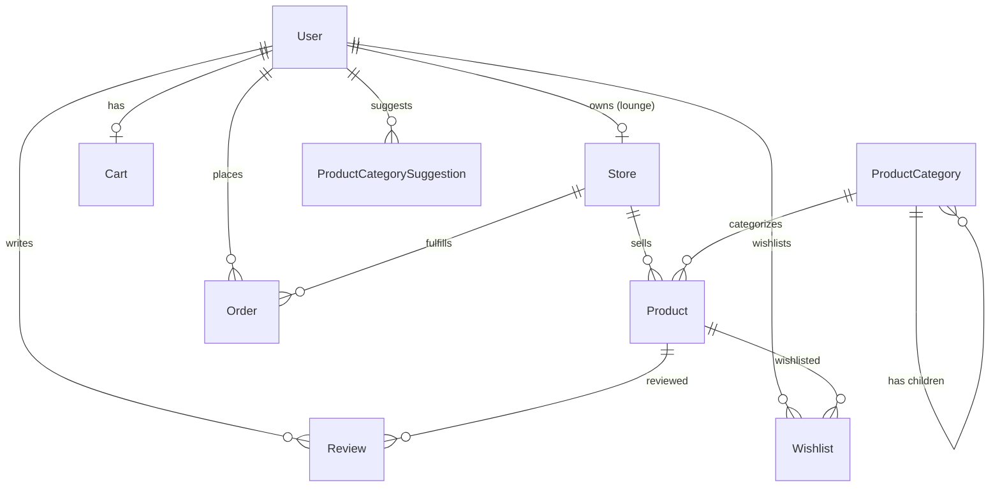

---

## API Endpoints

### Store Routes — `/v1/stores`

| Method | Endpoint | Auth | Description |
|--------|----------|------|-------------|
| `GET` | `/` | public | List active stores (paginated, searchable) |
| `GET` | `/:storeId` | public | Get store details |
| `GET` | `/slug/:slug` | public | Get store by slug |
| `GET` | `/my` | auth + lounge | Get own store |
| `POST` | `/` | auth + lounge | Create store |
| `PUT` | `/:storeId` | auth + lounge | Update own store |
| `PUT` | `/:storeId/logo` | auth + imageUpload | Upload store logo |
| `PUT` | `/:storeId/cover` | auth + imageUpload | Upload cover image |
| `PATCH` | `/:storeId/status` | admin | Update store status |
| `GET` | `/category/:category` | public | Stores by category |
| `GET` | `/nearby` | public | Geo-based store discovery |
| `DELETE` | `/:storeId` | admin | Delete store |

### Product Routes — `/v1/products`

| Method | Endpoint | Auth | Description |
|--------|----------|------|-------------|
| `GET` | `/` | public | List products (paginated, filterable) |
| `GET` | `/:productId` | public | Get product details |
| `GET` | `/slug/:slug` | public | Get product by slug |
| `GET` | `/store/:storeId` | public | Products by store |
| `POST` | `/` | auth + lounge + imageUpload | Create product |
| `PUT` | `/:productId` | auth + lounge | Update product |
| `PUT` | `/:productId/images` | auth + imageUpload | Upload product images |
| `PATCH` | `/:productId/status` | auth | Update product status |
| `PATCH` | `/:productId/stock` | auth | Update stock count |
| `DELETE` | `/:productId` | auth | Delete product |

### Product Category Routes — `/v1/product-categories`

| Method | Endpoint | Auth | Description |
|--------|----------|------|-------------|
| `GET` | `/` | public | List all active categories |
| `GET` | `/:categoryId` | public | Get category details |
| `POST` | `/` | admin | Create category |
| `PUT` | `/:categoryId` | admin | Update category |
| `DELETE` | `/:categoryId` | admin | Delete category |
| `GET` | `/:categoryId/children` | public | Get child categories |

### Product Category Suggestion Routes — `/v1/product-category-suggestions`

| Method | Endpoint | Auth | Description |
|--------|----------|------|-------------|
| `GET` | `/` | auth | List suggestions (paginated) |
| `GET` | `/stats` | admin | Suggestion statistics |
| `GET` | `/:id` | auth | Get suggestion by ID |
| `POST` | `/` | lounge | Create suggestion |
| `PUT` | `/:id` | lounge | Update own suggestion |
| `PATCH` | `/:id/status` | admin | Update suggestion status |
| `PATCH` | `/:id/admin-approve` | admin | Approve + auto-create category |
| `DELETE` | `/:id` | auth | Delete suggestion |

### Order Routes — `/v1/orders`

| Method | Endpoint | Auth | Description |
|--------|----------|------|-------------|
| `GET` | `/` | auth | List orders (buyer sees own, store sees theirs) |
| `GET` | `/:orderId` | auth | Get order details |
| `POST` | `/` | auth | Place order (from cart or direct) |
| `PATCH` | `/:orderId/status` | auth | Update order status |
| `PATCH` | `/:orderId/tracking` | lounge | Add tracking info |
| `PATCH` | `/:orderId/cancel` | auth | Cancel order |
| `GET` | `/store/:storeId` | lounge | Store's orders |

### Cart Routes — `/v1/cart`

| Method | Endpoint | Auth | Description |
|--------|----------|------|-------------|
| `GET` | `/` | auth | Get cart contents |
| `POST` | `/add` | auth | Add item to cart |
| `PATCH` | `/update` | auth | Update item quantity |
| `DELETE` | `/remove/:productId` | auth | Remove item |
| `DELETE` | `/clear` | auth | Clear entire cart |

### Review Routes — `/v1/reviews`

| Method | Endpoint | Auth | Description |
|--------|----------|------|-------------|
| `GET` | `/product/:productId` | public | Get reviews for a product |
| `GET` | `/store/:storeId` | public | Get reviews for a store |
| `GET` | `/:reviewId` | public | Get single review |
| `POST` | `/` | auth | Create review |
| `PUT` | `/:reviewId` | auth | Update own review |
| `DELETE` | `/:reviewId` | auth | Delete own review |
| `POST` | `/:reviewId/helpful` | auth | Mark review as helpful |
| `PATCH` | `/:reviewId/status` | admin | Approve/reject review |

### Wishlist Routes — `/v1/wishlist`

| Method | Endpoint | Auth | Description |
|--------|----------|------|-------------|
| `GET` | `/` | auth | Get user's wishlist |
| `POST` | `/:productId` | auth | Add to wishlist |
| `DELETE` | `/:productId` | auth | Remove from wishlist |

### Analytics Routes — `/v1/analytics`

| Method | Endpoint | Auth | Description |
|--------|----------|------|-------------|
| `GET` | `/store/:storeId` | lounge | Store analytics dashboard |
| `GET` | `/product/:productId` | lounge | Product performance metrics |
| `GET` | `/overview` | admin | Platform-wide marketplace stats |

---

## DTOs & Validation

### Store DTOs

| DTO | Fields | Key Validations |
|-----|--------|----------------|
| `CreateStoreDto` | name, description?, category, phoneNumber?, email?, website?, socialLinks?, policies? | `@IsString()`, `@IsEnum(StoreCategory)` |
| `UpdateStoreDto` | all optional | `@IsOptional()` |

### Product DTOs

| DTO | Fields | Key Validations |
|-----|--------|----------------|
| `CreateProductDto` | name, description?, categoryId?, price, compareAtPrice?, variants?, stock?, sku?, condition?, isDigital?, weight?, dimensions? | `@IsNumber()` for price/stock, `@Min(0)` |
| `UpdateProductDto` | all optional | `@IsOptional()` |
| `UpdateProductStockDto` | stock | `@IsNumber()`, `@Min(0)` |

### Order DTOs

| DTO | Fields | Key Validations |
|-----|--------|----------------|
| `CreateOrderDto` | storeId, items[]?, fromCart?, paymentMethod, shippingAddress | `@IsEnum(PaymentMethod)`, `@ValidateNested()` |
| `UpdateOrderStatusDto` | status | `@IsEnum(OrderStatus)` |
| `AddTrackingDto` | carrier?, trackingNumber?, trackingUrl? | `@IsString()` |

### Review DTOs

| DTO | Fields | Key Validations |
|-----|--------|----------------|
| `CreateReviewDto` | productId, storeId, orderId?, rating, title?, comment?, images? | `@Min(1) @Max(5)` for rating |
| `UpdateReviewDto` | rating?, title?, comment?, images? | All optional |

### Enums

```typescript
enum StoreStatus {
  pending = 'pending',
  active = 'active',
  suspended = 'suspended',
  closed = 'closed'
}

enum StoreCategory {
  beauty = 'beauty',
  fashion = 'fashion',
  wellness = 'wellness',
  accessories = 'accessories',
  tools = 'tools',
  other = 'other'
}

enum ProductStatus {
  draft = 'draft',
  active = 'active',
  archived = 'archived',
  outOfStock = 'outOfStock'
}

enum ProductCondition {
  new = 'new',
  used = 'used',
  refurbished = 'refurbished'
}

enum OrderStatus {
  pending = 'pending',
  confirmed = 'confirmed',
  processing = 'processing',
  shipped = 'shipped',
  delivered = 'delivered',
  completed = 'completed',
  cancelled = 'cancelled',
  returned = 'returned'
}

enum PaymentMethod {
  cashOnDelivery = 'cashOnDelivery',
  bankTransfer = 'bankTransfer',
  inStore = 'inStore'
}

enum PaymentStatus {
  pending = 'pending',
  paid = 'paid',
  refunded = 'refunded'
}
```

---

## Services

### StoreService

| Method | Description |
|--------|-------------|
| `createStore(ownerId, data)` | Create store (one per lounge), generate slug |
| `getStores(page, limit, search?, category?)` | Paginated active stores |
| `getStoreById(storeId)` | Full store details |
| `getStoreBySlug(slug)` | Lookup by URL slug |
| `getMyStore(ownerId)` | Get lounge's own store |
| `updateStore(storeId, ownerId, data)` | Update store info |
| `updateStoreLogo(storeId, file)` | Upload logo to R2 |
| `updateStoreCover(storeId, file)` | Upload cover to R2 |
| `updateStoreStatus(storeId, status)` | Admin status management |
| `getStoresByCategory(category, page, limit)` | Filter by category |
| `getNearbyStores(lat, lng, radius, page, limit)` | Geospatial query |
| `deleteStore(storeId)` | Delete store + cascade products |

### ProductService

| Method | Description |
|--------|-------------|
| `createProduct(storeId, data, files?)` | Create product, upload images, increment store stats |
| `getProducts(page, limit, filters)` | Paginated with category/price/status filters |
| `getProductById(productId)` | Full product + increment viewsCount |
| `getProductBySlug(slug)` | Lookup by slug |
| `getProductsByStore(storeId, page, limit)` | Store's products |
| `updateProduct(productId, storeId, data)` | Update product fields |
| `updateProductImages(productId, files)` | Replace images |
| `updateProductStatus(productId, status)` | Status management |
| `updateProductStock(productId, stock)` | Stock update |
| `deleteProduct(productId, storeId)` | Delete + cleanup |

### OrderService

| Method | Description |
|--------|-------------|
| `createOrder(buyerId, data)` | Create order, snapshot product data, decrement stock, clear cart items, notify store |
| `getOrders(userId, userType, filters)` | Buyer/store/admin filtered list |
| `getOrderById(orderId, userId)` | Get order with authorization |
| `updateOrderStatus(orderId, userId, status)` | Status transition with validation |
| `addTracking(orderId, storeOwnerId, tracking)` | Add shipping tracking |
| `cancelOrder(orderId, userId)` | Cancel + restore stock + notify |
| `getStoreOrders(storeId, filters)` | Store's order list |

### CartService

| Method | Description |
|--------|-------------|
| `getCart(userId)` | Get cart with populated product details |
| `addToCart(userId, productId, quantity, variant?)` | Add/update item |
| `updateCartItem(userId, productId, quantity)` | Change quantity |
| `removeFromCart(userId, productId)` | Remove item |
| `clearCart(userId)` | Empty cart |

### ReviewService

| Method | Description |
|--------|-------------|
| `createReview(userId, data)` | Create review, auto-detect verified purchase, update product/store ratings |
| `getProductReviews(productId, page, limit)` | Paginated product reviews |
| `getStoreReviews(storeId, page, limit)` | Paginated store reviews |
| `getReviewById(reviewId)` | Single review |
| `updateReview(reviewId, userId, data)` | Update own review |
| `deleteReview(reviewId, userId)` | Delete + recalculate ratings |
| `markHelpful(reviewId, userId)` | Increment helpfulCount |
| `updateReviewStatus(reviewId, status)` | Admin approve/reject |

### WishlistService

| Method | Description |
|--------|-------------|
| `getWishlist(userId, page, limit)` | Paginated wishlist with product details |
| `addToWishlist(userId, productId)` | Add product + increment wishlistCount |
| `removeFromWishlist(userId, productId)` | Remove + decrement |

### ProductCategoriesService

| Method | Description |
|--------|-------------|
| `createCategory(data)` | Admin creates category |
| `getCategories()` | All active categories (tree structure) |
| `getCategoryById(id)` | Single category |
| `updateCategory(id, data)` | Update category |
| `deleteCategory(id)` | Delete (fails if products exist) |
| `getChildCategories(parentId)` | Get sub-categories |

### ProductCategorySuggestionsService & ProductCategorySuggestionsAdminService

| Method | Description |
|--------|-------------|
| `createSuggestion(loungeId, data)` | Lounge suggests new category |
| `getSuggestions(page, limit, filters)` | Paginated list |
| `getSuggestionById(id)` | Single suggestion |
| `updateSuggestion(id, loungeId, data)` | Lounge updates own |
| `deleteSuggestion(id)` | Delete suggestion |
| `getSuggestionStats()` | Count by status |
| `updateSuggestionStatus(id, data)` | Admin status transition + notify |
| `adminApproveSuggestion(id, data)` | Approve → auto-create ProductCategory |

### MarketplaceAnalyticsService

| Method | Description |
|--------|-------------|
| `getStoreAnalytics(storeId)` | Revenue, orders, top products, rating trends |
| `getProductAnalytics(productId)` | Views, orders, conversion rate, reviews |
| `getPlatformOverview()` | Total stores, products, orders, revenue across platform |

---

## Flows

### Order Placement Flow

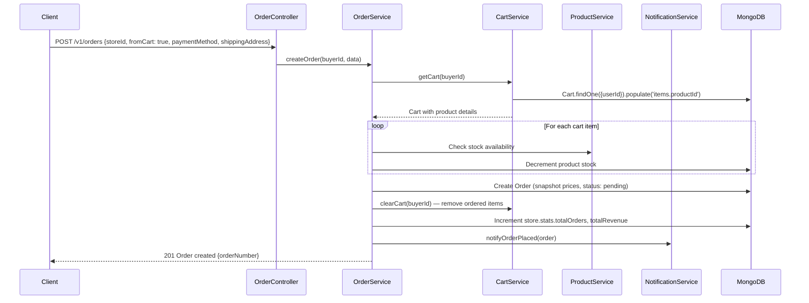

### Product Category Suggestion → Approval

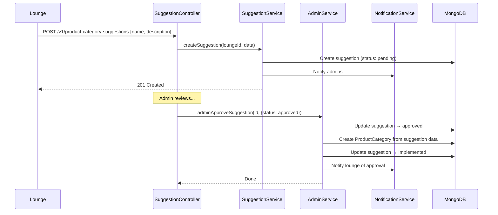

### Review & Rating Recalculation

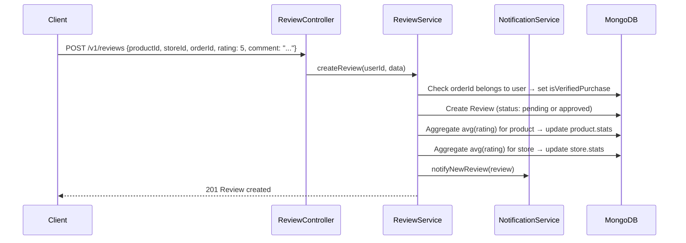

---

## Directory Structure

```
MarketplaceSystem/
├── controllers/
│   ├── store.controller.ts                    # Store CRUD + images
│   ├── product.controller.ts                  # Product CRUD + images + stock
│   ├── order.controller.ts                    # Order lifecycle
│   ├── cart.controller.ts                     # Cart management
│   ├── review.controller.ts                   # Review CRUD + moderation
│   ├── wishlist.controller.ts                 # Wishlist add/remove
│   ├── productCategories.controller.ts        # Category CRUD
│   ├── productCategorySuggestions.controller.ts  # Suggestion workflow
│   └── analytics.controller.ts               # Analytics endpoints
├── dtos/
│   ├── store.dto.ts
│   ├── product.dto.ts
│   ├── order.dto.ts
│   ├── cart.dto.ts
│   ├── review.dto.ts
│   ├── productCategories.dto.ts
│   └── productCategorySuggestions.dto.ts
├── interfaces/
│   ├── store.interface.ts
│   ├── product.interface.ts
│   ├── order.interface.ts
│   ├── cart.interface.ts
│   ├── review.interface.ts
│   ├── wishlist.interface.ts
│   ├── productCategory.interface.ts
│   └── productCategorySuggestion.interface.ts
├── models/
│   ├── store.model.ts
│   ├── product.model.ts
│   ├── order.model.ts
│   ├── cart.model.ts
│   ├── review.model.ts
│   ├── wishlist.model.ts
│   ├── productCategory.model.ts
│   └── productCategorySuggestion.model.ts
├── routes/
│   ├── store.route.ts
│   ├── product.route.ts
│   ├── order.route.ts
│   ├── cart.route.ts
│   ├── review.route.ts
│   ├── wishlist.route.ts
│   ├── productCategories.route.ts
│   ├── productCategorySuggestions.route.ts
│   └── analytics.route.ts
├── services/
│   ├── store.service.ts
│   ├── product.service.ts
│   ├── order.service.ts
│   ├── cart.service.ts
│   ├── review.service.ts
│   ├── wishlist.service.ts
│   ├── productCategories.service.ts
│   ├── productCategorySuggestions.service.ts
│   ├── productCategorySuggestionsAdmin.service.ts
│   └── marketplaceAnalytics.service.ts
└── tests/
    └── marketplace.test.ts
```
