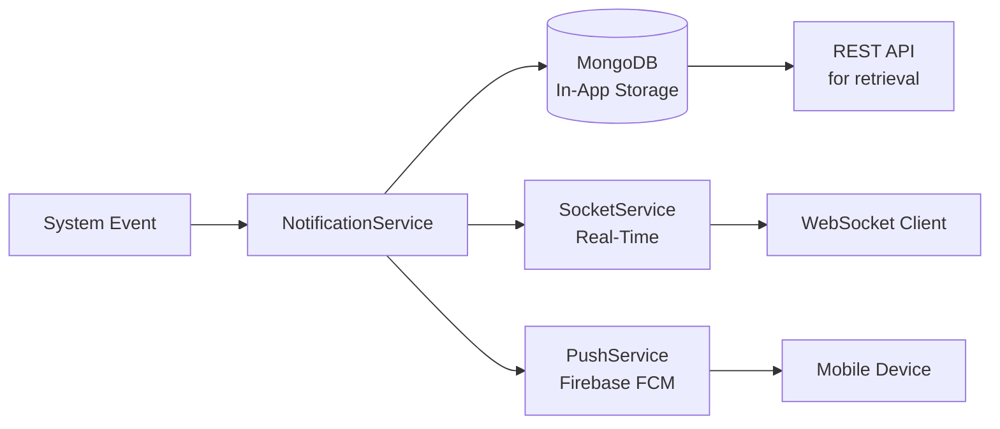
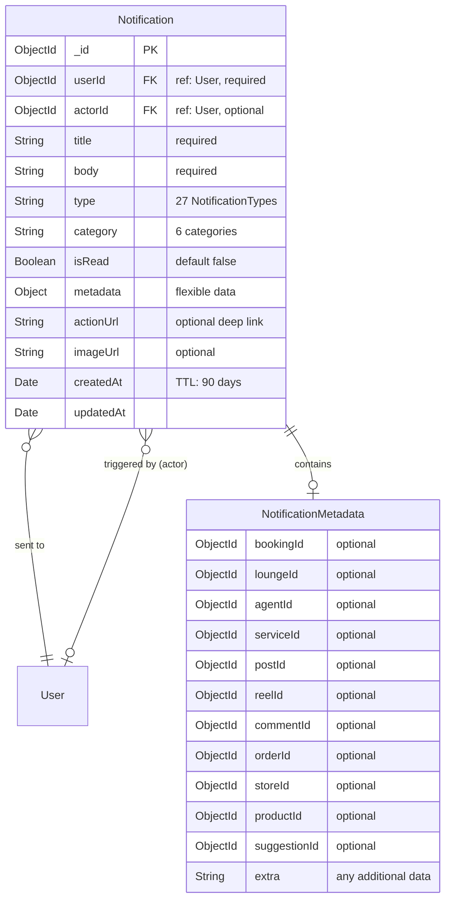
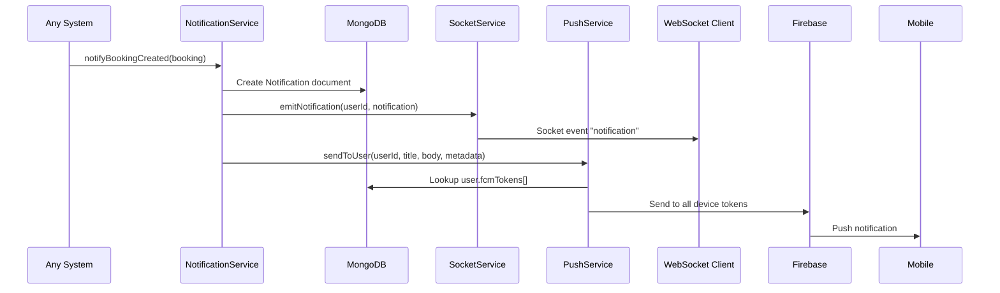
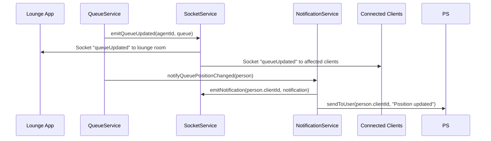
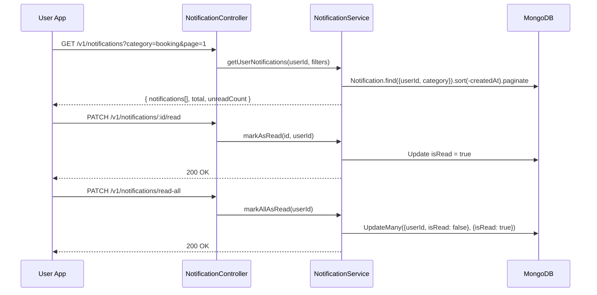

<p align="center">
  
</p>

# NotificationSystem

> Delivers notifications across three channels — in-app (MongoDB), real-time (Socket.IO), and push (Firebase FCM) — with 27 notification types across 6 categories.

---

## Table of Contents

- [Overview](#overview)
- [Database Schema](#database-schema)
- [Notification Types & Categories](#notification-types--categories)
- [API Endpoints](#api-endpoints)
- [DTOs & Validation](#dtos--validation)
- [Services](#services)
- [Flows](#flows)
- [Directory Structure](#directory-structure)

---

## Overview

The NotificationSystem is the **event distribution hub** of Frame Beauty. Every significant action (booking created, queue update, new follower, suggestion approved, etc.) passes through this system.

**Three delivery channels:**



| Channel | Technology | Purpose |
|---------|-----------|---------|
| **In-App** | MongoDB + REST API | Persistent notification inbox, read/unread tracking |
| **Real-Time** | Socket.IO | Instant updates for connected clients (queue changes, bookings) |
| **Push** | Firebase Cloud Messaging | Reach users when app is closed/backgrounded |

---

## Database Schema

### Notification



| Field | Type | Required | Description |
|-------|------|----------|-------------|
| `userId` | ObjectId | Yes | Recipient user |
| `actorId` | ObjectId | No | User who triggered the notification |
| `title` | String | Yes | Notification title |
| `body` | String | Yes | Notification body text |
| `type` | String | Yes | One of 27 `NotificationType` values |
| `category` | String | Yes | One of 6 `NotificationCategory` values |
| `isRead` | Boolean | — | Read status (default `false`) |
| `metadata` | Object | No | Contextual data (IDs, links) |
| `actionUrl` | String | No | Deep link for tap action |
| `imageUrl` | String | No | Thumbnail/avatar URL |
| `createdAt` | Date | — | Auto-set, **TTL index: 90 days** |

---

## Notification Types & Categories

### Categories

| Category | Description | Example Types |
|----------|-------------|---------------|
| `booking` | Booking lifecycle events | created, confirmed, cancelled, completed |
| `queue` | Queue position & status updates | added, position changed, reminder, turn |
| `social` | Social interactions | follow, like, comment, share |
| `content` | Content moderation & interaction | post liked, reel liked, report |
| `system` | Platform-wide announcements | account blocked, suggestion approved |
| `marketplace` | Store & order events | order placed, order shipped, review |

### All 27 Notification Types

| # | Type | Category | Trigger |
|---|------|----------|---------|
| 1 | `booking_created` | booking | Client creates a booking |
| 2 | `booking_confirmed` | booking | Lounge confirms booking |
| 3 | `booking_cancelled` | booking | Booking cancelled by any party |
| 4 | `booking_completed` | booking | Service completed |
| 5 | `booking_reminder` | booking | Upcoming booking reminder |
| 6 | `booking_updated` | booking | Booking details changed |
| 7 | `queue_added` | queue | Person added to queue |
| 8 | `queue_position_changed` | queue | Position update in queue |
| 9 | `queue_reminder` | queue | Your turn is approaching |
| 10 | `queue_turn` | queue | It's your turn now |
| 11 | `queue_completed` | queue | Service finished in queue |
| 12 | `queue_removed` | queue | Removed from queue |
| 13 | `new_follower` | social | Someone followed you |
| 14 | `lounge_liked` | social | Client liked a lounge |
| 15 | `lounge_rated` | social | Client rated a lounge |
| 16 | `post_liked` | content | Someone liked your post |
| 17 | `reel_liked` | content | Someone liked your reel |
| 18 | `comment_added` | content | New comment on your content |
| 19 | `content_reported` | content | Content was reported |
| 20 | `suggestion_created` | system | Lounge submitted suggestion |
| 21 | `suggestion_approved` | system | Admin approved suggestion |
| 22 | `suggestion_rejected` | system | Admin rejected suggestion |
| 23 | `account_blocked` | system | Account was blocked |
| 24 | `account_unblocked` | system | Account was unblocked |
| 25 | `order_placed` | marketplace | New order received |
| 26 | `order_status_changed` | marketplace | Order status updated |
| 27 | `new_review` | marketplace | Product/store reviewed |

---

## API Endpoints

### Notification Routes — `/v1/notifications` (all require `authMiddleware`)

| Method | Endpoint | Description |
|--------|----------|-------------|
| `GET` | `/` | Get user's notifications (paginated, filterable by category) |
| `GET` | `/unread-count` | Get count of unread notifications |
| `GET` | `/:notificationId` | Get single notification |
| `PATCH` | `/:notificationId/read` | Mark notification as read |
| `PATCH` | `/read-all` | Mark all notifications as read |
| `DELETE` | `/:notificationId` | Delete a notification |
| `DELETE` | `/` | Delete all notifications for current user |

---

## DTOs & Validation

| DTO | Fields | Key Validations |
|-----|--------|----------------|
| `CreateNotificationDto` | userId, actorId?, title, body, type, category, metadata?, actionUrl?, imageUrl? | `@IsMongoId()`, `@IsEnum(NotificationType)`, `@IsEnum(NotificationCategory)` |
| `GetNotificationsDto` | page?, limit?, category?, isRead? | `@IsOptional()`, `@IsNumber()` |

---

## Services

### NotificationService

Central notification orchestrator — CRUD + 30 trigger methods.

#### CRUD Methods

| Method | Description |
|--------|-------------|
| `createNotification(data)` | Create in DB + push via FCM + emit via Socket |
| `getUserNotifications(userId, filters)` | Paginated, filterable by category/read status |
| `getUnreadCount(userId)` | Count of `isRead: false` |
| `getNotificationById(id, userId)` | Get single, verify ownership |
| `markAsRead(id, userId)` | Set `isRead: true` |
| `markAllAsRead(userId)` | Bulk update |
| `deleteNotification(id, userId)` | Delete single |
| `deleteAllNotifications(userId)` | Delete all for user |

#### Trigger Methods (called by other systems)

| Method | Called By | Description |
|--------|----------|-------------|
| `notifyBookingCreated(booking)` | BookingService | Notify lounge of new booking |
| `notifyBookingConfirmed(booking)` | BookingService | Notify client of confirmation |
| `notifyBookingCancelled(booking, cancelledBy)` | BookingService | Notify affected party |
| `notifyBookingCompleted(booking)` | QueueService | Notify client of completion |
| `notifyBookingReminder(booking)` | Cron | Upcoming booking reminder |
| `notifyBookingUpdated(booking)` | BookingService | Notify of changes |
| `notifyQueueAdded(queue, person)` | QueueService | Notify person added to queue |
| `notifyQueuePositionChanged(queue, person)` | QueueService | Position update |
| `notifyQueueReminder(queue, person)` | Cron | Turn is approaching |
| `notifyQueueTurn(queue, person)` | QueueService | It's your turn |
| `notifyQueueCompleted(queue, person)` | QueueService | Queue service done |
| `notifyQueueRemoved(queue, person)` | QueueService | Removed from queue |
| `notifyNewFollower(targetId, followerId)` | FollowService | New follower |
| `notifyLoungeLiked(loungeId, clientId)` | LikeService | Lounge liked |
| `notifyLoungeRated(loungeId, clientId, score)` | RatingService | New rating |
| `notifyPostLiked(postOwnerId, likerId, postId)` | ContentLikeService | Post liked |
| `notifyReelLiked(reelOwnerId, likerId, reelId)` | ContentLikeService | Reel liked |
| `notifyCommentAdded(contentOwnerId, commenterId, contentId)` | CommentService | New comment |
| `notifyContentReported(adminIds, reporterId, contentId)` | ReportService | Content reported |
| `notifySuggestionCreated(adminIds, loungeId, suggestion)` | SuggestionService | New suggestion |
| `notifySuggestionApproved(loungeId, suggestion)` | CatalogSuggestionsService | Suggestion approved |
| `notifySuggestionRejected(loungeId, suggestion)` | CatalogSuggestionsService | Suggestion rejected |
| `notifyAccountBlocked(userId)` | UserManagementService | Account blocked |
| `notifyAccountUnblocked(userId)` | UserManagementService | Account unblocked |
| `notifyOrderPlaced(order)` | OrderService | New order |
| `notifyOrderStatusChanged(order)` | OrderService | Order status change |
| `notifyNewReview(review)` | ReviewService | New product review |

### SocketService

Singleton Socket.IO manager for real-time event distribution.

| Method | Event Name | Description |
|--------|-----------|-------------|
| `emitQueueUpdated(agentId, queue)` | `queueUpdated` | Broadcast queue state change to lounge room |
| `emitBookingCreated(booking)` | `bookingCreated` | Notify lounge of new booking |
| `emitBookingUpdated(booking)` | `bookingUpdated` | Booking status/detail change |
| `emitBookingDeleted(bookingId)` | `bookingDeleted` | Booking removed |
| `emitNotification(userId, notification)` | `notification` | Push in-app notification to specific user |

**Room structure:**
- Each user joins room `user:{userId}` on connect
- Lounge agents join room `lounge:{loungeId}`
- Queue updates broadcast to `lounge:{loungeId}` room

### PushService

Firebase Cloud Messaging integration for native push notifications.

| Method | Description |
|--------|-------------|
| `registerToken(userId, token, deviceId, platform)` | Register/update FCM token for a device |
| `removeToken(userId, deviceId)` | Unregister a device token |
| `sendToUser(userId, title, body, data?)` | Send push to all user's registered devices |
| `sendToUsers(userIds, title, body, data?)` | Batch send to multiple users |

**Token management:**
- Tokens stored in `User.fcmTokens[]` sub-document
- Supports multiple devices per user
- Automatically handles expired/invalid tokens

---

## Flows

### Notification Delivery Flow



### Real-Time Queue Update Flow



### Notification Read Flow



---

## Directory Structure

```
NotificationSystem/
├── controllers/
│   └── notification.controller.ts   # Notification REST endpoints
├── dtos/
│   └── notification.dto.ts          # Validation DTOs
├── interfaces/
│   └── notification.interface.ts    # Types, NotificationType, NotificationCategory enums
├── models/
│   └── notification.model.ts        # Notification Mongoose schema (TTL: 90 days)
├── routes/
│   └── notification.route.ts        # /v1/notifications routes
├── services/
│   ├── notification.service.ts      # CRUD + 30 trigger methods
│   ├── socket.service.ts            # Socket.IO singleton manager
│   └── push.service.ts              # Firebase FCM integration
└── tests/
    └── notification.test.ts
```
