<p align="center">
  
</p>

# ServiceCatalogSystem

> Manages the beauty service catalog: global services & categories, lounge-specific service offerings, service suggestions workflow, lounge ratings, and the queue-booking agent toggle.

---

## Table of Contents

- [Overview](#overview)
- [Database Schemas](#database-schemas)
- [Entity Relationships](#entity-relationships)
- [API Endpoints](#api-endpoints)
- [DTOs & Validation](#dtos--validation)
- [Services](#services)
- [Flows](#flows)
- [Directory Structure](#directory-structure)

---

## Overview

The ServiceCatalogSystem is the **product catalog** of Frame Beauty's service marketplace. It manages a two-tier catalog:

1. **Global Catalog** — Platform-wide services and categories maintained by admins
2. **Lounge Catalog** — Per-lounge service offerings with custom pricing, duration, gender targeting, and agent assignments

Additionally, it handles:
- **Service Suggestions** — Lounges can suggest new services; admins approve/reject
- **Ratings** — Clients rate lounges (1–5 stars)
- **Queue-Booking Toggle** — Lounges can enable/disable queue booking per agent

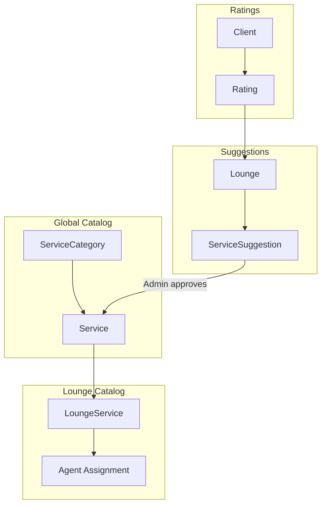

---

## Database Schemas

### ServiceCategory

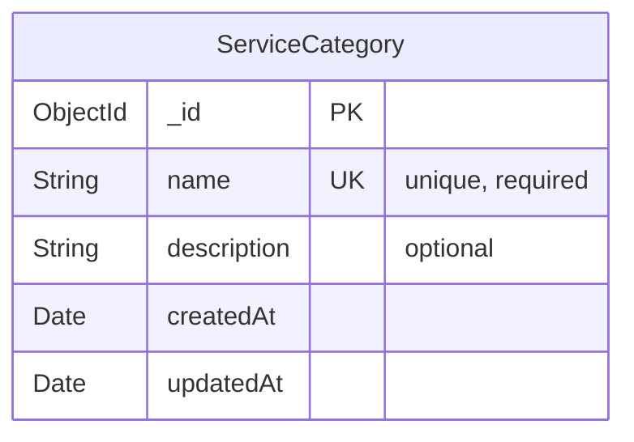

| Field | Type | Required | Description |
|-------|------|----------|-------------|
| `name` | String | Yes | Unique category name (e.g., "Hair", "Nails", "Skincare") |
| `description` | String | No | Category description |

### Service

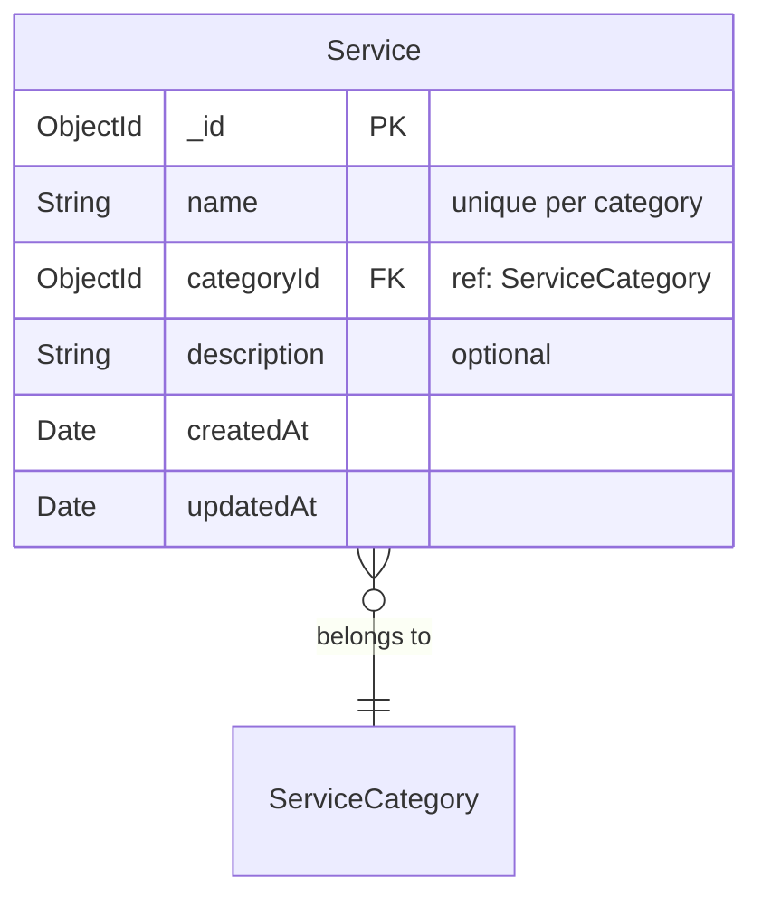

| Field | Type | Required | Description |
|-------|------|----------|-------------|
| `name` | String | Yes | Service name (unique within its category) |
| `categoryId` | ObjectId | Yes | Reference to ServiceCategory |
| `description` | String | No | Service description |

### LoungeService

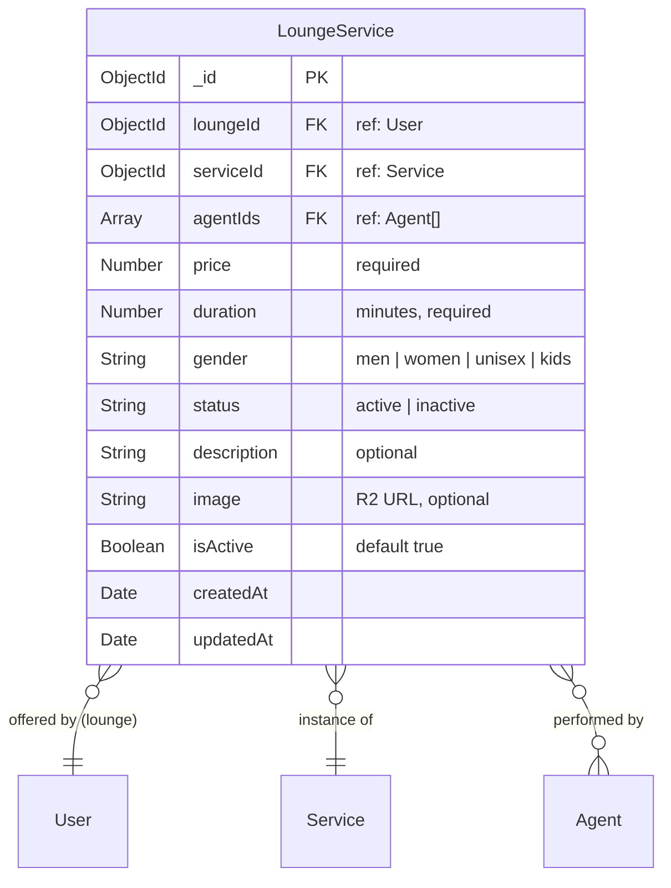

| Field | Type | Required | Description |
|-------|------|----------|-------------|
| `loungeId` | ObjectId | Yes | The lounge offering this service |
| `serviceId` | ObjectId | Yes | Reference to global Service |
| `agentIds` | ObjectId[] | No | Agents who can perform this service |
| `price` | Number | Yes | Price in local currency |
| `duration` | Number | Yes | Duration in minutes |
| `gender` | String | Yes | Target: `men`, `women`, `unisex`, `kids` |
| `status` | String | — | `active` or `inactive` |
| `description` | String | No | Lounge-specific description |
| `image` | String | No | Service image (R2 URL) |
| `isActive` | Boolean | — | Active toggle |

### ServiceSuggestion

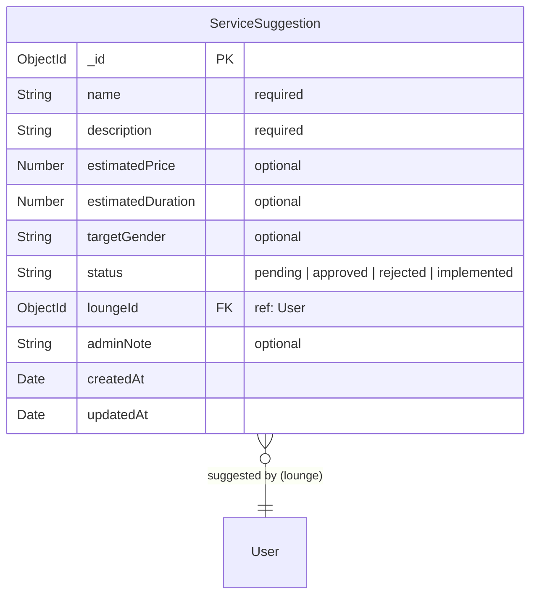

| Field | Type | Required | Description |
|-------|------|----------|-------------|
| `name` | String | Yes | Suggested service name |
| `description` | String | Yes | Description of the suggested service |
| `estimatedPrice` | Number | No | Suggested price point |
| `estimatedDuration` | Number | No | Suggested duration in minutes |
| `targetGender` | String | No | Intended audience |
| `status` | String | — | `pending` → `approved` / `rejected` → `implemented` |
| `loungeId` | ObjectId | Yes | Lounge that made the suggestion |
| `adminNote` | String | No | Admin feedback on the suggestion |

### Rating

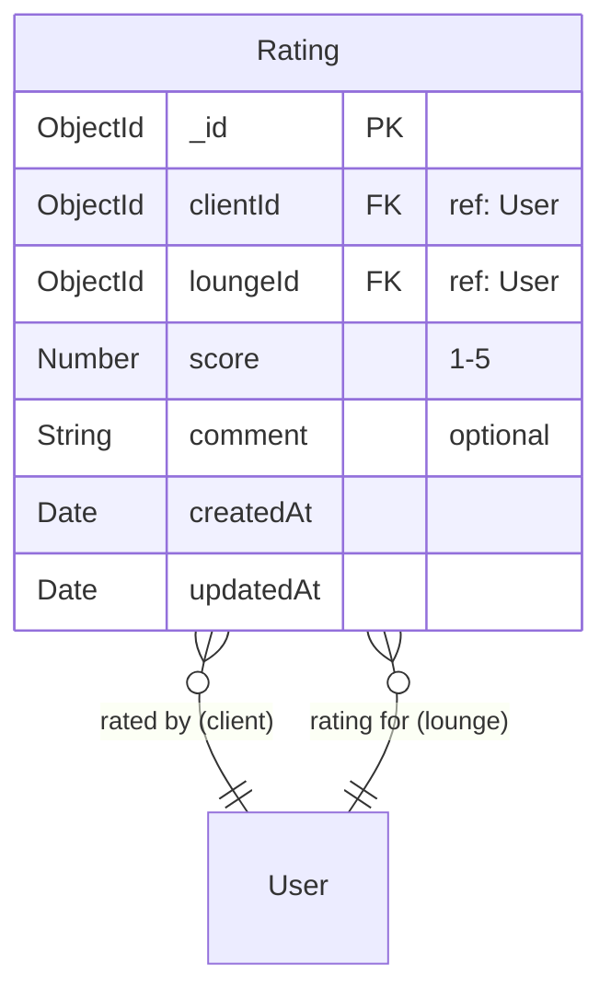

| Field | Type | Required | Description |
|-------|------|----------|-------------|
| `clientId` | ObjectId | Yes | Client who gave the rating |
| `loungeId` | ObjectId | Yes | Lounge being rated |
| `score` | Number | Yes | 1–5 stars |
| `comment` | String | No | Text review |
| | | | **Unique constraint:** `{clientId, loungeId}` — one rating per client per lounge |

---

## Entity Relationships

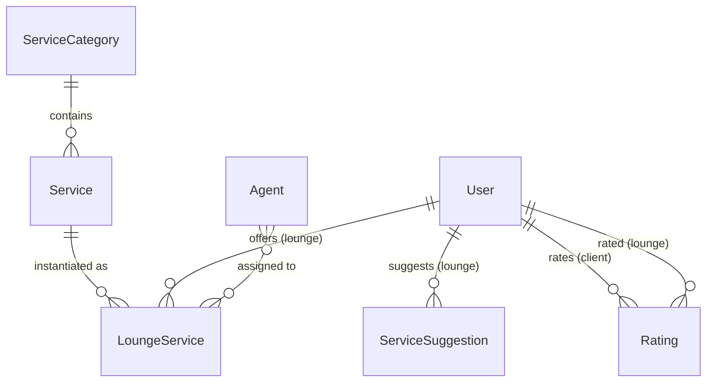

---

## API Endpoints

### Public Services — `/v1/services` (no auth required)

| Method | Endpoint | Description |
|--------|----------|-------------|
| `GET` | `/` | List all global services |
| `GET` | `/:id` | Get service by ID |

### Public Service Categories — `/v1/service-categories` (no auth required)

| Method | Endpoint | Description |
|--------|----------|-------------|
| `GET` | `/` | List all service categories |
| `GET` | `/:id` | Get category by ID |

### Lounge Services — `/v1/lounge-services` (auth required)

| Method | Endpoint | Description |
|--------|----------|-------------|
| `GET` | `/` | List all lounge services |
| `GET` | `/search` | Search lounge services by name |
| `GET` | `/lounge/:loungeId` | Get services for a specific lounge |
| `GET` | `/:serviceId` | Get lounge service by ID |
| `GET` | `/service-name/:serviceId` | Get service name by ID |
| `POST` | `/` | Create a lounge service |
| `POST` | `/bulk` | Bulk create lounge services |
| `PUT` | `/:serviceId` | Update a lounge service |
| `DELETE` | `/:serviceId` | Delete a lounge service |
| `PATCH` | `/:serviceId/toggle-status` | Toggle active/inactive status |
| `PATCH` | `/lounge/:loungeId/opening-hours` | Update lounge opening hours |
| `PUT` | `/lounge/:loungeId/profile` | Update lounge profile |
| `GET` | `/lounge/:loungeId/agents` | Get agents for a lounge |

### Lounge Routes — `/v1/lounge`

| Method | Endpoint | Auth | Description |
|--------|----------|------|-------------|
| `GET` | `/clients/:clientId` | auth | Get client info (lounge context) |
| `PATCH` | `/agents/:agentId/queue-booking` | auth + lounge | Toggle agent queue-booking acceptance |

### Service Suggestions — `/v1/service-suggestions`

| Method | Endpoint | Auth | Description |
|--------|----------|------|-------------|
| `GET` | `/` | auth | List suggestions (paginated) |
| `GET` | `/stats` | admin | Suggestion statistics |
| `GET` | `/:suggestionId` | auth | Get suggestion by ID |
| `POST` | `/` | lounge | Create a suggestion |
| `PUT` | `/:suggestionId` | lounge | Update own suggestion |
| `PATCH` | `/:suggestionId/status` | admin | Update suggestion status |
| `PATCH` | `/:suggestionId/admin-approve` | admin | Approve and auto-create service |
| `DELETE` | `/:suggestionId` | auth | Delete suggestion |

### Ratings — `/v1/ratings`

| Method | Endpoint | Auth | Description |
|--------|----------|------|-------------|
| `GET` | `/lounge/:loungeId` | auth | Get all ratings for a lounge |
| `GET` | `/me/:loungeId` | client | Get my rating for a lounge |
| `PUT` | `/` | client | Create or update rating (upsert) |
| `DELETE` | `/:loungeId` | client | Delete my rating |

---

## DTOs & Validation

| DTO | Fields | Key Validations |
|-----|--------|----------------|
| `CreateServiceDto` | name, categoryId, description? | `@IsString()` |
| `UpdateServiceDto` | all optional | `@IsOptional()` |
| `CreateServiceCategoryDto` | name, description? | `@IsString()` |
| `UpdateServiceCategoryDto` | all optional | `@IsOptional()` |
| `CreateServiceSuggestionDto` | name, description, estimatedPrice?, estimatedDuration?, targetGender? | `@IsString()`, `@IsNumber()` |
| `UpdateServiceSuggestionStatusDto` | status, adminNote?, categoryId?, name?, price?, duration?, gender? | `@IsEnum(ServiceSuggestionStatus)` |
| `AdminApproveServiceSuggestionDto` | status?, categoryId, name?, price?, duration?, gender?, adminNote? | Required `categoryId` for auto-creation |
| `UpsertRatingDto` | loungeId, score, comment? | `@Min(1) @Max(5)` |
| `CreateLoungeServiceDto` | loungeId, serviceId, agentIds?, price, duration, gender, status?, description?, image?, isActive? | `@IsNumber()` for price/duration |
| `UpdateLoungeServiceDto` | all optional | `@IsOptional()` |

### Enums

```typescript
enum ServiceSuggestionStatus {
  pending = 'pending',
  approved = 'approved',
  rejected = 'rejected',
  implemented = 'implemented'
}

enum ServiceLoungeGender {
  men = 'men',
  women = 'women',
  unisex = 'unisex',
  kids = 'kids'
}

enum LoungeServiceStatus {
  active = 'active',
  inactive = 'inactive'
}
```

---

## Services

### ServicesService

Global service catalog management.

| Method | Description |
|--------|-------------|
| `createService(data)` | Create a new global service |
| `getAllServices()` | List all services |
| `getServiceById(id)` | Get service by ID |
| `updateService(id, data)` | Update service |
| `deleteService(id)` | Delete service |
| `getServicesPaginated(page, limit)` | Paginated list |
| `searchServices(query)` | Text search |
| `getServicesByCategory(categoryId)` | Filter by category |
| `bulkCreateServices(data[])` | Batch import |

### ServiceCategoriesService

| Method | Description |
|--------|-------------|
| `createServiceCategory(data)` | Create category |
| `getAllServiceCategories()` | List all |
| `getServiceCategoryById(id)` | Get by ID |
| `updateServiceCategory(id, data)` | Update |
| `deleteServiceCategory(id)` | Delete |
| `searchServiceCategories(query)` | Text search |

### LoungeServicesService

Per-lounge service management.

| Method | Description |
|--------|-------------|
| `createLoungeService(data)` | Create lounge service offering |
| `getAllLoungeServices()` | List all |
| `getLoungeServicesByLoungeId(loungeId)` | Get services for a lounge |
| `getLoungeServiceById(serviceId)` | Get by ID |
| `getServiceNameById(serviceId)` | Lightweight name lookup |
| `updateLoungeService(serviceId, data)` | Update pricing, duration, agents |
| `deleteLoungeService(serviceId)` | Remove lounge service |
| `toggleLoungeServiceStatus(serviceId)` | Toggle active ↔ inactive |
| `patchLoungeOpeningHours(loungeId, hours)` | Update lounge hours |
| `getAgentsPerLounge(loungeId)` | List agents for a lounge |
| `updateLoungeProfile(loungeId, data)` | Update lounge profile fields |
| `getLoungeServicesPaginated(page, limit)` | Admin paginated view |
| `bulkCreateLoungeServices(data[])` | Batch import |
| `searchLoungeServices(query)` | Text search |

### ServiceSuggestionsService & CatalogSuggestionsService

| Method | Description |
|--------|-------------|
| `createServiceSuggestion(data)` | Lounge submits suggestion |
| `getServiceSuggestionsPaginated(page, limit)` | Paginated list |
| `getServiceSuggestionById(id)` | Get by ID |
| `updateServiceSuggestion(id, data)` | Lounge updates own suggestion |
| `deleteServiceSuggestion(id)` | Delete suggestion |
| `getServiceSuggestionsStats()` | Count by status |
| `updateServiceSuggestionStatus(id, data)` | Admin status transition + notification |
| `adminUpdateServiceSuggestionStatus(id, data)` | Admin approve → auto-creates Service + optionally LoungeService |

### RatingService

| Method | Description |
|--------|-------------|
| `upsertRating(clientId, dto)` | Create or update rating + recalculate lounge average + notify |
| `deleteRating(clientId, loungeId)` | Delete rating + recalculate average |
| `getLoungeRatings(loungeId, page, limit)` | Paginated ratings for a lounge |
| `getMyRating(clientId, loungeId)` | Get current user's rating for a lounge |

---

## Flows

### Service Suggestion → Approval → Auto-Creation

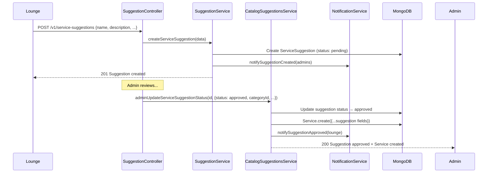

### Rating Upsert Flow

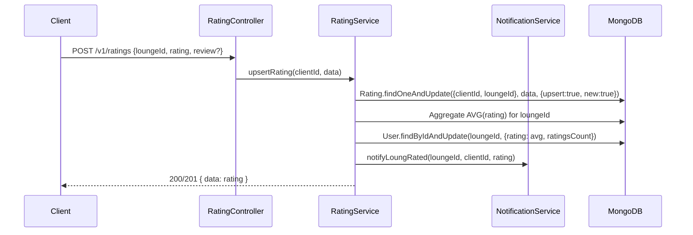

### LoungeService Assignment Flow

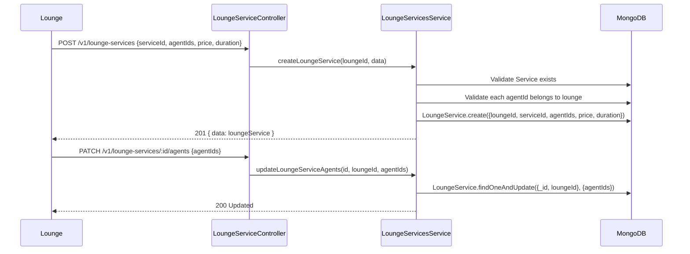

---

## Directory Structure

```
src/systems/ServiceCatalogSystem/
├── interfaces/
│   └── catalog.interface.ts    # ServiceCategoryType, SuggestionStatus enums
├── models/
│   ├── service.model.ts
│   ├── serviceCategory.model.ts
│   ├── loungeService.model.ts
│   ├── serviceSuggestion.model.ts
│   └── rating.model.ts
├── dtos/
│   ├── services.dto.ts
│   ├── serviceCategories.dto.ts
│   ├── loungeServices.dto.ts
│   ├── serviceSuggestions.dto.ts
│   └── rating.dto.ts
├── services/
│   ├── services.service.ts
│   ├── serviceCategories.service.ts
│   ├── loungeServices.service.ts
│   ├── serviceSuggestions.service.ts
│   └── rating.service.ts
├── controllers/
│   ├── services.controller.ts
│   ├── serviceCategories.controller.ts
│   ├── loungeServices.controller.ts
│   ├── serviceSuggestions.controller.ts
│   └── rating.controller.ts
├── routes/
│   ├── services.route.ts
│   ├── serviceCategories.route.ts
│   ├── loungeServices.route.ts
│   ├── serviceSuggestions.route.ts
│   └── rating.route.ts
└── README.md
```
    AS->>DB: Create new Service {name, categoryId}
    AS->>DB: Optionally create LoungeService for the suggesting lounge
    AS->>DB: Update suggestion status → implemented
    AS->>NS: notifySuggestionApproved(loungeId)
    AS-->>API: Done
```

### Rating & Average Recalculation

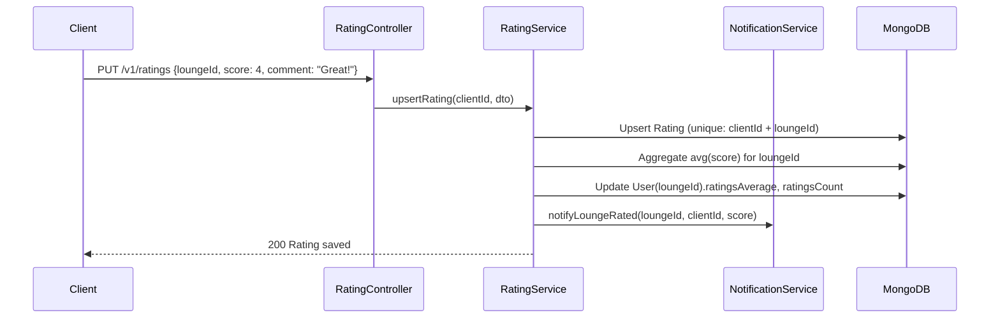

### Queue-Booking Toggle

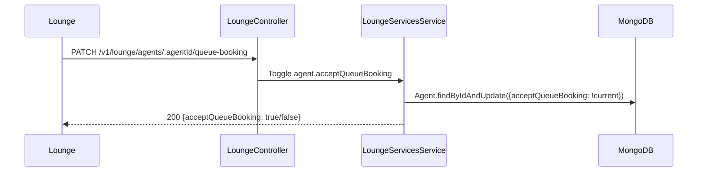

---

## Directory Structure

```
ServiceCatalogSystem/
├── controllers/
│   ├── services.controller.ts           # Global services endpoints
│   ├── serviceCategories.controller.ts  # Category endpoints
│   ├── loungeServices.controller.ts     # Lounge service management
│   ├── lounge.controller.ts             # Lounge-specific operations
│   ├── serviceSuggestions.controller.ts  # Suggestion endpoints
│   └── rating.controller.ts             # Rating endpoints
├── dtos/
│   ├── services.dto.ts
│   ├── serviceCategories.dto.ts
│   ├── loungeServices.dto.ts
│   ├── serviceSuggestions.dto.ts
│   └── rating.dto.ts
├── interfaces/
│   ├── services.interface.ts
│   ├── serviceCategories.interface.ts
│   ├── loungeServices.interface.ts
│   ├── serviceSuggestions.interface.ts
│   └── rating.interface.ts
├── models/
│   ├── service.model.ts
│   ├── serviceCategory.model.ts
│   ├── loungeService.model.ts
│   ├── serviceSuggestion.model.ts
│   └── rating.model.ts
├── routes/
│   ├── services.route.ts
│   ├── serviceCategories.route.ts
│   ├── loungeServices.route.ts
│   ├── lounge.route.ts
│   ├── serviceSuggestions.route.ts
│   └── rating.route.ts
├── services/
│   ├── services.service.ts
│   ├── serviceCategories.service.ts
│   ├── loungeServices.service.ts
│   ├── serviceSuggestions.service.ts
│   ├── catalogSuggestions.service.ts
│   └── rating.service.ts
└── tests/
    └── serviceCatalog.test.ts
```
