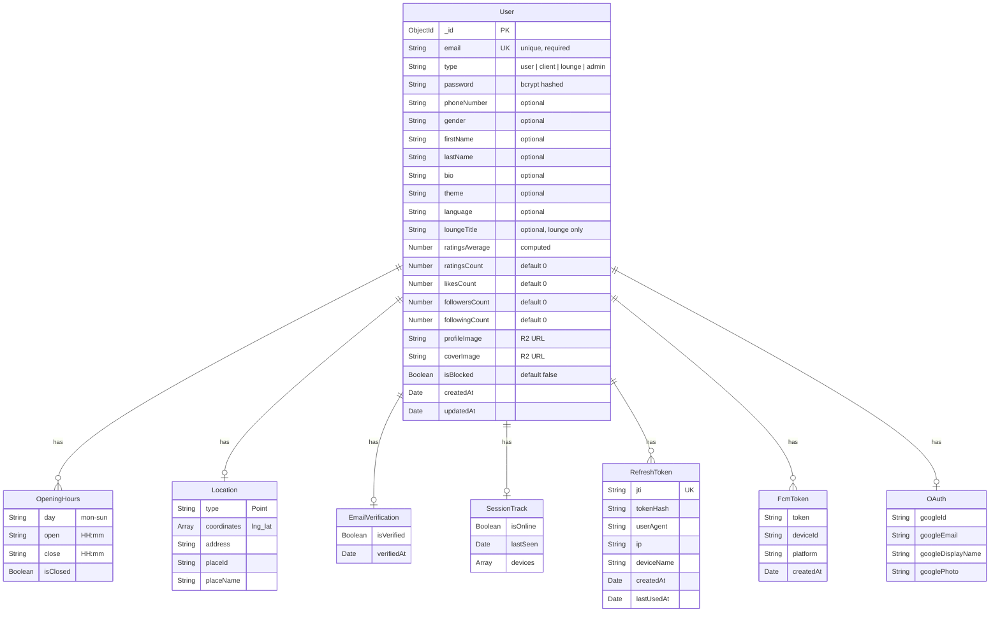
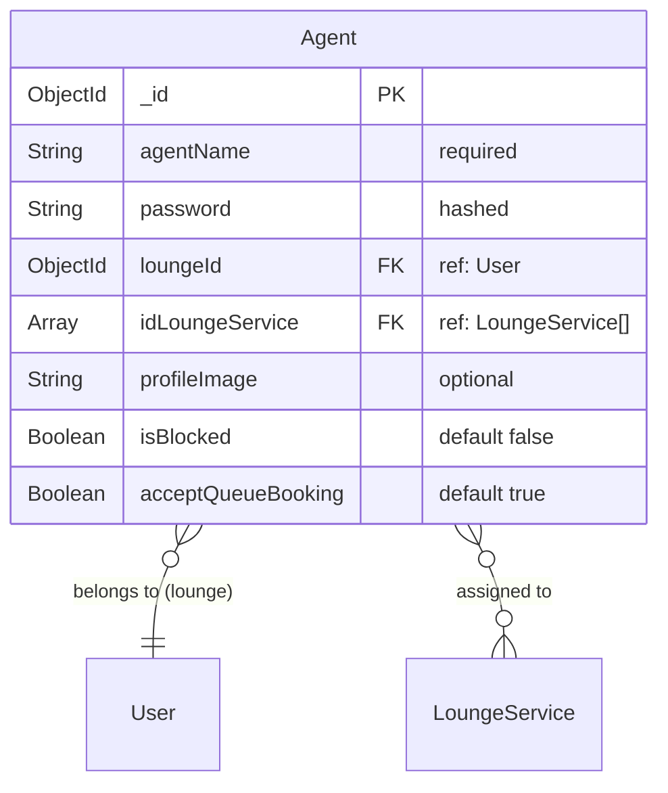
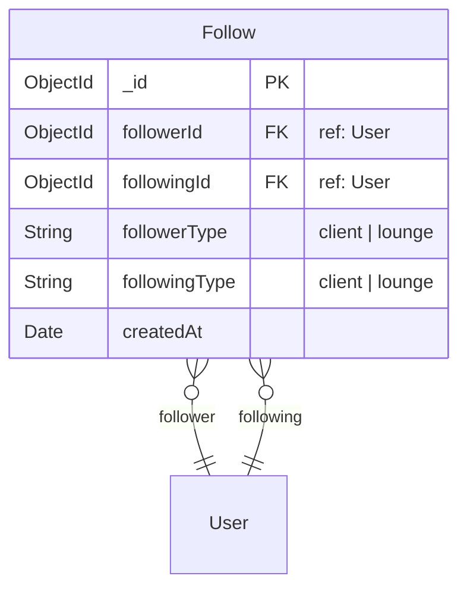
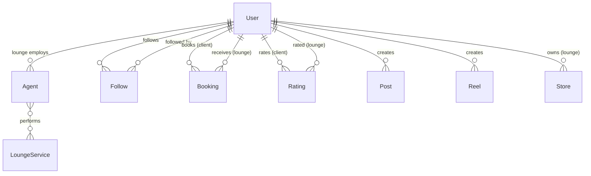
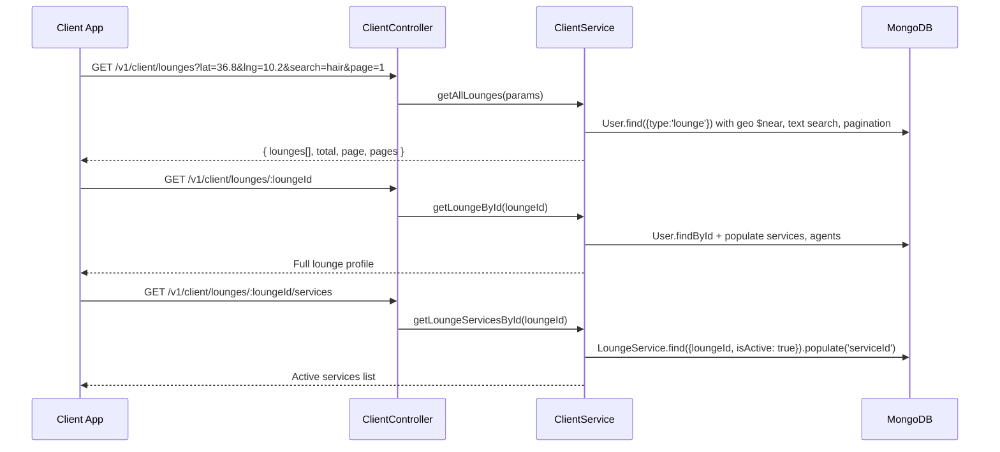
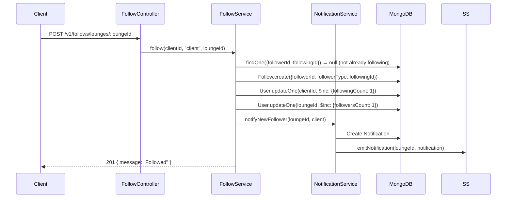
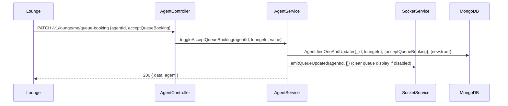
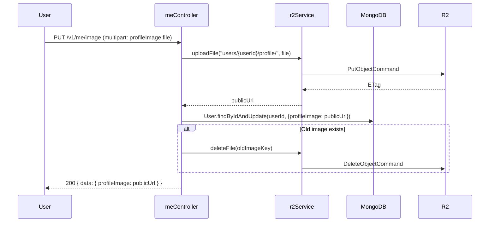

<p align="center">
  
</p>

# UserManager

> Manages all user entities (clients, lounges, agents), profile operations, the follow system, and client-facing lounge/profile browsing.

---

## Table of Contents

- [Overview](#overview)
- [Database Schemas](#database-schemas)
- [Entity Relationships](#entity-relationships)
- [API Endpoints](#api-endpoints)
- [DTOs & Validation](#dtos--validation)
- [Services](#services)
- [Flows](#flows)
- [Directory Structure](#directory-structure)

---

## Overview

The UserManager is the **identity backbone** of Frame Beauty. It owns the `User`, `Agent`, and `Follow` models and exposes four route groups:

| Route Group | Base Path | Purpose |
|-------------|-----------|---------|
| **CurrentUser** | `/v1/me` | Authenticated user's own profile operations |
| **Client** | `/v1/client` | Client-facing lounge discovery and profile browsing |
| **Agent** | `/v1/agents` | Agent CRUD for lounges and admins |
| **Follow** | `/v1/follows` | Social follow/unfollow system |

**Key Capabilities:**
- User profile management (update info, images, location, theme, language)
- Password change and email re-verification
- Lounge discovery with geolocation and service filtering
- Agent management (create, assign to services, manage queue-booking toggle)
- Social follow system with follower/following counts
- Client profile visitor view (bookings, liked lounges, ratings)

---

## Database Schemas

### User



| Field | Type | Required | Description |
|-------|------|----------|-------------|
| `email` | String | Yes | Unique email address |
| `type` | String | Yes | `user`, `client`, `lounge`, or `admin` |
| `password` | String | Yes | bcrypt-hashed password |
| `phoneNumber` | String | No | Contact phone |
| `gender` | String | No | User's gender |
| `firstName` / `lastName` | String | No | Display name |
| `bio` | String | No | Profile bio |
| `theme` / `language` | String | No | UI preferences |
| `loungeTitle` | String | No | Display name for lounge-type users |
| `ratingsAverage` | Number | — | Computed average of ratings received |
| `ratingsCount` | Number | — | Total ratings received |
| `likesCount` | Number | — | Total likes received (lounge) |
| `followersCount` / `followingCount` | Number | — | Social graph counts |
| `openingHours` | Array(7) | No | Per-day schedule `{day, open, close, isClosed}` |
| `location` | GeoJSON | No | 2dsphere-indexed location for geospatial queries |
| `profileImage` / `coverImage` | String | No | Cloudflare R2 URLs |
| `emailVerification` | Object | — | `{isVerified, verifiedAt}` |
| `isBlocked` | Boolean | — | Admin block flag |
| `sessionTrack` | Object | — | `{isOnline, lastSeen, devices[]}` |
| `refreshTokens` | Array | — | Active JWT refresh sessions |
| `fcmTokens` | Array | — | Firebase push notification tokens |
| `failedLoginAttempts` | Number | — | Brute force counter |
| `lockUntil` | Date | — | Account lockout expiry |
| `passwordChangedAt` | Date | — | Last password change |
| `oauth` | Object | — | Google OAuth profile data |

### Agent



| Field | Type | Required | Description |
|-------|------|----------|-------------|
| `agentName` | String | Yes | Display name |
| `password` | String | Yes | Hashed password |
| `loungeId` | ObjectId | Yes | Reference to the lounge (User) this agent works for |
| `idLoungeService` | ObjectId[] | No | Services this agent can perform |
| `profileImage` | String | No | R2 URL |
| `isBlocked` | Boolean | — | Blocked by admin/lounge |
| `acceptQueueBooking` | Boolean | — | Whether agent accepts queue bookings (toggle) |

### Follow



| Field | Type | Description |
|-------|------|-------------|
| `followerId` | ObjectId | The user who follows |
| `followingId` | ObjectId | The user being followed |
| `followerType` | String | Type of follower |
| `followingType` | String | Type of the followed user |
| | | **Unique compound index:** `{followerId, followingId}` |

---

## Entity Relationships



---

## API Endpoints

### CurrentUser Routes — `/v1/me` (all require `authMiddleware`)

| Method | Endpoint | Middleware | Description |
|--------|----------|-----------|-------------|
| `GET` | `/` | — | Get current user profile |
| `PUT` | `/` | `validation(UpdateUserDto)` | Update profile |
| `DELETE` | `/` | `validation(DeleteAccountDto)` | Delete account (requires password) |
| `POST` | `/change-password` | `validation(ChangePasswordDto)` | Change password |
| `PUT` | `/location` | `validation(LocationDto)` | Update geolocation |
| `PUT` | `/image` | `imageUpload.single('profileImage')` | Upload profile image |
| `PUT` | `/cover-image` | `imageUpload.single('coverImage')` | Upload cover image |
| `PUT` | `/client` | `validation(UpdateClientProfileDto)` | Update client-specific fields |
| `PUT` | `/theme` | `validation(UpdateThemeDto)` | Update UI theme |
| `PUT` | `/language` | `validation(UpdateLanguageDto)` | Update language preference |
| `POST` | `/send-verification-code` | `validation(SendVerificationEmailDto)` | Re-send email verification |
| `POST` | `/verify-email` | `validation(VerifyEmailCodeDto)` | Verify email with code |
| `DELETE` | `/reels/:reelId` | — | Delete own reel |

### Client Routes — `/v1/client` (auth + adminOrLoungeOrClient)

| Method | Endpoint | Description |
|--------|----------|-------------|
| `GET` | `/lounges` | Discover lounges (with geo, search, pagination) |
| `GET` | `/lounges/:loungeId` | Get lounge details |
| `GET` | `/lounges/:loungeId/services` | Get lounge's active services |
| `GET` | `/services/:serviceId/lounges` | Find lounges offering a specific service |
| `GET` | `/profile/:clientId` | View client public profile |
| `GET` | `/profile/:clientId/bookings` | View client's past bookings |
| `GET` | `/profile/:clientId/likes` | View client's liked lounges |
| `GET` | `/profile/:clientId/ratings` | View client's ratings |

### Agent Routes — `/v1/agents`

| Method | Endpoint | Auth | Description |
|--------|----------|------|-------------|
| `GET` | `/` | admin or lounge | List all agents |
| `GET` | `/:agentId` | admin or lounge | Get agent details |
| `POST` | `/` | admin or lounge + imageUpload + validation | Create agent |
| `PUT` | `/:agentId` | admin or lounge + validation | Update agent |
| `DELETE` | `/:agentId` | admin or lounge | Delete agent |
| `PUT` | `/:agentId/image` | admin or lounge + imageUpload | Upload agent profile image |

### Follow Routes — `/v1/follows` (auth + adminOrLoungeOrClient)

| Method | Endpoint | Description |
|--------|----------|-------------|
| `POST` | `/:targetId` | Follow a user/lounge |
| `DELETE` | `/:targetId` | Unfollow |
| `GET` | `/check/:targetId` | Check if following |
| `GET` | `/following/:userId` | Get user's following list |
| `GET` | `/followers/:userId` | Get user's followers list |
| `GET` | `/counts/:userId` | Get follower/following counts |

### Lounge Routes — `/v1/lounge` (auth required)

| Method | Endpoint | Auth | Description |
|--------|----------|------|-------------|
| `GET` | `/most-booked` | auth (all users) | Get all lounges ordered by most completed bookings |
| `GET` | `/clients/:clientId` | auth + adminOrLoungeOrClientOrAgent | Get client info (lounge context) |
| `PATCH` | `/agents/:agentId/queue-booking` | auth + lounge | Toggle agent queue-booking acceptance |
| `PATCH` | `/me/queue-booking` | auth + agent | Agent toggles own queue-booking acceptance |

#### `GET /v1/lounge/most-booked`

Returns **all lounges** sorted by the number of completed bookings in descending order (most booked first). Lounges with zero completed bookings appear at the bottom. Accessible to **all authenticated users** (clients, lounges, agents, admins).

**Response:**

```json
{
  "success": true,
  "data": [
    {
      "_id": "64a1b2c3d4e5f6a7b8c9d0e1",
      "completedBookings": 42,
      "totalRevenue": 1250.50,
      "loungeTitle": "Beauty Lounge Cairo",
      "email": "lounge@example.com",
      "profileImage": "https://r2.example.com/profile.jpg",
      "coverImage": "https://r2.example.com/cover.jpg",
      "location": {
        "type": "Point",
        "coordinates": [31.2357, 30.0444],
        "address": "Cairo, Egypt",
        "placeName": "Beauty Lounge Cairo"
      },
      "averageRating": 4.7,
      "ratingCount": 35,
      "likeCount": 120,
      "followersCount": 340
    },
    {
      "_id": "64a1b2c3d4e5f6a7b8c9d0e2",
      "completedBookings": 28,
      "totalRevenue": 870.00,
      "loungeTitle": "Style Hub",
      "email": "style@example.com",
      "averageRating": 4.2,
      "ratingCount": 18,
      "likeCount": 65,
      "followersCount": 210
    }
  ],
  "count": 2,
  "message": "Lounges retrieved successfully, ordered by completed bookings"
}
```

The array includes every lounge in the platform, ordered from most completed bookings to fewest. Lounges with zero bookings have `completedBookings: 0` and `totalRevenue: 0`.

---

## DTOs & Validation

### User DTOs

| DTO | Fields | Validation |
|-----|--------|-----------|
| `CreateUserDto` | email, password, type, firstName?, lastName?, phoneNumber?, gender?, loungeTitle?, bio? | `@IsEmail()`, `@MinLength(8)`, `@IsString()` |
| `UpdateUserDto` | All fields optional from CreateUserDto | `@IsOptional()` on each |
| `DeleteAccountDto` | password | `@IsString()` |
| `UpdateClientProfileDto` | firstName?, lastName?, bio?, phoneNumber?, gender? | All `@IsString() @IsOptional()` |
| `ChangePasswordDto` | currentPassword, newPassword | `@IsString()`, `@MinLength(8)` |
| `UpdateLoungeProfileDto` | loungeTitle?, bio?, phoneNumber?, firstName?, lastName? | All optional |
| `LocationDto` | lat, lng, address?, placeId?, placeName? | `@IsNumber()` for coords |
| `OpeningHoursDto` | openingHours[] | `@IsArray()` of `DayOpeningHoursDto` |
| `DayOpeningHoursDto` | day, open?, close?, isClosed? | `@IsString()`, `@IsBoolean()` |
| `UpdateThemeDto` | theme | `@IsString()` |
| `UpdateLanguageDto` | language | `@IsString()` |

### Agent DTOs

| DTO | Fields | Validation |
|-----|--------|-----------|
| `CreateAgentDto` | agentName, password, loungeId, idLoungeService[], profileImage?, isBlocked? | Required fields validated |
| `UpdateAgentDto` | All optional from CreateAgentDto | `@IsOptional()` |

---

## Services

### CurrentUserService

Self-service operations for the authenticated user.

| Method | Description |
|--------|-------------|
| `sendVerificationCode(email)` | Generates 6-digit code, sends verification email |
| `verifyEmailCode(email, code)` | Validates code, marks email as verified |
| `changePassword(userId, data)` | Verifies current password, hashes new one |
| `updateUser(userId, userData)` | General profile update |
| `updateUserLocation(userId, locationData)` | Updates GeoJSON location |
| `updateClientProfile(userId, clientData)` | Client-specific field update |
| `updateTheme(userId, theme)` | Update theme preference |
| `updateLanguage(userId, language)` | Update language preference |
| `uploadProfileImage(userId, file)` | Upload to R2, update URL |
| `uploadCoverImage(userId, file)` | Upload cover to R2 |
| `deleteMe(userId, password)` | Verify password then soft/hard delete |

### UserManagementService

Admin-facing user management (used by AdminSystem).

| Method | Description |
|--------|-------------|
| `findUsersPaginated(search, page, limit)` | Search + paginate users |
| `findUserById(userId)` | Get user by ID |
| `createUser(userData)` | Create new user |
| `updateUser(userId, userData)` | Admin update user |
| `deleteUser(userId)` | Delete user |
| `changeUserBlockedState(userId, isBlocked)` | Block/unblock + clear sessions if blocking |
| `getOnlineUsers()` | Find users with `sessionTrack.isOnline = true` |
| `getAllLoungeNames()` | Lightweight list of all lounge names |

### ClientService

Client-facing lounge discovery.

| Method | Description |
|--------|-------------|
| `getAllLounges(params)` | Paginated lounge list with search, geo filtering |
| `getLoungeById(loungeId)` | Full lounge profile with stats |
| `getLoungeServicesById(loungeId)` | Active services for a lounge |
| `getLoungesByService(serviceId, params)` | Lounges offering a specific service |

### ClientVisitorProfileService

Public profile viewing for other users.

| Method | Description |
|--------|-------------|
| `getClientProfile(clientId, viewerType)` | Public profile with conditional data |
| `getClientBookings(clientId, viewerId, viewerType, params)` | Client's past bookings |
| `getClientLikedLounges(clientId, page, limit)` | Lounges the client has liked |
| `getClientRatings(clientId, page, limit)` | Ratings the client has given |

### AgentService

Agent CRUD for lounge owners and admins.

| Method | Description |
|--------|-------------|
| `createAgent(data, file?)` | Create agent, optionally upload image |
| `getAgentsByLounge(loungeId)` | List agents for a lounge |
| `getAgentById(agentId, loungeId?)` | Get agent (scoped to lounge if not admin) |
| `updateAgent(agentId, data, loungeId?)` | Update agent fields |
| `deleteAgent(agentId, loungeId?)` | Delete agent |
| `getAllAgents(user?)` | Admin: all agents; Lounge: own agents |
| `uploadProfileImage(agentId, file, loungeId?)` | Upload agent profile image to R2 |

### FollowService

Social graph follow/unfollow.

| Method | Description |
|--------|-------------|
| `follow(followerId, followerType, targetId)` | Create follow + increment counts + notify |
| `unfollow(followerId, targetId)` | Remove follow + decrement counts |
| `isFollowing(followerId, targetId)` | Check follow relationship |
| `getFollowing(userId, page, limit, filterType?)` | Paginated following list with optional type filter |
| `getFollowers(userId, page, limit, filterType?)` | Paginated followers list |
| `getCounts(userId)` | `{ followersCount, followingCount }` |

---

## Flows

### Lounge Discovery Flow



### Client Follow a Lounge



### Agent Availability Toggle



### Profile Image Upload



---

## Security Notes

- **Search query escaping** — All user-supplied `search` strings are passed through `escapeRegex()` before being embedded in MongoDB `$regex` patterns (`email`, `username`, `phoneNumber` in `UserManagementService`; `loungeTitle`, `firstName`, `lastName`, `bio` in `ClientService`). This prevents ReDoS attacks and operator injection.
- **Concurrent follow safety** — A unique compound index on `{ followerId, followingId }` prevents duplicate follow documents at the database level. The service catches MongoDB duplicate-key errors (code `11000`) on concurrent requests and returns `{ following: true }` gracefully.
- **Role enforcement** — All mutation routes verify the requester is the resource owner or an admin before allowing updates or deletes.

---

## Directory Structure

```
UserManager/
├── controllers/
│   ├── currentUser.controller.ts        # Self-service profile operations
│   ├── client.controller.ts             # Client-facing lounge discovery
│   ├── agent.controller.ts              # Agent CRUD
│   └── admin.controller.ts              # User management for admin facade
├── dtos/
│   ├── user.dto.ts                      # User-related DTOs
│   └── agent.dto.ts                     # Agent DTOs
├── interfaces/
│   ├── user.interface.ts                # User, Agent interfaces
│   └── follow.interface.ts              # Follow interface
├── models/
│   ├── user.model.ts                    # User Mongoose schema
│   ├── agent.model.ts                   # Agent Mongoose schema
│   └── follow.model.ts                  # Follow Mongoose schema
├── routes/
│   ├── currentUser.route.ts             # /v1/me routes
│   ├── client.route.ts                  # /v1/client routes
│   ├── agent.route.ts                   # /v1/agents routes
│   └── follow.route.ts                  # /v1/follows routes
├── services/
│   ├── currentUser.service.ts           # Self-service logic
│   ├── userManagement.service.ts        # Admin user management
│   ├── client.service.ts                # Lounge discovery
│   ├── clientVisitorProfile.service.ts  # Profile viewing
│   ├── agent.service.ts                 # Agent CRUD logic
│   └── follow.service.ts                # Follow/unfollow logic
└── tests/
    └── currentUser.test.ts              # User manager tests
```
